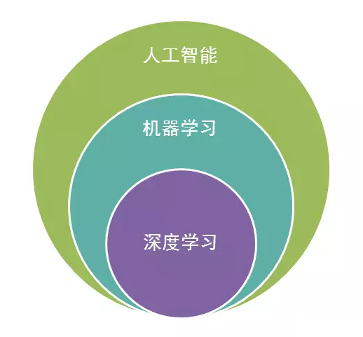

# 深度学习

深度学习可以追溯到上世纪50年代，当时提出了<def>感知机模型（Perceptron）</def>，但由于其局限性，导致其后被淘汰。直到上世纪80年代，Hinton等人提出了<def>多层感知机（Multi-Layer Perceptron，MLP）</def>模型和误差<def>反向传播（Back-Propagation，BP）</def>算法，使得深度学习重新受到关注。但由于当时计算机性能不足，深度学习的发展受到了限制。

随着计算机性能的不断提升和数据量的不断增加，深度学习逐渐崛起。2006年，Hinton等人提出了<def>深度信念网络(DBN)</def>模型，它利用无监督学习的方法训练多层神经网络，为深度学习奠定了基础。2012年，Hinton的学生Alex Krizhevsky使用<def>深度卷积神经网络（Deep Convolutional Neural Network，DCNN）</def>在ImageNet图像识别比赛中大幅领先，标志着深度学习在计算机视觉领域的突破。此后，深度学习在语音识别、自然语言处理等领域也取得了重大突破。

现在，深度学习已经成为人工智能领域的重要分支之一，它在图像识别、语音识别、自然语言处理、智能驾驶、医疗等领域都有广泛的应用。未来，随着硬件技术的不断提升和数据的不断增加，深度学习的应用前景将更加广阔。

!!! note "译注"

	严格来说，DCNN 是一种基于 CNN 的深度神经网络模型，与传统的 CNN 相比，DCNN 可以处理更复杂的任务，并且具有更强的表达能力和更好的泛化性能。但在日常使用中并不会严格区分两者，因此均可以用来指代神经网络。

## 机器学习

机器学习（Machine Learning，ML）是一种人工智能的分支领域，主要研究如何通过算法和数学模型，让计算机系统自动地从数据中学习并进行预测或决策，从而实现人工智能的目标。

机器学习可以分为监督学习、无监督学习和强化学习三种主要类型：

监督学习：指在已知输入和输出数据的情况下，让计算机通过学习输入和输出之间的映射关系，从而实现对新数据进行预测或分类。

无监督学习：指在没有标注的数据集中，让计算机通过学习数据之间的相似性或规律，从而实现对数据的聚类、降维、异常检测等任务。

强化学习：指让计算机通过与环境的交互，学习如何做出最优的决策，从而实现自主学习和自主决策的能力。

## 深度学习与机器学习

深度学习和机器学习都是人工智能领域的分支，如下图所示，他们是包含关系。

如果你非要区分的话，它们之间的区别如下：

算法复杂度：深度学习的算法复杂度比机器学习高，需要更多的计算资源和数据。

特征提取：深度学习可以自动进行特征提取，而机器学习需要手动进行特征提取。

数据量：深度学习需要大量的数据来进行训练，而机器学习可以在相对较小的数据集上进行训练。

预测精度：深度学习在某些领域的预测精度更高，如图像识别和语音识别等。而机器学习在某些领域的预测精度更高，如推荐系统和异常检测等。

应用场景：深度学习主要应用于图像识别、语音识别、自然语言处理等领域，而机器学习主要应用于数据挖掘、推荐系统、异常检测等领域。

目前来说，您不用过于纠结是否要深入了解机器学习及背后的公式推理。本教程可以帮助您实现深度学习的研究入门，如果您之后有需要可以通过李航的《统计学习方法》等内容深入了解机器学习。本教程后续也会推出机器学习的内容及代码实现，帮助您更好的学习实践相关内容。

## 深度学习与神经网络

深度学习和神经网络其实并不具备太大的区分性。如果非要说的话那就是"深度学习属于神经网络"。当然在本教程中神经网络不是指代生物学中的神经网络，而是人工设计的由神经元组成的模型。

!!! important

	有些时候为了区分生物学的神经网络，将人工智能中设计的网络称为**人工神经网络**（Artificial Neural Network，ANN），但这种具体区分的用法并不多。所以一般（Neural Network，NN）就可以用来替代人工神经网络。

深度学习的核心是神经网络，神经网络是一种模拟人类神经系统的计算模型，可以通过训练来学习数据的特征和模式。深度学习通过多层神经网络来进行学习和预测，每个神经网络层都可以提取不同层次的特征，从而实现对数据的深层次理解和分析。

深度学习中的神经网络包括前馈神经网络、卷积神经网络、循环神经网络等，它们各自具有不同的结构和特点。前馈神经网络是最基本的神经网络，它只有前向传播的过程，适用于分类和回归等任务。卷积神经网络则是专门用于图像处理的神经网络，它通过卷积和池化等操作来提取图像的特征。循环神经网络则可以处理序列数据，如语音和文本等。

## 让我们开始吧

你现在已经知道一些深度学习的相关背景了，或许有些概念还是有些晦涩难懂，但不必过于纠结，我们可以先开始我们的教程。

## 附加资源
http://neuralnetworksanddeeplearning.com