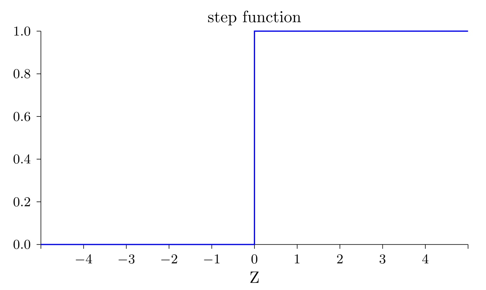
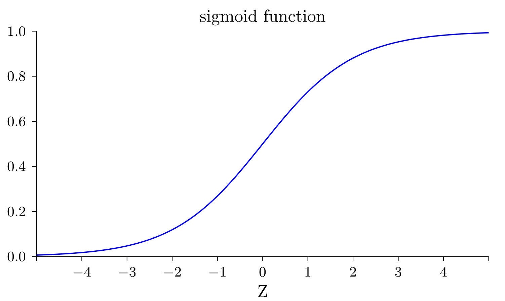
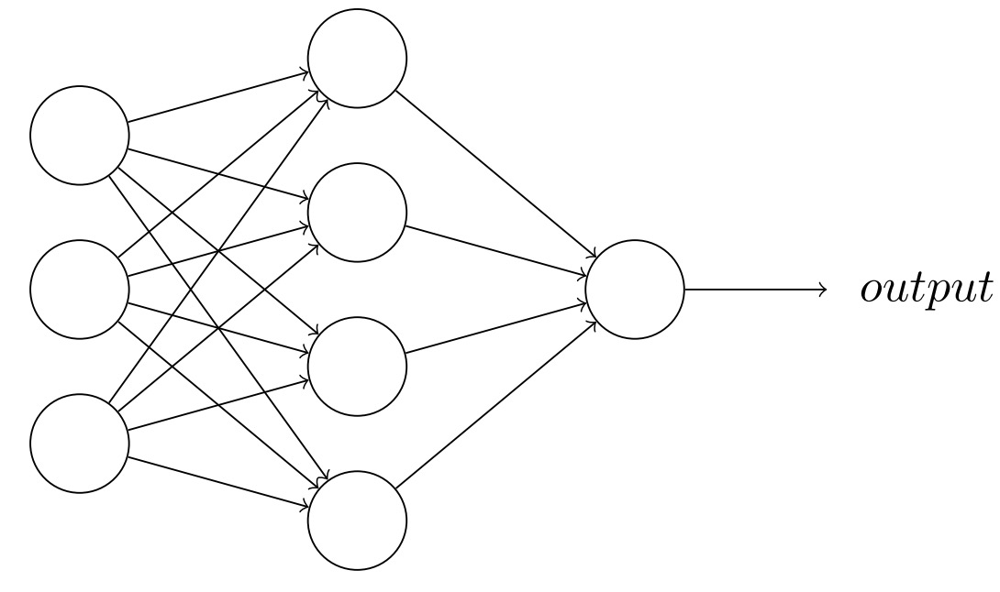

# S型神经元

在我们之前的讲解中，你已经知道了感知器可以实现二值分类，也就是通过输入判断输出0还是1。但这种感知器的功能还是太有限了，因此我们希望能够丰富一下它的功能。

## 激活函数
当我们利用感知器实现二值分类的时候，我们实际上是通过一个<def>阶跃函数</def>对输入加权 \(x * w + b\) 进行判断，并得到最终的输出。这个阶跃函数可能长这样

$$output = \left\{\begin{matrix}
 & 0 &  if & x < 0 \\ 
 & 1 & if & x > 0
\end{matrix}\right.$$

现在我们给对输入进行处理的这类函数取个名字，叫<def>激活函数</def>。比如刚刚提到的阶跃函数就属于激活函数。既然起了中文名字，那肯定要对应来一个数学符号表达，就用\( \delta \)吧。

那现在第一节中感知器的表示就不再需要判断分支了，可以直接写成

$$output = \delta(x * w + b)$$

这里加权输入这么长也不好看，我们直接用

$$ z \equiv x * w + b $$ 简写一下，上式就可以变成

$$output = \delta(z)$$

现在看是不是清爽多了。

## sigmoid函数

正如世界并不是非黑即白，而是有无穷个中间色一样，如果我们感知器的输出只能输出两个值，那他的表示能力肯定是有限的，因此我们希望能将<def>阶跃函数</def>修改为<def>sigmoid函数</def>，这样可以对不同的输入返回0到1之间任意的值，比如0.3713，用来表示神经元的激活状态。我们的sigmid函数长成这样

这样我们就对感知器引入了<def>平滑特性</def>。他可以对于输入和权重带来的微小改变产生输出的微小变化。现在我们用数学公式表示一下这个sigmoid函数
$$sigmoid(z)\equiv \frac{1}{1+e^{-z}}$$
其中z表示 \(x * w + b\)，这样上式就可以表示为
$$out = \sigma(z) = sigmoid(z) = \frac{1}{1+exp(x * w + b\}}$$
而这，就是<def>S型神经元</def>的表达式了。另外我们之后在描述时候就不再使用感知器了，而是使用<def>神经元</def>来表示这样一个对输入作出反映的单元。

!!! Important

	需要注意的是，S型神经元的激活函数并非只有simgoid函数一种，他还可以包含类似tanh等激活函数，这些不同的函数具体作用和应用场景又有不同，但此时暂时不过多介绍。

## 实现异或操作

现在我们回想一下让神经元实现逻辑门时候的代码。每个神经元的权重和偏置都是我们人为设定的。但是，权重和偏置可是神经元独一无二的特性啊，如果都手工设定，怎么能展示他们的个性呢？
有没有一种方法，可以让神经元根据任务的不同，自己去学习自己独属的权重和偏置呢？

答案当然是可以的，但正如我们之前所说，一个神经元的力量太微小了，他不能完成某些任务。所以当我们希望神经元自己根据不同任务学习权重和偏置时，我们一般需要先搭建一个神经网络，他可能长下面这样子

他和我们之前的多层感知机是不是相同，但这里每个小组件都替换成了神经元，因此整体也被我们称为<def>神经网络</def>。

想象一下我们正在玩1-100的猜数字游戏，A先想出一个数字，B去猜，如果大了就继续猜更小的数字，如果小了就继续猜更大的数字，直到最后猜出那个正确的数字。

我们梳理一下这个过程，首先它是一个经过多次尝试的反馈过程。每次需要知道猜测的结果是大还是小，还要知道根据这个结果怎么去修改猜测的值。对应到神经元的学习中，我们需要多次学习，让网络在每一次学习过程中逐渐修改每个神经元的权重和偏置，进而使整体网络趋近目标。我们称每次学习过程为一次<def>迭代<\def>。
在每次迭代过程中，我们需要一个<def>损失函数</def>去判断神经元输出的结果和目标结果差距有多少。
还需要一个<def>反向传播算法</def>来告诉神经元该怎么修改。

上面提到的<def>损失函数</def>和<def>反向传播算法</def>是两个新的概念，而且都是复杂而又困难的。在接下来的两节我们将逐一学习。
