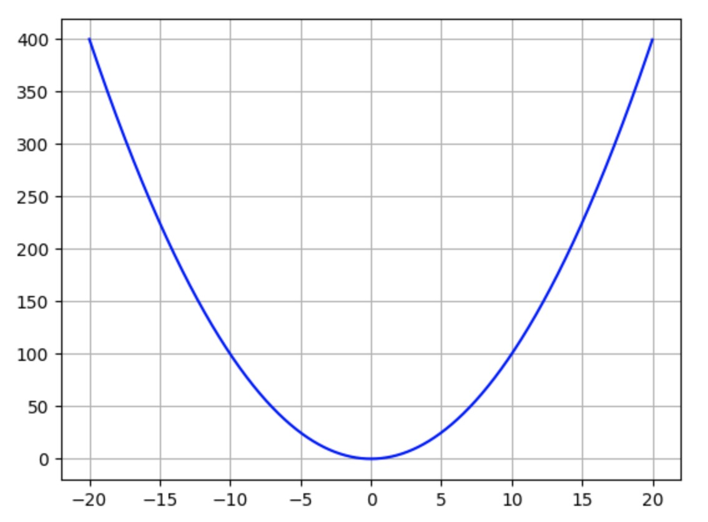
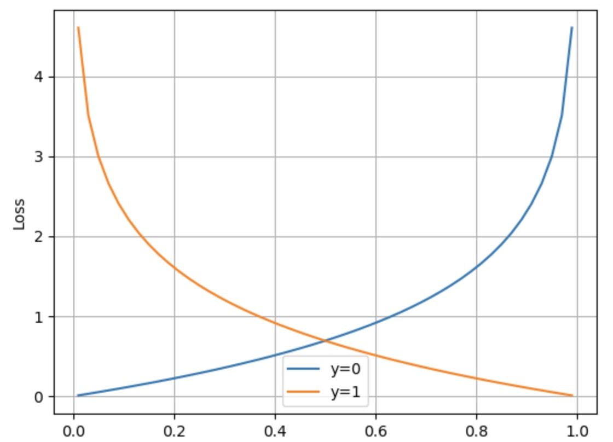

# 损失函数

损失函数可以深度学习中一个非常重要的概念，用于衡量网络的预测结果与目标值之间的差异，即网络的误差大小。我们一般将预测结果用\(y\)表示，将目标值称为金标准(ground truth,gt)。

损失函数就像一个神经网络的领路人，用来指导网络的训练过程，帮助网络不断地优化，最终得到更准确的预测结果。
当预测值和目标值差距远的时候，对应的损失值就大，相反如果距离近，损失值就小。

## 损失函数的主要作用

衡量模型的性能：损失函数可以衡量模型的预测值与真实值之间的差异，从而评估模型的性能。当损失函数的值越小，说明模型的预测结果越接近真实值，模型的性能越好。

指导模型的训练：损失函数可以指导模型的训练过程，帮助模型不断地优化，最终得到更准确的预测结果。在训练过程中，模型通过最小化损失函数来调整权重和偏置等参数，从而提高模型的准确性和泛化能力。

选择合适的算法和模型：不同的问题和模型需要选择不同的损失函数，例如分类问题常用交叉熵损失函数，回归问题常用均方误差损失函数等。选择合适的损失函数可以帮助我们更好地解决问题和选择合适的算法和模型。

常见的损失函数包括均值绝对误差（Mean Absolute Error, MAE）、均方误差（Mean Square Error, MSE）、交叉熵（Cross Entropy, CE）、对数损失（Logarithmic Loss, Log Loss）等，需要根据具体问题和模型来选择合适的损失函数。

## MAE
这里我们先简单介绍一个最基本的均值绝对误差, 也就是<def>L1 loss</def>。他用来表示对当前网络的输出y与目标gt之间误差的绝对值进行求和，表示为
$$L1 \ \ loss(y, gt) = \frac{1}{N} \sum_{1}^{N}\left | y_{i} - gt_{i} \right | $$ 

这里N表示样本数，我们一般对多个样本的误差取平均得到最终结果。

MAE的图像表示如下

## MSE
接下来介绍一个和MAE类似的损失函数，均方误差（Mean Square Error, MSE），也就是<def>L2 loss</def>，他用来表示对当前网络的输出y与目标gt之间误差的绝对值进行求和，表示为
$$L1 \ \ loss(y, gt) = \frac{1}{N} \sum_{1}^{N} (y_{i} - gt_{i} )^{2} $$ 

这里N表示样本数，我们一般对多个样本的误差取平均得到最终结果。

MSE的图像表示如下

## MAE与MSE对比
MAE的优点：

- 对离群值鲁棒性较强：MAE是对误差的绝对值进行求和，对离群值的影响较小，因此在存在离群值的情况下，MAE相对于MSE更能够反映模型的性能。

- 求导简单：MAE对误差的绝对值求导后为常数1或-1，因此求导比较简单。

- 更加直观：MAE是误差的平均绝对值，更加直观地反映了模型预测的误差程度。

MSE的优点：

- 误差平方：MSE是对误差的平方进行求和，能够更加敏感地反映误差的大小。

- 更加光滑：MSE是平方项的和，可以更加光滑地拟合数据，对于一些连续的回归问题效果更好。

- 适用于梯度下降优化：MSE的平方项是可导的，因此可以使用梯度下降等优化算法进行训练和优化。

总之，在存在离群值的情况下，MAE相对于MSE更加鲁棒；在需要更加敏感地反映误差大小的问题中，MSE相对于MAE更加适用。

额是不是要先解释一下什么是离群值（Outlier），是指在数据集中与其他数据点显著不同或明显偏离的数据点。离群值可能是由于测量误差、数据录入错误、异常事件等原因引起的，它们通常与其他数据点存在较大的差异，会对数据集的统计分析和建模产生影响。

至于为什么MAE鲁棒，比如预测个人资产的数据集，一般人都是百万左右，突然有马云的一千亿，那数据就这样：

[1, 2, 3, 4, 10000]， 单位百万

使用MSE计算平方后误差就会非常非常大。所以MAE计算绝对值相对误差会小点，鲁棒性也就更好。

## 交叉熵（Cross Entropy, CE）
交叉熵通常用于<def>分类问题</def>中,这里分类任务可以简单理解为目标值具有有限个类别，这里的有限个假如是2，就是二分类，比如给定一个人，分类男或者女。假如大于2，就是多分类，比如给定一个水果的图片，分类是苹果，梨还是橘子。
交叉熵损失函数定义为：
$$CE \ \ loss(y, gt) = -\frac{1}{N} \sum_{1}^{N} (gt*log(y_{i}) + (1-gt)*log(y_{i}) ) $$ 
交叉熵是一种非负的损失函数，当gt=1时，交叉熵的值只与预测值y'有关；当y=0时，交叉熵的值只与预测值1-y'有关。因此，交叉熵可以很好地衡量分类问题中的误差大小。

这里肯定有同学要问了，gt只有0，1的话，该怎么用在多分类任务中呢？那就需要用到<def>one-hot 编码</def>了。
one-hot编码是一种常用的编码方式，它将每个类别都表示为一个向量，其中只有一个元素为1，其余元素为0。one-hot编码的目的是为了将离散的类别转化为连续的向量，便于计算和处理。
还以水果分类为例。我们提前规定，将这个三分类任务的标签设置为长度为3的向量，按照规则

- 苹果：[1,0,0],
- 梨：[0,1,0]
- 橘子：[0,0,1]。

为了计算交叉熵，我们让网络输出也3个值，每个值为0-1之间的数字，表示对应这个类的概率，组成一个长度为3的一维向量。一般认为概率最大的类别就是网络最终猜测的类别。
假如网络输出为[0.2, 0.3, 0.5]，表示这个网络认为有0.2的概率是苹果，0.3的概率是梨，0.5的概率为橘子。之后就可以计算输出的向量和标准向量之间的概率了。

需要注意的是，one-hot编码通常只适用于类别数量较少的情况，如果类别数量很多，one-hot编码会导致向量维度过高，从而增加计算量和存储空间。

!!! Important

	我们上文提到的多分类任务默认是 多分类问题中的二分类任务。也就是给定一个图像，他只可能是梨或者苹果。与之相对的可能存在一张图既有苹果又有梨，那么网络预测哪个都对，gt也应该是两种类别都置1，这种也能使用交叉熵损失函数计算，但我们目前先不考虑这种情况。

!!! Important

	如果图片不属于标签中的类别的情况，比如给了一个菠萝的图片进行上面的三分类。这是分类任务固有的弊端，我们暂时不考虑这种情况，

交叉熵的图像如下

从曲线可以看出，当预测值与gt差距越大，损失函数就越大，这样可以更好地引导模型学习正确的分类策略。一般在多分类任务中，交叉熵函数比上文介绍的MAE和MSE效果好。

当然深度学习发展这么长时间产生了许多不同的损失函数，他们有各自不同的优势及应用场景，但他们目的都是衡量网络预测的结果和目标结果之间的差距。这里先了解这三个基础的损失函数已经足够了。之后我们会尽量详细的介绍不同损失函数的作用以及区别。
