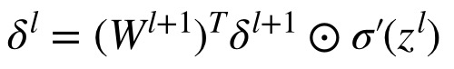

# 反向传播算法

<def>反向传播（Backpropagation，BP）</def>算法是一种常用的神经网络训练算法，用于**计算神经网络中每个权重的梯度**，从而进行模型参数的优化。
BP算法的基本思想是通过计算神经网络输出值和真实值之间的误差，然后将误差沿着网络反向传播，计算每个神经元的误差贡献，并根据误差贡献来更新神经网络的权重。

## 前向传播梳理
首先我们整体梳理一下前向传播算法。
我们先假设有一个如下的三层神经网络，它包含一个输入层，隐藏层，和输出层。

[//]: # (![]&#40;../img/01/06/net.jpg&#41;)

首先来重新梳理一下各个参数的含义

\(z_{j}^{l}\)： 表示第l层第j个神经元的输入

\(a_{j}^{l}\)： 表示第l层第j个神经元的输出

\(w_{jk}^{l}\)：表示第l-1层第k个神经元 到 第l层第j个神经元的连接上的权重

\(b_{j}^{l}\)： 表示第l层第j个神经元的偏置

回忆一下第三节单个神经元的输出，

$$a = \sigma(z) = sigmoid(z) = \frac{1}{1+exp(x * w + b\}}$$

可以类似的将隐藏层的三个输出表示为

$$a_{0}^{2} = \sigma(z_{0}^{2}) = \sigma(w_{00}^{2}*x_{0} + w_{01}^{2}*x_{1} + b_{0}^{2}) $$

$$a_{1}^{2} = \sigma(z_{1}^{2}) = \sigma(w_{10}^{2}*x_{0} + w_{11}^{2}*x_{1} + b_{1}^{2}) $$

$$a_{2}^{2} = \sigma(z_{2}^{2}) = \sigma(w_{20}^{2}*x_{0} + w_{21}^{2}*x_{1} + b_{2}^{2}) $$

类似的， 输出层可以表示为

$$a_{0}^{3} = \sigma(z_{0}^{3}) = \sigma(w_{00}^{3}*a_{0}^{2} + w_{01}^{3}*a_{1}^{2} + w_{02}^{3}*a_{2}^{2} + b_{0}^{3}) $$

这里我们要注意了，如果将每个神经元都用公式表示一遍太麻烦了，所以这里我们引入矩阵的概念，将隐藏层直接表示为：

$$a^{l} = \sigma(z^{l}) = \sigma(W^{l}*a^{l-1} + b^{l}) $$

千万别问我为啥能用矩阵表示，你看看列的这么整齐的公式，是不是单独把w提出来位置都不用变就是向量W了。

## 计算损失函数

这里我们用上节讲过的MSE Loss来计算损失函数，表达式为：

$$ C = \frac{1}{2N}\sum_{x}\left \| y - a(x) \right \|^{2} $$

其中 \( \frac{1}{2N} \)用于后续优化求导。

## 梯度计算

现在在一轮迭代中，我们已经知道了前向过程及当前计算的损失函数。接下来我们希望能够了解这个损失函数怎么指导网络优化权重和偏置。

这里先不做过多的引入，根据大学微积分知识，我们知道在多元函数中，如果只考虑其中某一个自变量对于因变量的影响，就可以使用<def>偏导数（Partial Derivative）</def>来描述这种关系。

首先我们计算一下最后一层代价函数C到输出层神经元的计算。因为C是关于W和b的函数，因此我们在指导W的过程中，可以单独计算W的偏导数，告诉W优化的方向。b同理，接下来先推理一下

C关于W的偏导数推理如下：

[//]: # (![]&#40;../img/01/06/func1.jpg&#41;)

C关于b的偏导数推理如下：

[//]: # (![]&#40;../img/01/06/func2.jpg&#41;)

[//]: # ($$ {a}' $$)

[//]: # ($$ \frac{\partial C&#40;W, b&#41;}{\partial w^{l}} = \frac{\partial C&#40;W, b&#41;}{\partial a^{l}} \frac{\partial a^{l} }{\partial z^{l}} \frac{\partial z^{l} }{\partial w^{l}} $$)

[//]: # (=&#40;a^{l}-y&#41;\odot {\sigma}'&#40;z^l&#41;a^{l-1})

其中 \(\odot \) 符号表示Hadamard 乘积，或者 Schur 乘积。其定义按元素乘积，其中左右两边矩阵必须具有相同的维度。举个例子

$$
\begin{bmatrix}
1\\ 
2
\end{bmatrix} \odot \begin{bmatrix}
3\\ 
4
\end{bmatrix} = \begin{bmatrix}
1 * 3\\ 
2*4
\end{bmatrix} =  \begin{bmatrix}
3\\ 
8
\end{bmatrix} 
$$

由于公式中具有相同的组件，因此为简化函数，我们定义

[//]: # (![]&#40;../img/01/06/func3.jpg&#41;)

[//]: # (\delta^l =\frac{\partial C&#40;W, b&#41;}{\partial a^{l}} \frac{\partial a^{l} }{\partial z^{l}} =&#40;a^{l}-y&#41;\odot {\sigma}'&#40;z^l&#41;)

如此，损失函数到输出层对权重W和b的求导可以简化为：

$$ \frac{\partial C(W, b)}{\partial w^{l}} = \delta^l a^{l-1} $$

$$ \frac{\partial C(W, b)}{\partial b^{l}} = \delta^l $$

现在我们要计算一下隐藏层的函数，刚才之所以能对输出层求导计算，是因为输出层的w，b是损失函数C的输入。但隐藏层没有这种关系，我们可以将隐藏层w，b作为输出层的函数，进而通过<def>链式法则</def>，从损失函数推导到隐藏层。

假设我们已经求出第l+1层的\( \delta^{l+1} \), 第l层的计算可以表示为

$$ \delta^l = \frac{\partial C(W, b)}{\partial z^{l+1}} =  \frac{\partial z^{l+1}}{\partial z^{l}} $$

又

$$ z^{l+1} = W^{l+1}a^l+b^{l+1} =  W^{l+1}\sigma(z^l)+b^{l+1}  $$

可求出 

[//]: # (![]&#40;../img/01/06/func4.jpg&#41;)

[//]: # (\frac{\partial z^{l+1}}{\partial z^{l}} = &#40;W^{l+1}&#41;^T {\sigma}'&#40;z^l&#41;)

代人得

[//]: # (\delta^l = &#40;W^{l+1}&#41;^T \delta^{l+1} \odot {\sigma}'&#40;z^l&#41;)

如此我们便得到的\( \delta^l \)的递推关系，只要求出某一层 \( \delta^l \)，即可方便的求出对该层w和b的梯度。

## 参数更新

求出梯度后，我们可以利用梯度下降算法，将梯度乘以一个极小的学习率 \( \eta \),更新的权重和偏置可以表示为

$$ w^{l} = w^{l} - \eta \frac{\partial C(W, b)}{\partial w^{l}}  $$

$$ b^{l} = b^{l} - \eta \frac{\partial C(W, b)}{\partial b^{l}}  $$

## 多次迭代

通过上述的前向传播，计算loss，梯度计算，参数更新等步骤，我们便实现了一次迭代的过程。正如生活会一而再，再而三的打击我们，最终使我们变更优秀一样。
网络也需要经过多次迭代才能最终达到训练的目标。

为了使训练停下来，我们一般会设置固定迭代次数，达到迭代次数后停止。也可以比较相邻两次迭代计算得到的误差。如果误差一直在某个很小的范围，我们认为学习的差不多就这个水平了，然后让网络停止训练。

目前我们已经准备好了使用网络自己学习异或操作的所有知识。接下来一节将用代码实现该内容。