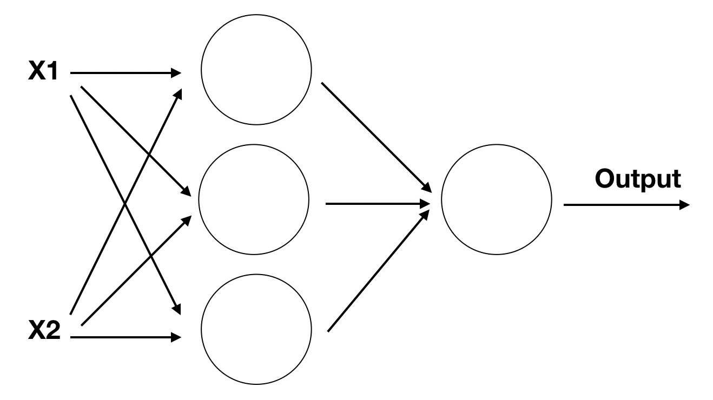
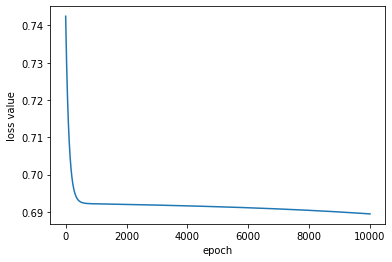

# 自学习异或操作


这一节需要假设你已经对python有了基础的知识，接下来的代码都是使用python实现

## 导入模块

首先我们需要导入numpy函数。

```python
import numpy as np
import matplotlib.pyplot as plt
```
其中numpy是我们用于计算的库，plt则是后续用来观察的库

# 定义输入输出

然后我们可以定义输入的数据和期望得到的结果,输入是一个二维数组，用来枚举所有可能的输入情况。输出为对输入进行异或操作期望的结果。

```python
# 训练数据
X = np.array([[0, 0], [0, 1], [1, 0], [1, 1]])
y = np.array([[0], [1], [1], [0]])
```

## 定义网络

接下来我们需要定义一个神经网络，他的输入是2，因为每次x的取值是2。隐藏层定义为3，这个是任意取得，当然你也可以选择2或者4。最后设计输出层为1，因为输出只可能有一个值。
这样我们的代码就可以添加上这样的超参

```python
nn = NeuralNetwork(2, 3, 1)
```
这时候网络如果可视化的话，它长下图这样子



我们需要预定义一下隐藏层的权重weights1和偏置bias1，以及隐藏层到输出层的权重weights2和偏置bias2，他们用代码表示为
```python
def __init__(self, input_size, hidden_size, output_size):
    # 初始化权重和偏置
    self.weights1 = np.random.randn(input_size, hidden_size)
    self.bias1 = np.zeros((1, hidden_size))
    self.weights2 = np.random.randn(hidden_size, output_size)
    self.bias2 = np.zeros((1, output_size))
```

回忆一下s型神经元的表达式，我们似乎缺一个激活函数\(\delta\),他用代码表示为
```python
def sigmoid(x):
    return 1.0 / (1 + np.exp(-x))
```
对应的也需要sigmoid的导数，形式为sigmoid(x)*(1-sigmoid(x)),由于sigmoid(x)即为上一层的输出，因此可以直接定义为：
```python
def sigmoid_derivative(x):
    return x * (1 - x)
```

## 前向传播

现在就可以写出前向传播的完整过程了,通过前向传播我们就能得到网络的预测结果了，这里用a2表示

```python
# 前向传播
def forward(self, X):
    self.z1 = np.dot(X, self.weights1) + self.bias1
    self.a1 = sigmoid(self.z1)
    self.z2 = np.dot(self.a1, self.weights2) + self.bias2
    self.a2 = sigmoid(self.z2)
    return self.a2
```

## 计算误差

误差直接使用gt减去预测值

```python
self.error = y - output
```

## 反向传播


```python
self.delta2 = self.error * sigmoid_derivative(output)
self.error1 = self.delta2.dot(self.weights2.T)
self.delta1 = self.error1 * sigmoid_derivative(self.a1)
```

## 参数更新
```python
# 更新权重和偏置
self.weights2 += self.a1.T.dot(self.delta2)
self.bias2 += np.sum(self.delta2, axis=0, keepdims=True)
self.weights1 += X.T.dot(self.delta1)
self.bias1 += np.sum(self.delta1, axis=0)
```

接下来就是通过一定的迭代次数训练该网络，他的整个过程是

```python
# 训练模型
def train(self, X, y, epochs):
    loss_list = []
    for i in range(epochs):
        output = self.forward(X)
        self.backward(X, y, output)
        loss = np.mean(np.square(y - output))
        loss_list.append(loss)
    plt.plot(loss_list)
    plt.title('Loss Curve')
    plt.xlabel('Epochs')
    plt.ylabel('Loss')
    plt.show()
```

如果代码正确的话，你将得到一张这样的损失函数图像



可以看到输出和gt已经很像了，到这里我们就实现了设计一个神经网络，并通过迭代学习是他达到一个功能。以后你遇到的所有内容都是对这个项目的拓展和补充修改。此时你唯独对反向传播还完全不理解，那继续进行下一节的学习吧。

# 推理
注意我们最后行定义了一个推理函数，我们在训练完网络后，希望能推理看看得到的结果是否能实现我们目标，它的具体代码如下
```python
# 预测
def predict(self, X):
    return self.forward(X).round()
```

你可以尝试通过调试训练网络实现该异或功能，这将是一个很好的起点。全部的代码可以在[这里](https://github.com/learnAI-CN/learnAI-code/blob/main/01-XOR.py)看到。需要告诉你的是这个代码是由ChatGPT独立实现的。

