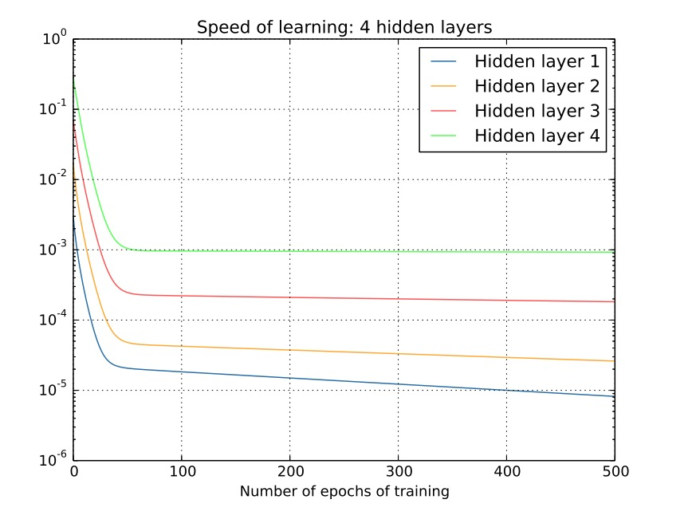
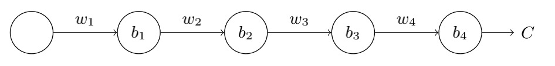
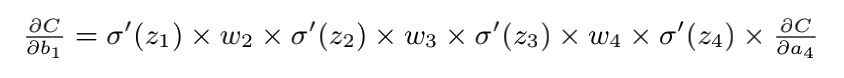
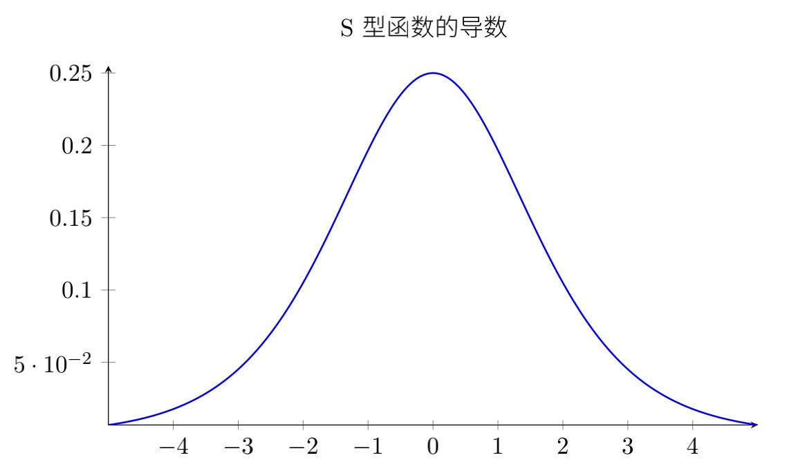

# 梯度消失/梯度爆炸

将梯度消失/爆炸放在这里其实有点提前了，但因为他在数学原理上和BP是息息相关的，因此本节提前介绍一下这个概念，当然您也可以在第二章学完之后再来看本节

梯度消失/爆炸（Gradient vanishing/Gradient exploding）统一可以归为梯度不稳定的问题。在靠近输入层的隐藏层中或会消失，或会爆炸。这种不稳定性导致基于梯度学习的深度神经网络训练变得异常困难。

## 概念

梯度消失：在每次训练的迭代中，梯度值会几乎消失，使得权重无法得到有效更新，甚至神经网络可能完全无法继续训练。

梯度爆炸：在每次训练的迭代中，梯度值会指数形增加，使得权重无法得到有效更新，甚至神经网络可能完全无法继续训练。

上图展示了一个4层网络训练在训练过程中不同隐藏层的学习速度，其中Hidden1表示距离输入最近的层，对应的Hidden4表示离输出最近的隐藏层。
这是⼀项重要的观察结果：⾄少在某些深度神经⽹络中，我们在隐藏层 BP 的时候梯度倾向于变⼩。这意味着在前⾯的隐藏层中的神经元学习速度要慢于后⾯的隐藏层。这个现象也被称作是消失的梯度问题

其他网络可能会产⽣类似的问题 —— 在前⾯的层中的梯度会变得⾮常⼤！这也叫做激增的梯度问题（exploding gradient problem）
这也没⽐消失的梯度问题更好处理。更加⼀般地说，在深度神经⽹络中的梯度是不稳定的，在前⾯的层中或会消失，或会激增。这种不稳定性才是深度神经⽹络中基于梯度学习的根本问题。

## 产生原理
现在要思考一下，为什么网络训练会产生这个问题？

现在我们想象有一个既简单的网络，它包含三个隐藏层，但是每层只有一个神经元。这个网络可能长下图这样。

其中包含一些我们常见的变量，W表示权重，b表示偏置，C为代价函数。每个神经元在输出前要经过激活函数Sigmoid。
根据之前梯度传播的知识，我们如果希望能求C对\(b_1\)的偏导，那就需要通过链式法则，得到

如果您认可这个公式，那现在我们需要理解一下不断重复项\(w_1 {\sigma }'(Z) \)的含义。下图展示了Sigmoid函数的导数

可以发现即使在输入为0的时候，导数也最大达到0.25。如果网络的权重满足均值为0，标准差为1的高斯分布，意味着每个\( ｜w｜< 1 \)。
如此以来不断重复项\(w_1 {\sigma }'(Z) \)的结果必然小于0.25。 而我们在反向传播时还需要将这个项连乘，结果必然会指数级下降。
这是不是就可以理解为什么会导致梯度消失的问题了。

当然，这⾥并⾮严格的关于消失的梯度微调的证明⽽是⼀个不太正式的论断。还有⼀些可能的产⽣原因了。反过来，如果该项大于1，连乘的结果就是梯度爆炸。

## 解决方法
对应训练遇到该问题又该如何解决呢？

- 使用其他激活函数。既然产生的原因是激活函数的导数太小，那我们就换一个激活函数，比如使用ReLU，其导数为1，就不存在该问题
- 使用batchNormalization, 这个是希望把权重进行标准化，也就是修改W
- 使用短连接，因为在计算浅层梯度时需要从深层一点点计算回来，如果我们直接将损失函数作用于浅层，就也可以避免该问题。

目前提到的解决方法还没有设计，您可能不理解是什么意思，之后我们在讲的时候会再次呼应这个问题。

