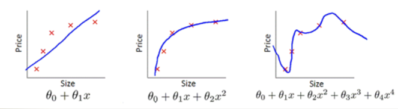

# 过拟合/欠拟合

导致泛化性差有两个很重要的原因，即<def>过拟合（Overfitting）</def>和<def>欠拟合（Underfitting）</def>。本节将详细介绍一下

下图可以形象的展示欠拟合和过拟合的形式，我们希望网络学习数据的二次函数分布。欠拟合的问题在于拟合的公式太简单，只学到了线性分布，无法描述大多数数据集的分布。
过拟合反而过于追求每一个训练集的分布，学习到了四阶函数，导致拟合公式过于复杂，有点类似于死记硬背，没有理解数据背后的规律，泛化能力差。




## 欠拟合效果展示
当我们使用[minist实现](../02%20HardWayToDeep/01%201Channel%20minist.md)中识别minist的代码进行修改，定义第二层网络神经元个数为10的话，

```python
if __name__=="__main__":
    net = network.Network([784, 10, 10]) 
    
    net.SGD(training_data, 30, 10, 3.0, test_data=test_data)

```

训练最终可以得到以下输出：

```python
Epoch 27 : 9196 / 10000
Epoch 28 : 9198 / 10000
Epoch 29 : 9182 / 10000
```

结果只能达到91%，很明显这比30个隐藏神经元的效果差，这种模型在训练集上的表现较差，无法很好地拟合训练数据的真实分布的情况被称为欠拟合。


## 欠拟合产生原因


造成欠拟合的原因主要有：


1、模型复杂度过低：当模型过于简单时，模型无法学习到训练数据中的复杂关系，导致模型无法很好地拟合数据。例如，在图像分类任务中，如果模型只有一层线性层，那么模型的表达能力就非常有限，无法很好地拟合数据。

2、数据量过少：当训练数据量过少时，模型的泛化能力也会受到限制，因为模型没有足够的数据来学习数据的真实分布。例如，在图像分类任务中，如果只有很少的图像数据可用于训练，那么模型就很难学习到图像数据的复杂特征和关系。

3、过度的正则化：当过度使用正则化技术（如L1正则化、L2正则化、Dropout等）时，模型可能会过于简单，从而导致欠拟合的问题。例如，在使用L1正则化时，如果正则化权重太大，那么模型可能会过于稀疏，无法学习到训练数据中的复杂特征和关系。

4、特征不足：当特征提取不足时，模型无法很好地学习到数据中的关键特征，从而导致欠拟合的问题。例如我们需要训练一个模型来预测一个人的体重，但是我们只使用了身高这一个特征。可能存在身高相同但体重不同的情况，因此模型可能无法很好地拟合数据，出现欠拟合的问题。如果我们增加更多的特征，如年龄、性别、饮食习惯等预测效果会更好。

## 欠拟合解决方法

为了解决欠拟合问题，可以采用以下方法：

增加模型复杂度：当模型过于简单时，可以通过增加模型复杂度来提高模型的拟合能力。例如可以通过增加模型的层数、增加每层的神经元数、使用更复杂的激活函数等方法来增加模型的复杂度。

增加数据量：增加数据量是解决欠拟合问题的最有效方法之一。更多的数据可以帮助模型更好地学习数据的真实分布，从而提高模型的泛化能力。

特征工程：特征工程是指对原始数据进行一些预处理和特征提取，从而提高模型的泛化能力。例如可以通过特征选择、特征变换、特征提取等方法来增加模型的拟合能力。


## 过拟合效果展示

那是不是网络中间层数量变多效果就会提升呢，我们尝试将网络中间参数设为两层100看看训练结果。
```python
if __name__=="__main__":
    net = network.Network([784, 100,  100, 10]) 
    
    net.SGD(training_data, 30, 10, 3.0, test_data=test_data)
```

实验发现训练的精度提升了，但是测试精度反而下降了。
这种现象被我们称为过拟合，是指模型在学习训练数据时过度拟合了训练数据的细节和噪声，导致模型对新数据的预测不准确。


## 过拟合产生原因

造成过拟合的原因主要有：

模型过于复杂：当模型过于复杂时，它可能会过度拟合训练数据中的噪声和细节，而不是学习数据的潜在规律。过于复杂的模型可能会有太多的参数，使得它们可以拟合任何训练数据，但是这会导致泛化能力不足，无法很好地适应新数据。

数据不足：当训练数据较少时，模型可能会过度拟合训练数据，因为它们无法从有限的数据中学习到足够的信息，无法很好地泛化到新数据。此时可以通过数据增强等技术来扩充训练数据集，以减少过拟合的风险。

过度训练：当模型训练时间过长时，可能会导致过拟合。如果模型在训练数据上训练得足够好，但是训练时间过长，它可能会过于自信，过度拟合训练数据中的噪声和细节。因此，可以通过早停等技术来避免过度训练。

特征不足：当模型所使用的特征不足以捕捉数据的复杂性时，可能会出现过拟合的问题。如果模型无法从训练数据中学习到足够的信息，它可能会过度拟合训练数据中的噪声和细节，而不是学习数据的潜在规律。因此，应该选择合适的特征，并对其进行适当的处理和组合，以减少过拟合的风险。


## 过拟合解决方法

增加数据量：增加数据量是解决过拟合问题的最有效方法之一。更多的数据可以帮助模型更好地学习数据的真实分布，从而提高模型的泛化能力。

简化模型：减少模型的复杂度可以减少模型对噪声和细节的拟合，从而提高模型的泛化能力。例如可以通过减少模型的层数、减少每层的神经元数、使用正则化等方法来简化模型。

使用正则化技术：正则化技术可以限制模型的复杂度，防止模型过度拟合训练数据。常用的正则化技术包括L1正则化、L2正则化、Dropout等。

交叉验证：交叉验证是一种评估模型泛化能力的方法，可以评估模型在不同数据集上的性能，从而避免过拟合的问题。

提前终止：在训练过程中，可以通过监控模型在验证集上的性能，来判断模型是否已经过拟合。一旦模型在验证集上的性能开始下降，就可以提前终止训练，从而避免过拟合的问题。


## 参考

https://github.com/mnielsen/neural-networks-and-deep-learning/blob/master/src/network.py


