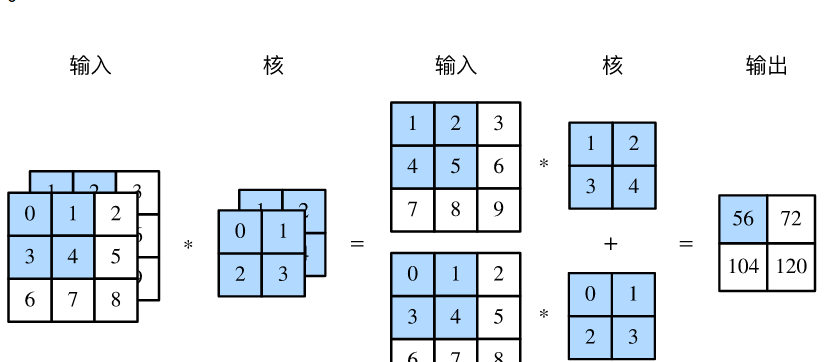

# 卷积层

在第一章中我们已经可以编写了一个可以自主训练学习的网络用于实现异或功能。在本章我们将深入深度学习实现字符识别任务
同时为了提升网络学习效率，我们会在恰当的时候对之前的内容进行深入讲解

回想一下实现异或操作的神经网络，我们将输入表示为一维向量。但从这章开始，我们希望能够处理图像数据，如下图我们展示了一些minist数据。


## 二维卷积

通过你聪明的大脑你肯定瞬间能认出这些数字，但是如果是计算机呢？如何让他们从存储时候的二进制，经过网络推理得到数字结果。
根据我们之前的工作，我们可以将图像转成一维输入，然后利用多层神经元训练学习，得到最终的10个输出，分别代表0-9的预测结果。
但这样就破坏了图像空间结构，训练质量肯定会大打折扣。因此我们在这里引入用于图像的二维卷积。

如下图所示，是一个简单的卷积层


首先我们先介绍一下<def>卷积核（Kernel）</def>。即上图中间的部分，可以看到他是一个2*2的二维矩阵。你可以把每一个小方框当作一个神经元
方框中的值就是当前这个神经元的权重。

和通常⼀样，我们把输⼊像素连接到⼀个隐藏神经元层。但是我们不会把每个输⼊像素连接到每个隐藏神经元。相反，我们只是把输⼊图像进⾏⼩的，局部区域的连接。
具体来说，这个小的局部的区域就被称为<def>局部感受野</def>。他的维度和卷积核的维度相同。

在计算每个输出时，实现方式如图中淡蓝色的部分，将局部感受野与卷积核进行对应位置的元素乘再求和。这样就得到输出最左上角的值。

之后需要将局部感受野进行平行和垂直移动一格，每次移动都与卷积核计算得到输出。如横向平移一个的操作如下


如此循环，得到最终的输出


这样我们便完成了一个卷积核对输入的卷积操作。我们之后将这样的输出称为<def>特征图</def>。接下来我们需要介绍一些概念丰富一下卷积

## 步长

在我们的局部感受野和卷积核的计算过程中，我们每次将局部感受野或平行或垂直移动一格，这其实是默认步长为1。

那能不能设置成其他值呢？当然可以，比如说如果我们设置成2，输出的第二行和第二列都会空过去不再计算，如此得到最终2*2的输出，表示如下


这里可以留意一下，当步长为2时，网络的输出变成输入尺寸的一半。这在之后的网络设计中可能会用到

## padding

细心的你可能发现了，我们在卷积之后的尺寸和输入相比变小了！这其实在应用中会带来一定的麻烦，为解决这个问题。
一般将输入的边缘补0，然后再与卷积核进行卷积计算，这样得到的特征图会保持和输入相同的尺寸。


## 共享权重和偏置

你可能发现，我们在计算特征图时候，使用了相同的卷积核对输入进行操作。这被我们称为<def>共享权重</def>。

其实图中未展现出来的是，我们会对Out统一加相同的偏置，这个偏置被称为<def>共享偏置</def>。

记得刚提到的卷积核的概念吗？他更具体来说包含共享权重和共享偏置。如此便实现了神经元的W*x+B的操作。


## 多输入

如果是minist这种黑白图像，输入确实是只有一个<def>通道</def>，那如果遇到彩色图呢？他是三通道卷积的具体实现是什么样的？今儿说其他多通道的输入呢？

当输入是多通道时，我们也需要定义和输入通道数相同的卷积核，然后每个卷积核和他对应的输入层进行上面的卷积操作。
那这样输出是不是也会有多个通道，确实，但我们会将这多个通道的输出对应位置求和。实现过程如下图所示

!!! Important
    
    通道，即有多少个输入的特征图




## 多输出

但我们定义了和输入相同数量的kernel，结果只得到了一个输出。如果是作为输出层也可以用，但如果是隐藏层呢，我们一般希望能有多个层，那怎么得到多输出呢？
我们重复上面的多输入过程就好了，定义多个 与输入通道数相同的卷积核。这样就能得到多个输出了。具体实现如下图所示


## pytorch框架下卷积

你说这么复杂，要按照之前一样写代码岂不是要累死。其实不用担心，早有大佬设计了深度学习框架，我们在代码实现中只需要调用其中的函数就好。

深度学习框架（Deep Learning Framework）是一种软件工具，用于简化和加速深度学习模型的开发和部署。深度学习框架提供了一系列的函数和工具，可以帮助开发者快速构建、训练和优化深度学习模型，同时支持多种硬件平台和操作系统。

深度学习框架通常具有以下特点：

支持多种深度学习模型：深度学习框架支持多种深度学习模型，包括卷积神经网络、循环神经网络、自编码器等。

提供高效的计算库：深度学习框架提供了高效的计算库，可以在多种硬件平台上加速计算，包括CPU、GPU、TPU等。

提供易用的API接口：深度学习框架提供了易用的API接口，可以帮助开发者快速构建和训练深度学习模型，同时提供了丰富的可视化工具，方便模型的调试和优化。

支持多种编程语言：深度学习框架支持多种编程语言，包括Python、C++、Java等，方便开发者选择自己熟悉的语言进行开发。

提供强大的社区支持：深度学习框架有着庞大的社区支持，包括开发者、研究人员、企业等，提供了丰富的学习资源和技术支持。

目前，常用的深度学习框架包括TensorFlow、PyTorch、Keras、Caffe等，它们在不同的应用场景和问题上都有着广泛的应用。深度学习框架的出现和发展，极大地促进了深度学习的研究和应用，使得开发者可以更加方便地构建、训练和优化深度学习模型。


如此处的pytorch中的卷积实现代码如下

```python
torch.nn.Conv2d(in_channels, out_channels, kernel_size, stride=1, padding=0, bias=True)
```
具体参数解释如下：

- in_channels: 定义输入的通道数
- out_channels: 定义输出的通道数
- kernel_size: 定义卷积核的尺寸，实践中我们经常默认为3
- stride: 定义步长，一般来说默认为1
- padding: 定义对特征图补0的数量
- bias: 是否使用偏置


至此我们便介绍完了卷积神经网络中最基本的卷积操作。对他的深入理解将在之后介绍。