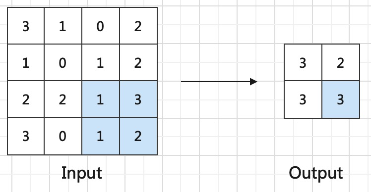
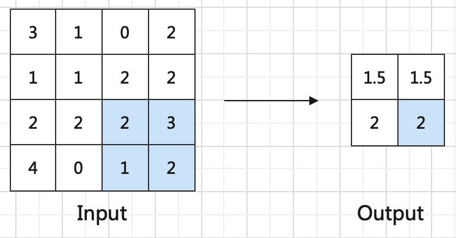

# 池化层

在网络设计中，我们常常使用<def>池化层（Pooling Layer）</def> 减小特征图的尺寸和参数数量，从而减少计算量和内存消耗，同时提高模型的鲁棒性和泛化能力。

## 作用


池化层作为神经网络中的一个重要组成部分，主要有以下几个作用：

- 减小特征图尺寸：池化层可以通过降低特征图的尺寸，减少神经网络中的参数数量和计算量，从而加速神经网络的训练和推理过程。

- 提取主要特征：池化层可以通过对特征图进行降维，保留输入特征图的主要特征，同时减少噪声和冗余信息的影响，提高模型的鲁棒性和泛化能力。

- 增强模型的平移不变性：池化层可以将输入特征图中的局部特征转换成全局特征，从而增强模型对于平移不变性的适应能力。这对于图像识别和物体检测等应用非常重要。

- 提高模型的泛化能力：池化层可以减少特征图中的噪声和冗余信息，从而提高模型的泛化能力，使得模型更加鲁棒和可靠。

总之，池化层作为神经网络中的一个重要组成部分，可以有效地减少参数数量和计算量，同时提取主要特征和增强模型的平移不变性，从而提高模型的性能和泛化能力。


## 最大池化层

<def>最大池化层</def>将输入特征图分割成若干个大小相等的矩形区域，对于每个区域中的像素，取其最大值作为该区域的输出值。最大池化的具体实现步骤如下：

1、将输入特征图分割成若干个大小相等的矩形区域，通常使用2×2的矩形区域。

2、对于每个区域中的像素，取其最大值作为该区域的输出值。

3、将所有输出值按照相同的顺序排列，得到最终的输出特征图。

其具体实现过程如下：



这里展示的是最常用的分割区域为2×2，步长为2的最大池化操作，每次将分割区域中最大的值作为输出特征图中的结果。

函数实现

```python
torch.nn.MaxPool2d(kernel_size, stride=None, padding=0)
```
具体参数解释如下

- kernel_size: 定义核大小，即从多大的局部特征图中计算
- stride: 定义步长，需要降采样几倍就可以设置为几，一般定义为2
- padding: 定义padding大小


## 均值池化层

<def>均值池化层</def>与最大池化层的操作一模一样，区别在于均值池化在对kernel size内局部感受野计算过程中，不再是提取最大值，而是计算均值。

下图是最常用的分割区域为2×2，步长为2的均值池化操作




函数实现

```python
torch.nn.MaxPool2d(kernel_size, stride=None, padding=0)
```
具体参数解释如下

- kernel_size: 定义核大小，即从多大的局部特征图中计算
- stride: 定义步长，需要降采样几倍就可以设置为几，一般定义为2
- padding: 定义padding大小


## 最大池化和均值池化的优缺点

均值池化层和最大池化层都是池化层中常用的类型，它们各有优缺点，具体如下：

均值池化层：

优点：

- 可以减少特征图中的噪声和冗余信息，提高模型的鲁棒性和泛化能力。
- 对于图像中的平滑区域，均值池化能够更好地平滑特征图，并且能够减小特征图中的噪声和冗余信息。
- 对于输入特征图的变化不敏感，对于输入特征图的微小变化会有较小的影响。
缺点：

- 对于图像中的边缘和纹理等信息的保留不如最大池化层，可能会降低模型的准确性。
- 对于输入特征图的变化不敏感，对于输入特征图中的重要信息可能会被平均化处理，导致模型性能下降。

最大池化层：

优点：

- 能够更好地保留输入特征图中的边缘和纹理等重要信息，提高模型的准确性。
- 对于输入特征图的微小变化非常敏感，对于输入特征图的重要信息能够得到更好的保留。
缺点：

- 对于图像中的平滑区域，最大池化可能会忽略一些重要信息。
- 对于特征图中的噪声和冗余信息的影响不如均值池化，可能会导致模型的鲁棒性和泛化能力下降。

综上所述，均值池化和最大池化各有优缺点，应根据具体的应用场景和需求进行选择。在一些需要保留细节信息的任务中，最大池化可能更适合；而在一些需要平滑特征图并减少噪声和冗余信息的任务中，均值池化可能更适合。

## 全局池化层

<def>全局池化层（Global Pooling Layer）</def>是一种池化层中的一种类型。通常用于卷积神经网络的最后一层，用于将特征图转换成一维向量，并将其输入到全连接层中进行分类或回归等任务。
其实说白了他就是上面最大池化层和均值池化层的一种特殊形式，当kernel size和输入特征尺寸相同时，就变成了全局池化层。

- 全局最大池化层：对每个特征图提取最大值，得到特征数相同，尺寸为1*1的输出
- 全局均值池化层：对每个特征图计算均值，得到特征数相同，尺寸为1*1的输出。