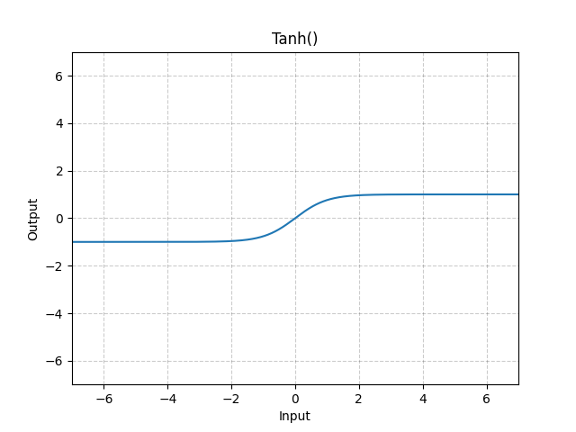

# 激活层

激活层是一个相对比较简单，但是深入研究又能很深的网络层。还记得我们神经元会经过一个激活函数得到输出吗？
激活层就是对特征图的每一个值应用激活函数，用来引入非线性性质和提高模型的表达能力。
常用的激活函数如之前介绍的sigmoid，还有这次要介绍的ReLU，tanh等。

## sigmoid函数

其函数表达式为

$$f(x)=1/(1+exp(-x))$$
， 可以将输入数据映射到[0,1]的范围内，用于进行二分类任务。

在pytorch中的函数实现方式如下

```python
torch.sigmoid(input)
```
该函数可以直接使用，参数只有一个简单的input。

## ReLU函数

<def>修正线性单元（Rectified Linear Unit， ReLU）</def>。
其函数表达式为

$$f(x)=max(0,x)$$

，可以将输入数据中的负值置为0，从而引入非线性性质，提高模型的表达能力。

该函数的图像表达如下：


ReLU函数的主要优点是简单、快速和有效，它在深度学习中被广泛使用。ReLU函数具有以下几个特点：

- 非线性：ReLU函数是一种非线性函数，可以引入非线性性质，提高模型的表达能力和适应能力。

- 稀疏性：由于ReLU函数将输入数据中的负值置为0，因此可以得到稀疏的特征表示，从而减少特征之间的相关性。

- 快速：ReLU函数的计算速度非常快，可以大大加速神经网络的训练和推理过程。

- 鲁棒性：ReLU函数对于输入数据中的噪声和异常值具有一定的鲁棒性，可以提高模型的泛化能力。

!!! Important

    需要注意的是，ReLU函数存在一个缺陷，即可能会出现“神经元死亡”问题。当输入数据中的负值较大时，ReLU函数的导数为0，导致梯度消失，从而使得该神经元无法更新。为了解决这个问题，可以使用LeakyReLU函数或其他改进版本的ReLU函数。LeakyReLU函数表达式为f(x)=max(αx,x)，其中α是一个小于1的常数，通常取0.01

在pytorch中的函数实现方式如下

```python
torch.nn.ReLU(inplace=False)
```
- inplace: inplace参数是一个布尔值，用于控制是否将计算结果直接覆盖到输入数据中，而不是创建一个新的张量来存储结果。当inplace参数为True时，ReLU函数将会直接修改输入数据中的负值，而不是创建一个新的张量来存储结果。当inplace参数为False时，ReLU函数将会创建一个新的张量来存储结果。建议在内存消耗较大的情况下设置inplace=True

注意该函数与torch.sigmoid不同，他需要先定义，然后再使用。代码如下

```python
import torch.nn as nn
m = nn.ReLU()
input = torch.randn(2)
output = m(input)
```

## tanh函数

tanh函数的计算过程与sigmoid函数类似，都是一种S型函数，可以将输入数据映射到一个有限的范围内。tanh函数的输出值范围在[-1,1]之间，当输入数据为0时，tanh函数的输出值为0；当输入数据为正数时，tanh函数的输出值在0到1之间；当输入数据为负数时，tanh函数的输出值在-1到0之间。
其函数表达式如下：

$$ tanh(x) = \frac{e^x - e^{-x}}{e^x+e^{-x}} $$

函数的图像表示如下：



tanh函数的主要优点是具有以下几个性质：

非线性：tanh函数是一种非线性函数，可以引入非线性性质，提高模型的表达能力和适应能力。

双曲性：tanh函数具有双曲性质，可以将输入数据映射到[-1,1]的范围内，使得输出值具有对称性，从而使得模型更加稳定和可靠。

可微性：tanh函数是一种连续可导的函数，可以方便地进行梯度计算和反向传播，加速神经网络的训练过程。


在pytorch中的函数实现方式如下

```python
torch.nn.Tanh()
```
应用时候代码如下：

```python
import torch.nn as nn
m = nn.Tanh()
input = torch.randn(2)
output = m(input)
```

但由于该函数计算复杂度较高，因此tanh函数使用场景并不多。


## 拓展
1、基于ReLU的改进函数有LeakyReLU、PReLU、ELU、ReLU6 等激活函数，你可以搜搜看他们有什么改进与作用。

2、最近有很多新的激活函数，如Mish、Swish等，你可以搜搜看他们有什么改进与作用。