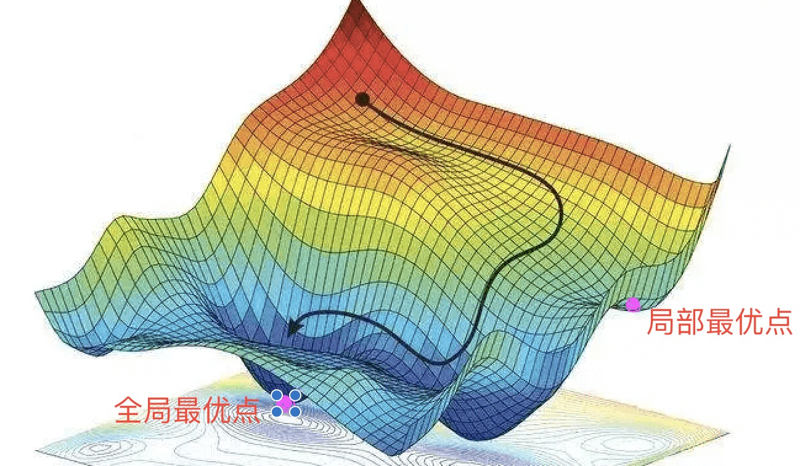

# 优化算法

## 介绍

什么是优化算法，他是用来找一批神经网络的参数 \( \theta \), 可以使损失函数显著降低的算法。
举个例子，深度学习实际就是使用网络去拟合一个复杂的函数，希望求出这个函数的最优解。但一般来说这个函数非常复杂，所以我们通过梯度下降一点点的修改网络参数。
所以在计算异或的时候，我们计算梯度后，利用公式
$$ 参数 -= -lr * 梯度 $$

来更新网络参数， 这种利用迭代的思想来尽可能的逼近问题最优解的算法就是优化算法。

常见的优化算法包括常见的优化算法包括梯度下降（Gradient Descent）、随机梯度下降（Stochastic Gradient Descent，SGD）、自适应梯度算法（Adaptive Gradient Algorithm，AdaGrad）、自适应矩估计算法（Adaptive Moment Estimation，Adam）等

下图展示了理想情况下，优化算法在寻找全局最优解时候的优化路径



图中z轴表示目标函数，越小越好。局部最小点表示此处梯度为0，此处的目标函数f(x)小于周围的任何点的目标函数。全局最优点表示此处梯度为0，但此处的目标函数f(x)小于作用域内任意点的目标函数。

## 梯度下降

介绍中举例的方法就是梯度下降法，他是最常用的一种优化算法。在每次迭代中，在当前位置寻找梯度下降最快的方向，来逐渐逼近优化的目标函数。且离目标函数越近，逼近的“步伐”也就越小。
梯度下降法的更新公式为：
$$ \theta_{t+1} = \theta_t - \eta \cdot \triangledown_{\theta}J(\theta) $$
\( \eta \)表示学习率，控制每次参数更新的幅值大小；符号表示顺着梯度的反方向；\( \triangledown_{\theta}J(\theta) \)表示梯度。

用图像表示如下


特别注意的是，梯度下降法虽然每次都是向全局最优解方向更新，但不一定能够找到全局的最优解，很有可能找到的是一个局部最优解。


## 随机梯度下降

由于梯度下降每次需要计算所有数据的梯度，导致运算时间长，运算复杂度大。因此SGD考虑计算一批随机数据的梯度来代替全部数据的梯度，进而更新参数。
在每次选取样本\( (x^i, y^i ) \)计算后，参数更新公式为
$$ \theta_{t+1} = \theta_t - \eta \cdot \triangledown_{\theta}J(\theta, x^i, y^i) $$

SGD的好处是计算速度快，每次迭代并不是都向着整体最优化方向，导致梯度下降的波动非常大，反而容易跳出局部最优解。

缺点是每批次数据是随机的，所以计算的代价函数会有严重震荡，不过可以通过减小学习率缓解。


## 动量优化法

为了实现更加平稳和快速的参数更新，提高模型的性能。一般会在梯度下降的基础上，引入动量的概念。

动量的概念来自物理学，当我们将一个小球从山上滚下来，没有阻力时，它的动量会越来越大，但是如果遇到了阻力，速度就会变小。但不至于遇到一个小坑就出不来，因为还有之前的一股"冲劲"，如此避免进入局部最小值。

具体来说，动量优化法在每一次迭代中，不仅使用当前的梯度信息进行参数更新，还引入一个动量向量，用于记录之前参数更新的方向和大小。使得梯度方向在不变的维度上，参数更新变快，梯度有所改变时，更新参数变慢。
动量向量可以在参数更新的过程中，平滑地引导参数的移动方向，从而减少参数更新的震荡和波动，提高模型的收敛速度和稳定性。

动量优化法的更新公式为：

$$ v_t = \beta v_{t-1} + (1 - \beta) \nabla J(\theta) $$
$$ θ = θ - \eta v_t $$

其中v表示动量， \( \beta \)是动量系数，\( \nabla J(\theta) \)是损失函数关于模型参数的梯度，\( \theta \)是模型参数，\( \alpha \)是学习率。

## 学习率

在之前的梯度下降算法中，我们一直在使用一个参数 \( \eta \)，学习率。它用于控制模型参数在每一次迭代中的更新步长和速度。
较小的学习率会导致模型收敛速度较慢，但可能会得到更准确的结果；而较大的学习率会导致模型收敛速度较快，但可能会出现震荡和不稳定的情况。
下图中，左边展示了学习率过大导致的震荡，右边为学习率太小导致的收敛过慢的问题。


通常，学习率的选择和调整可以采用以下几种方法：

固定学习率：在模型训练过程中，将学习率固定为一个常数值，不随着迭代次数的增加而改变。这种方法比较简单，但可能会导致模型收敛速度较慢或出现过拟合等问题。

学习率衰减：在模型训练过程中，随着迭代次数的增加，逐渐降低学习率的大小。学习率衰减方法可以加速模型的收敛速度，避免过拟合和震荡等问题。

自适应学习率：在模型训练过程中，根据模型的参数更新情况，自适应地调整学习率的大小。常见的自适应学习率算法包括 AdaGrad、RMSprop、Adam 等。

最后一点你看不懂没关系，我们接下来就详细介绍一下。

## 自适应学习率优化算法

刚才我们谈到学习率的设置需要和训练过程共同使用，且过大或者过小都不行，因此如何设置学习率是一件至关重要的事情。

此外，梯度下降中学习率对每个维度都是相同的，这限制了对不同维度的适应问题。因此Adagrad算法根据自变量在每个维度的梯度值的大小来调整各个维度上的学习率，从而避免统一的学习率难以适应所有维度的问题。

Adagrad算法的基本思想是对每个参数的历史梯度平方进行累加，并将其作为学习率的分母，从而使得对于频繁出现的参数，其学习率相对较小，而对于不频繁出现的参数，其学习率相对较大。

具体来说，他在原来的基础上加入了一个梯度的累加变量 \( S_t \),

$$ S_t \leftarrow  S_{t-1} + g_t \odot g_t $$

然后对学习率根据累加梯度进行调整，

$$ x_t \leftarrow x_{t-1} - \frac{ \alpha }{ \sqrt{s_t+\epsilon } } \odot g_t $$

其中 \( \epsilon \)是一个很小的数字，为了维持数值的稳定性。

Adagrad算法是一种自适应学习率的优化算法，它在每个参数上使用不同的学习率，根据参数的历史梯度来自适应地调整学习率，以便于在训练初期时有更大的学习率，后期则逐渐减小学习率。

Adagrad算法的缺点是会使得学习率逐渐变小，最终可能导致学习率过小而难以收敛。


## RMSProp

鉴于Adagrad 使学习率变小的缺点，RMSProp使用了和动量法类似的思想，对梯度和累加变量利用指数加权平均，

$$ S_t \leftarrow  \gamma S_{t-1} + (1-\gamma )g_t \odot g_t $$

然后将目标函数自变量中每个元素的学习率通过按元素运算重新调整，更新自变量，

$$ x_t \leftarrow x_{t-1} - \frac{ \alpha }{ \sqrt{s_t+\epsilon } } \odot g_t $$


## Adam

Adam是在RMSProp的基础上，引入动量的想法改进的，不仅对累加状态变量 \( s_t \) 进行指数加权平均，还对每一个小批量的梯度 \( g_t \) 进行指数加权平均。

1、首先对动量变量进行加权平均

$$ v_t \leftarrow  \beta_1 v_{t-1} + (1-\beta_1 )g_t $$

2、对状态变量的指数加权平均

$$ s_t \leftarrow  \beta_2 s_{t-1} + (1-\beta_2 )g_t \odot g_t $$

默认\( \beta_1=0.9 \) , \( \beta_2=0.999 \)。所以方差估计的移动远远慢于动量估计的移动。

3、
如果 mt 和 vt 被初始化为 0 向量，那它们就会向 0 偏置，进而导致学习率过大，从而影响模型的收敛。
因此Adam算法中使用了偏差校正来消除初始偏差的影响，使得在初始阶段学习率不会过大，从而提高模型的收敛速度和泛化能力。

$$ \hat{v_t} = \frac{ v_t }{ 1 - \beta_1^t } $$

$$ \hat{s_t} = \frac{ s_t }{ 1 - \beta_2^t } $$

4、更新参数

$$ x_t \leftarrow x_{t-1} - \frac{ \alpha\hat{v_t}  }{ \sqrt{\hat{s_t}+\epsilon } } $$


## 实现
简单介绍一下SGD和Adam在pytorch中如何实现，主要分为定义和更新两步

```python
import torch
import torch.optim as optim

# 定义模型
model = ...

# 定义损失函数
criterion = ...

# 定义优化器，学习率为0.01，动量为0.9
optimizer = optim.SGD(model.parameters(), lr=0.01, momentum=0.9)
# 定义优化器，学习率为0.001
# optimizer = optim.Adam(model.parameters(), lr=0.001)

# 训练模型
for epoch in range(num_epochs):
    for inputs, labels in train_loader:
        # 前向传播
        outputs = model(inputs)
        loss = criterion(outputs, labels)

        # 反向传播
        optimizer.zero_grad()
        loss.backward()
        optimizer.step()
```

在使用优化器时，需要将模型的参数传递给优化器对象，然后在每次训练迭代时调用optimizer.zero_grad()清空梯度缓存，调用loss.backward()计算梯度，最后调用optimizer.step()更新模型参数。可以根据实际需求调整优化器的超参数，如学习率、动量、权重衰减等。


## 评价
由于SGD和Adam是比较具有代表性的两种优化方法，因此我们将对他们进行评价。

Adam算法的优点：

自适应性：Adam算法可以自适应地调整每个参数的学习率，根据参数的历史梯度来自适应地调整学习率，从而加快收敛速度，提高模型的泛化能力。

可以处理稀疏梯度：Adam算法可以处理稀疏梯度，对于很多实际问题来说，梯度通常是稀疏的，这时使用Adam算法会比SGD更加稳定。

不需要手动调整学习率：Adam算法不需要手动调整学习率，因为它可以自适应地调整每个参数的学习率，从而避免了手动调整学习率的麻烦和不确定性。

Adam算法的缺点：

需要更多的计算资源：Adam算法需要更多的计算资源，因为它需要维护每个参数的一阶矩和二阶矩，而SGD只需要维护一阶梯度即可。

SGD算法的优点：

计算简单：SGD算法的计算量比较小，只需要计算每个参数的一阶梯度，因此可以节省计算资源。

对小数据集效果较好：对于小数据集，SGD算法的效果通常比Adam算法更好，因为小数据集中的梯度通常比较稳定，不需要使用自适应学习率的方法。

SGD算法的缺点：

容易陷入局部最优解：SGD算法容易陷入局部最优解，因为它只考虑了当前的梯度方向，可能会错过全局最优解。

需要手动调整学习率：SGD算法需要手动调整学习率，因为学习率过大会导致震荡，学习率过小会导致收敛速度过慢。手动调整学习率需要经验和尝试，比较麻烦。


