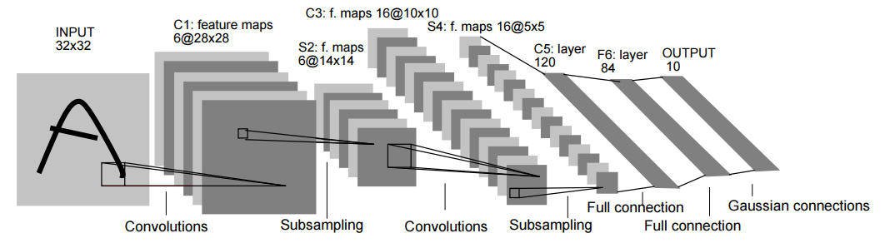

# 卷积神经网络实现minist分类

通过本节一个个神经网络的子模块介绍，您已经了解了各个组件的功能及作用。但如盲人摸象。如果仅仅看到部分很难去理解网络整体的情况。
为了帮助您对卷积神经网络有一个整体的了解，本次我们希望利用torch组件设计LeNet实现MNIST字符识别，帮助您更深的理解。


## 环境安装

因为我们的网络比较简单，因此可以直接在mac或者linux系统上使用以下命令安装torch及相关的包。

```python
pip install torch, torchvision
```

## Lenet介绍

LeNet是一种经典的卷积神经网络模型，由Yann LeCun等人在1998年提出，主要用于手写数字识别任务。LeNet是第一个成功应用卷积神经网络的模型，为后来的卷积神经网络模型的发展奠定了基础。其网络结构如下



现在我们通过图像介绍一下网络结构，而能看懂网络结构图也是您之后学习中必备的技能。

1、Input

输入是一个宽高为32*32，通道为1的图像。

2、C1

从图中可以看出，C1是input通过卷积得到的通道数为6的特征图，每个特征图的尺寸为28*28。

但卷积的具体参数需要看论文的设置，具体为kernel size = 5 * 5，stride=1，padding=0。


3、S2

S2是C1通过步长为2的降采样得到的特征图，其通道数不变，尺寸变为原来的1/2，即14*14。

池化的方式图中也无法看出，通过论文得知是平均池化，此外后面还接了一个sigmoid层引入非线性。

4、C3

图中可以看出，C3是S2通过卷积得到的通道数为16的特征图，每个特征图的尺寸为10*10。

但卷积的具体参数需要看论文的设置，具体为kernel size = 5 * 5，stride=1，padding=0。

5、S4

S4是C3通过步长为2的降采样得到的特征图，其通道数不变，尺寸变为原来的1/2，即5*5。

池化的方式图中也无法看出，通过论文得知是平均池化，此外后面还接了一个sigmoid层引入非线性。

6、C5

C5 是一个通道数为120，宽高均为1的特征图。但具体怎么从二维变成一维的问题，在介绍池化层时我们提到可以采用全局池化。
但这里通过flatten函数将特征展平，变为[16*5*5, 1]的一维向量，然后在采用全连接层转为[120, 1]的向量。

7、F6

F6 同样是通过全连接层得到的[80,1]的向量。

8、OUTPUT

output是通过全连接层得到[10,1]的向量，对应分类为0-9共10个数字的概率。论文采用了高斯激活。

总体而言LeNet作为作为最早的CNN，已经初步具备了 "卷积-降尺寸-激活" 等提取特征流程。最后通过全连接输出不同类的概率。
之后的模型大体也是按照该流程，区别在于不同组件的顺序修改、组件替换、网络加深等。

## LeNet网络搭建
趁热打铁，我们现将上述步骤通过torch实现，代码如下
```python
# 定义 LeNet 网络
class LeNet(nn.Module):
    def __init__(self):
        super(LeNet, self).__init__()
        self.conv1 = nn.Conv2d(1, 6, 5)
        self.pool1 = nn.MaxPool2d(2, 2)
        self.conv2 = nn.Conv2d(6, 16, 5)
        self.pool2 = nn.MaxPool2d(2, 2)
        self.fc1 = nn.Linear(16 * 4 * 4, 120)
        self.fc2 = nn.Linear(120, 84)
        self.fc3 = nn.Linear(84, 10)

    def forward(self, x):
        x = self.pool1(torch.relu(self.conv1(x)))
        x = self.pool2(torch.relu(self.conv2(x)))
        x = x.view(-1, 16 * 4 * 4)
        x = torch.relu(self.fc1(x))
        x = torch.relu(self.fc2(x))
        x = self.fc3(x)
        return x
```
在网络输出层，我们删除了高斯激活。

## 导入库函数
首先需要导入所需的库函数，代码如下
```python
import torch
import torch.nn as nn
import torch.optim as optim
import torchvision
import torchvision.transforms as transforms
```


## 定义数据
torchvision包里面包含了MNIST的数据集，所以我们这里使用<fun>torchvision.datasets.MNIST</fun>调用即可。<fun>transform</fun>参数接受一个<fun>torchvision.transforms</fun>中定义的变换操作，用于对数据进行预处理和数据增强。  <fun>torch.utils.data.DataLoader</fun>是 PyTorch 中的一个数据加载器，它可以帮助我们更方便地对数据进行批量处理和迭代。

```python
# 加载数据集并进行预处理
transform = transforms.Compose(
    [transforms.ToTensor(),                    # 转为tensor数据
     transforms.Normalize((0.5,), (0.5,))])    # 减均值除方差进行归一化

trainset = torchvision.datasets.MNIST(root='./data', train=True,
                                        download=True, transform=transform)
trainloader = torch.utils.data.DataLoader(trainset, batch_size=64,
                                          shuffle=True, num_workers=2)

testset = torchvision.datasets.MNIST(root='./data', train=False,
                                       download=True, transform=transform)
testloader = torch.utils.data.DataLoader(testset, batch_size=64,
                                         shuffle=False, num_workers=2)
```

## 损失函数和优化器

```python
# 定义损失函数和优化器
net = LeNet()
criterion = nn.CrossEntropyLoss()
optimizer = optim.SGD(net.parameters(), lr=0.01, momentum=0.9)
```

## 定义训练主干
```python
# 训练网络
for epoch in range(10):  # 进行 10 次训练循环
    running_loss = 0.0
    for i, data in enumerate(trainloader, 0):
        inputs, labels = data
        optimizer.zero_grad()

        # 前向传播、反向传播、优化
        outputs = net(inputs)
        loss = criterion(outputs, labels)
        loss.backward()
        optimizer.step()

        running_loss += loss.item()
        if i % 100 == 99:
            print('[%d, %5d] loss: %.3f' %
                  (epoch + 1, i + 1, running_loss / 100))
            running_loss = 0.0

print('Finished Training')


# 测试网络
correct = 0
total = 0
with torch.no_grad():
    for data in testloader:
        images, labels = data
        outputs = net(images)
        _, predicted = torch.max(outputs.data, 1)
        total += labels.size(0)
        correct += (predicted == labels).sum().item()

print('Accuracy of the network on the 10000 test images: %d %%' % (
    100 * correct / total))
```

## 总结
通过上述代码你已经成功复现了MNIST文本识别，此时你可以尝试更改一下修改不同池化层，不同激活函数看看是否能得到不同的结果。
完整的代码可以在[这里](https://github.com/learnAI-CN/learnAI-code/blob/main/03-lenet-minist.py)找到。其实这个完整代码也是由ChatGPT实现的。
