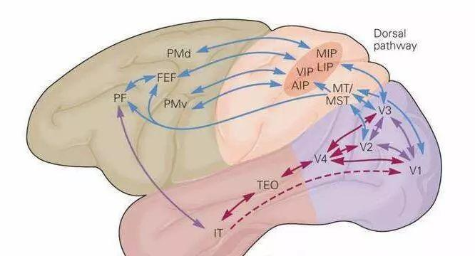
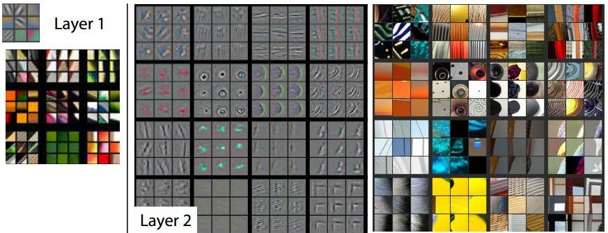
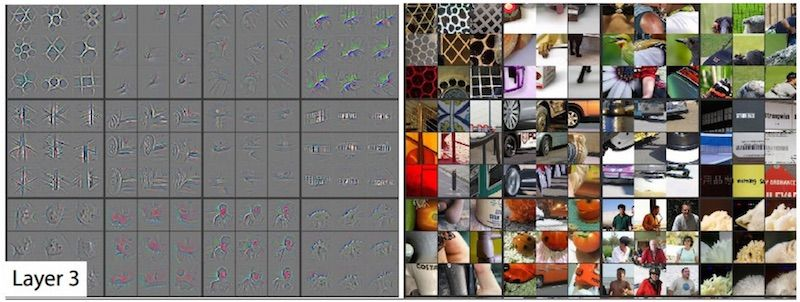

# 为什么卷积神经网络有效

通过本章的介绍，你已经发现深度卷积神经网络可以轻松的完成字符识别，实际上它还可以做更复杂的任务。
但即使我们理解网络每一层的作用及实现原理，我们知道前向，反向传播的作用。我们仍然很难从整体来说为什么神经网络可以实现这些任务。

一般来说对DCNN有效性的解释分为两种，一种是从数学角度的分析，对网络的表示能力、映射特性的数学分析；第二个方面是卷积网络和动物视觉系统关系的研究，分析二者的关系有助于理解、设计更好的方法，同时也促进了神经科学的进步。

## 数学角度

从数学上看，多层神经网络本质上是一个复合函数。通过选择合适的激活函数和适当的网络结构，神经网络就可以实现对任何一个从输入向量到输出向量的连续映射函数的逼近，这个结论称为万能逼近（universal approximation）定理。

具体来说，万能逼近是基于以下两个定理：

Cybenko定理：任何具有有限输入和输出维度的连续函数，都可以用一个具有至少一个隐层的前馈神经网络来逼近。其中，隐层的大小可以是任意的，而且激活函数必须是sigmoid函数或tanh函数。

Hornik定理：任何具有有限输入和输出维度的连续函数，都可以用一个具有至少一个隐层的前馈神经网络来任意逼近。其中，隐层的大小可以是任意的，而且激活函数可以是任何连续、单调递增的函数。

这些定理表明，神经网络具有很强的逼近能力，可以在任意精度下逼近任何连续函数。然而，在实际应用中，神经网络的具体表现和性能受到许多因素的影响，如网络结构、参数初始化、学习率、正则化等。因此，神经网络的实际表现和性能需要根据具体任务和数据进行优化和调整。

## 仿生学角度

视觉神经科学认为，人在认知图像时是分层抽象的，首先理解的是颜色和亮度，然后是边缘、角点、直线等局部细节特征，接下来是纹理、几何形状等更复杂的信息和结构，最后形成整个物体的概念。

目前已经证明，视觉皮层具有层次结构。从视网膜传来的信号首先到达初级视觉皮层（primary visual cortex），即V1皮层。V1皮层简单神经元对一些细节、特定方向的图像信号敏感。
V1皮层处理之后，将信号传导到V2皮层。V2皮层将边缘和轮廓信息表示成简单形状，然后由V4皮层中的神经元进行处理，它颜色信息敏感。复杂物体最终在IT皮层（inferior temporal cortex）被表示出来。

而卷积神经网络可以看成是上面这种机制的简单模仿。它由多个卷积层构成，每个卷积层包含多个卷积核，用这些卷积核从左向右、从上往下依次扫描整个图像，得到称为特征图（feature map）的输出数据。
网络前面的卷积层捕捉图像局部、细节信息，有小的感受野，即输出图像的每个像素只利用输入图像很小的一个范围。后面的卷积层感受野逐层加大，用于捕获图像更复杂，更抽象的信息。经过多个卷积层的运算，最后得到图像在各个不同尺度的抽象表示。

Yann LeCun的得意门生Matthew Zeiler在2013年专门写了一篇论文，阐述了用反卷积网络可视化整个卷积网络，并进行分析和调优。他在ImageNet上的特征可视化分析如下：

对于一个给定的feature map,我们选择其中响应最大的9个pixel。每个Layer的左边表示通过这9个响应通过反卷积得到的可视化输出，右侧代表该响应对应输入中的感受野。
例如,在layer5的第一行第二列(红框中的9个)，这些图片块似乎没有什么共同之处，但是从左边的可视化结果我们可以看出，这个特殊的feature map关注的是背景中的草，而不是前景中的物体。

所以每个层中的投影显示出网络中特征的分层特性。第二层响应角落和其他的边缘/颜色信息，层三具有更复杂的不变性，捕获相似的纹理，层四显示了显著的变化，并且更加类别具体化，层五则显示了具有显著姿态变化的整个对象。
这些证明了网络其实是在模拟人类大脑的实现。

这又引出一个问题，我们探索挖掘神经网络的能力，是否要以对脑科学的认识为基础，进而设计网络模拟大脑。还是向飞机一样通过空气动力学，而非像鸟儿一样一定要设计出挥动的翅膀。其实目前来看后者好像更占上风。

