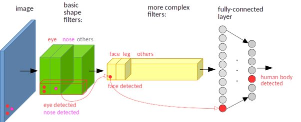
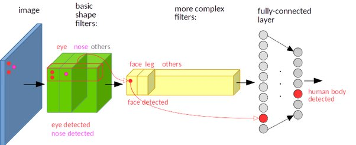
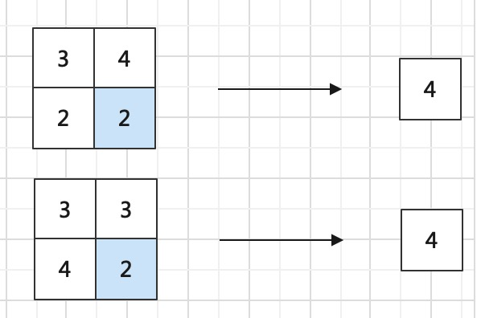
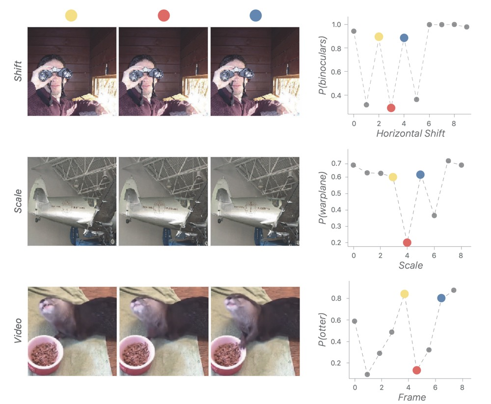

# 深度卷积神经网络的特性

DNN一般包含<def>平移不变性</def>，<def>旋转不变性</def>和<def>尺度不变性</def>。它们可以提高神经网络的泛化能力和鲁棒性，从而适应更广泛的应用场景。
但目前为什么具有这些不变性并没有统一的解释，此外更有其他工作怀疑网络是否具备这些不变性，这些只做拓展讨论。

## 三性介绍

DNN的平移不变性，旋转不变性和尺度不变性是指当输入图像无论被平移，被旋转，还是被缩放，输出的分类结果都不会变化。
举例来说，一张猫的图像，无论猫在左上角还是在右下角，无论是正着还是旋转了一定度数，无论是1080P还是540P，网络都能正确分类为猫。
毫无疑问人类具备这样的能力，我们认为正常的DNN也具备这种能力，否则将极大限制网络的应用。

## 平移不变形的原因

一般认为网络具备平移不变形是 Conv+maxpooling 的原因。

对于卷积，无论图像中目标在哪里，对应位置的卷积核都可以学到相应的特征表示。如下图所示

输入图像的左下角有一个人脸，经过卷积，人脸的特征（眼睛，鼻子）也位于特征图的左下角。

假如人脸特征在图像的左上角，那么卷积后对应的特征也在特征图的左上角。

因此网络可以通过卷积核的自我学习能力实现平移不变性。

池化层可以对感受野目标内的图像无论位移到哪里，经过池化后输出的激活都是相同的。 如下图所示，无论最大激活值在哪里，最后的输出都是相同的。

## 不同意见

也有工作认为网络只具备微弱的平移不变性，但不具备旋转、尺寸不变性。该观点主要来自论文[why do deep convolutional networks generalize so poorly to small image transformations](https://arxiv.org/pdf/1805.12177.pdf)
该文章通过对比不同网络发现：微小的平移或形变都会极大地改变输出结果。对于卷积和池化论文也有不同观点

- 步长为1的卷积层是有不变性的，但是步长不为1的卷积层和池化层却没有不变性。
- 池化层反而会破坏模型的不变性。

如下图所示，

在视频的连续帧中，网络预测会因为微小的平移变化，尺度变化和水獭的姿势改变导致预测结果急剧变差。

另一篇工作 [Object Detection in 20 Y ears: A Survey](https://arxiv.org/pdf/1905.05055.pdf) 认为，网络的旋转不变性和尺度不变性是通过数据增强使网络训练学习得到的。

## 参考

https://www.quora.com/How-is-a-convolutional-neural-network-able-to-learn-invariant-features
https://zhuanlan.zhihu.com/p/103342289