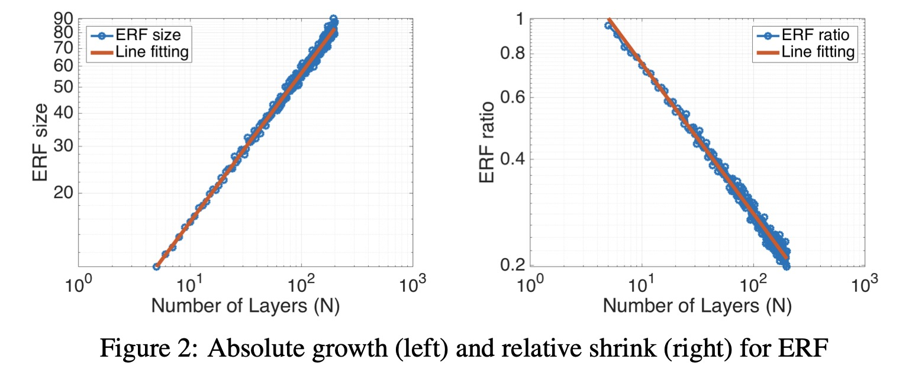

# 感受野

<def>感受野（Receptive Field）</def>用于描述网络中每个神经元对于输入数据的感受区域大小。

## 基本理解

在卷积神经网络中，每一层的特征图都是由上一层的特征图通过卷积操作得到的。因此，每个神经元的感受野大小可以由上一层神经元的感受野大小和卷积核大小确定。
通常情况下，感受野的大小会随着网络层数的增加而增大，因为每一层的特征图都是由上一层的特征图通过卷积操作得到的，而卷积核的大小通常不变。
如下图所示，

[//]: # (![]&#40;../../img/02/09/03/img1.png&#41;)

我们认为网络经过三层卷积后，第三层的黄色的神经元包含了输入中\( 5*5 \)的输入的图像信息，因此Layer3的感受野为5。

## 计算公式

一般来说，感受野的计算可以采用从最后层向前面递推计算。

- 池化层：如果正向池化层的感受野为m*m，则反向计算感受野时候

$$ RF_i= RF_{i+1}*m $$

- 卷积层：定义步长\( S_i \), 卷积核\( K_i \)，则反向计算感受野

$$ RF_i= (RF_{i+1}-1) * S_i + K_i $$

综上倒推可以逐层计算感受野的大小。

## 作用

- 小尺寸的卷积代替大尺寸的卷积，可减少网络参数、增加网络深度。在第四章我们会介绍

- 感受野的值越大表示蕴含的特征更为全局、语义层次更高；而值越小则表示其所包含的特征越趋向于局部和细节。

- 分类和检测任务中，如果感受野过小，网络不容易训练收敛。

## 有效感受野

刚才谈的都是理想状态下感受野的计算,可以记作<def>理想感受野</def>。但是感受野特征图中的每个像素值并不是同等重要，一个像素点越接近感受野中心，它对输出特征的计算所起作用越大，这意味着 某一个特征不仅仅是受限在输入图片某个特定的区域，而且呈指数级聚焦在区域的中心。 该聚焦区域即为<def>有效感受野（effective receptive field，ERF）</def>。

所以有效感受野占理论感受野很小的一部分，并且呈高斯分布。一般网络更多的保留了局部信息。

在论文[《Understanding the Effective Receptive Field in Deep Convolutional Neural Networks》](https://arxiv.org/pdf/1701.04128.pdf)中，作者使用多种不同的架构、激活函数等来进行有效感受野的可视化实验。并得到如下结论。

1、有效感受野区域是类高斯分布

如下图所示

没有非线性激活的uniformly和randomly加权的卷积核具有完美的高斯形状，具有非线性的randomly加权的卷积核接近高斯形状。ReLU这种非线性激活使分布趋向于远离高斯分布。

2、\( \sqrt{n} \)绝对增长，\( \frac{1}{\sqrt{n}} \)相对衰减

上图中，左边展示了理论感受野的尺寸随网络层数成正相关，线性拟合后相关系数为\( \sqrt{n} \)。右边为 有效感受野和理论感受野的比例随网络层数的变化呈负相关，相关系数为\( \frac{1}{\sqrt{n}} \)。
所以有效感受野其实和理论感受野相乘的话，有效感受野基本随网络层数加深并没有什么变化。这也说明了有效感受野是远小于理论感受野的。

3、下采样（Subsample）和扩张卷积（Dialtion convolution）会提高有效感受野

4、训练会提高有效感受野范围

上图展示了CIFAR-10分类和CamVid语义分割任务训练的模型训练前后的ERF比较，显而易见，训练后感受野是变大的，这也符合我们的直觉。

5、合理的权重初始化，可以提高感受野和加速收敛。

## 参考
https://blog.csdn.net/weixin_42782150/article/details/108725423
https://arxiv.org/pdf/1701.04128.pdf