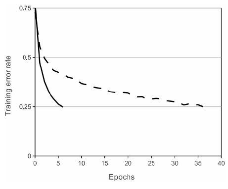
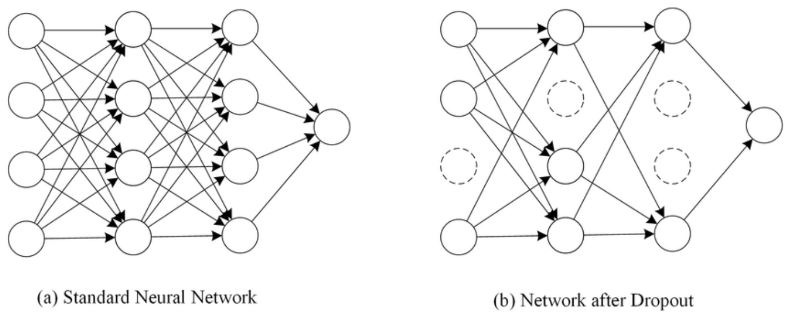

# AlexNet

## 说在本章之前
关于本章的几个经典网络，相关文章浩如烟海，层出不穷。我一直在想我该通过怎样的方式才能讲出所有您所需要的内容。为此，
我希望

1）在每个文章之前将他的特点先简单罗列出来，您可能刚看到还不明白，但您可以在之后详细内容中遇到这些点，此时就需要您稍加留意了。

2）我们在每节都会提供网络的代码，希望您能实现cifar10/cifar100分类任务。同时我会罗列一下改进的方向，希望您能通过修改代码更深入的理解网络内容。

## AlexNet特点
- 使用ReLU激活函数
- 使用DropOut避免过拟合
- 采用大数据集训练
- 对数据集进行增扩操作
- 多GPU训练
- 使用重叠的maxpooling
- 使用LRN归一化层


## AlexNet简介

虽然LeNet在80年代就被提出，但当时计算机硬件和软件的性能都比较有限，不足以支持更深、更宽的神经网络模型，因此LeNet的应用范围受到了一定的限制。
人们不确定卷积神经网络是否能处理更复杂更大的数据。

随着计算机硬件和软件的发展，特别是GPU的出现，神经网络模型的计算能力得到了很大的提升，可以更加高效地训练深度卷积神经网络模型。
同时，随着数据集的不断增加，也为深度卷积神经网络的发展提供了更加丰富的数据支持。

在这种背景下，由Alex Krizhevsky等人在2012年提出AlexNet，主要用于ILSVRC2012图像分类比赛，获得了当年的冠军。他可以算作现代深度卷积神经网路的开山之作，为后来的卷积神经网络模型的发展奠定了基础。
AlexNet采用了更深、更宽的网络结构，采用了较大的卷积核和ReLU激活函数，使用了局部响应归一化（Local Response Normalization，LRN）处理，同时全连接层的设计也有所不同。他的设计更加复杂，可以处理更加复杂的数据，如高分辨率的图像数据。

## AlexNet网络结构

AlexNet网络结构如下：


网络主要包含五个卷积层（Convlution），三个重叠的最大池化层（Overlapping MaxPooling）和三个全连接层（Full Connected，FC）。
以下将整体介绍不同块的构成，可能有些组件您现在还不了解，但我希望能先给你一个整体拼图，之后会具体介绍单独的细节。

- Input：256x256的RGB三通道图像。因此输入维度是training_numx256x256x3。
- Layer1：Conv+ReLU+Pooling+LRN。其中Conv采用96个11x11大小的卷积核，步长为4。Overlapping MaxPooling采用3x3卷积核，步长为2。
- Layer2：Conv+ReLU+Pooling+LRN。其中Conv采用256个5x5的卷积核，步长为1，padding=2。Overlapping MaxPooling采用3x3卷积核，步长为2。
- Layer3：Conv+ReLU，其中Conv采用384个3x3的卷积核，步长为1，padding=1。
- Layer4：Conv+ReLU，其中Conv采用384个3x3的卷积核，步长为1，padding=1。
- Layer5：Conv+ReLU+Pooling+Dropout，其中Conv采用256个3x3的卷积核，步长为1，padding=1。Overlapping MaxPooling采用3x3卷积核，步长为2。Dropout rate=0.5。
- Layer6：FC+ReLU+Dropout，输出4096个神经元。ropout rate=0.5。
- Layer7：FC+ReLU，输出4096个神经元
- Output：FC+ReLU，1000个神经元。

## ReLU介绍
之前我们在激活函数简单介绍过ReLU，此处详细介绍AlexNet为什么采用ReLU引入非线性。
首先引入两个概念，饱和函数和非饱和函数
- 饱和函数：当自变量趋于无穷大的时候，其值有界。如tanh函数值域为[-1, 1]
- 非饱和函数：当自变量趋于无穷大的时候，其值也趋向无穷大。如ReLU函数当输入趋于无穷大，值也为无穷大。

由于非饱和函数比饱和函数在梯度下降时收敛速度更快，所以作者采用ReLU替代tanH函数。下图展示了在一个4层的卷积网络中使用ReLU函数和tanH函数对比。
在CIFAR-10数据集上达到25%的训练错误率RelU要比相同条件下使用tanh函数快6倍。



此外，ReLU函数由于是线性的，所以其导数始终为1，可以极大减少计算量。

## Dropout

引入Dropout主要是为了防止过拟合。在神经网络中Dropout通过修改神经网络本身结构来实现，对于某一层的神经元，通过定义的概率将神经元置为0，
这个神经元就不参与前向和后向传播，就如同在网络中被删除了一样，同时保持输入层与输出层神经元的个数不变，然后按照神经网络的学习方法进行参数更新。
在下一次迭代中，又重新随机删除一些神经元（置为0），直至训练结束。



需要注意的是，Dropout只在训练中将某些神经元置0，测试时依旧采用所有的参数。就像演戏时候随机几个部队完成某项任务，真正打仗时候所有部队一起出动。
在另一个意义上来讲，你可以把每次训练时候留下的神经元作为一个网络，这样其实训练过程训练了多个网络，最终的结果由这些多个网络共同决定。

## 大数据集训练
作者在论文中认为自己的贡献点包含：训练了一个很大的CNN来处理大规模数据并取得了目前最好的成绩。这一点毋庸置疑，因为AlexNet确实是大数据集
训练深度卷积神经网络的先河。那之前为什么没人使用大数据集训练呢？因为1）之前缺乏大数据集。但这个显然不是主要原因，毕竟缺乏可以采集嘛。
2）运算资源不足。之前计算机硬件的性能也非常有限，神经网络的训练需要花费大量的时间和计算资源，这也限制了神经网络在大规模数据集上的应用。
3）容易过拟合。所以AlexNet采用了更大的网络，Dropout，数据增扩等方式解决过拟合，提升网络泛化性。而这几点直到目前依旧是解决过拟合问题的主要途径。

## 数据增扩
AlexNet在训练时，在数据扩充（data augmentation）这样处理： 

（1）随机裁剪，对256×256的图片进行随机裁剪到224×224，然后进行水平翻转，相当于将样本数量增加了（（256-224）^2）×2=2048倍； 

（2）测试的时候，对左上、右上、左下、右下、中间分别做了5次裁剪，然后翻转，共10个裁剪，之后对结果求平均。作者说，如果不做随机裁剪，大网络基本上都过拟合； 

（3）对RGB空间做PCA（主成分分析），然后对主成分做一个（0, 0.1）的高斯扰动，也就是对颜色、光照作变换，结果使错误率又下降了1%。

## 使用重叠的maxpooling
此前CNN中普遍使用平均池化，AlexNet全部使用最大池化，避免平均池化的模糊化效果。
并且AlexNet中提出让步长比池化核的尺寸小的观点，这样池化层的输出之间会有重叠和覆盖，提升了特征的丰富性。实际使用kernel size=3，stride=2。
但能否提升特征丰富度很难说，因为后来的网络设计一般采用相同的kernel size 和 步长。

## 使用LRN归一化层
这一点放在最后是因为这个好像真没用，至少是后来的网络设计不常用。
由于ReLU函数不像tanh和sigmoid一样有一个有限的值域区间，所以在ReLU之后需要进行归一化处理，
LRN的思想来源于神经生物学中一个叫做“侧抑制”的概念，指的是被激活的神经元抑制周围的神经元。
所以对局部神经元的活动创建竞争机制，使得其中响应比较大的值变得相对更大，并抑制其他反馈较小的神经元，增强了模型的泛化能力。


## 代码实现
这里我们希望能用AlexNet分类Cifar10。首先要介绍以下cifar10。
CIFAR-10数据集是机器学习和计算机视觉领域中常用的数据集之一，被广泛用于图像分类、目标识别、物体检测等任务的研究和评估。
由于CIFAR-10数据集的图像尺寸较小、类别较少，因此相对于其他数据集，它的计算资源和训练时间要求较低，适合用于模型设计和算法研究的快速验证。
CIFAR-10数据集包含10个类别的32x32像素的RGB彩色图像，每个类别有6000张图像，共有50000张训练图像和10000张测试图像。

### 数据加载
```python
import torch
import torchvision
from torchvision import transforms as transforms

transform = transforms.Compose(
    [transforms.RandomHorizontalFlip(), 
     transforms.ToTensor(), 
     transforms.Normalize((0.5, 0.5, 0.5), 
                          (0.5, 0.5, 0.5))])

cifar10_classes = ('plane', 'car', 'bird', 'cat',
                   'deer', 'dog', 'frog', 'horse', 'ship', 'truck')


def cifar10_loader(train=True, batch_size=128):
    set = torchvision.datasets.CIFAR10(root='~/data', train=train,
                                       download=True, transform=transform)
    loader = torch.utils.data.DataLoader(set, batch_size=batch_size,
                                         shuffle=True, num_workers=4)
    return loader
```

### 模型定义
```python
class AlexNet(nn.Module):

    def __init__(self, num_classes=10):
        super(AlexNet, self).__init__()
        self.features = nn.Sequential(
            nn.Conv2d(3, 64, kernel_size=3, stride=1, padding=2),
            nn.ReLU(inplace=True),
            nn.MaxPool2d(kernel_size=2),
            nn.Conv2d(64, 192, kernel_size=3, padding=2),
            nn.ReLU(inplace=True),
            nn.MaxPool2d(kernel_size=2),
            nn.Conv2d(192, 384, kernel_size=3, padding=1),
            nn.ReLU(inplace=True),
            nn.Conv2d(384, 256, kernel_size=3, padding=1),
            nn.ReLU(inplace=True),
            nn.Conv2d(256, 256, kernel_size=3, padding=1),
            nn.ReLU(inplace=True),
            nn.MaxPool2d(kernel_size=3, stride=2)
        )
        self.fc_layers = nn.Sequential(
            nn.Dropout(0.6),
            nn.Linear(4096, 2048),
            nn.ReLU(inplace=True),
            nn.Dropout(0.6),
            nn.Linear(2048, 2048),
            nn.ReLU(inplace=True),
            nn.Linear(2048, num_classes),
        )

    def forward(self, x):
        conv_features = self.features(x)
        flatten = conv_features.view(conv_features.size(0), -1)
        fc = self.fc_layers(flatten)
        return fc
```

## 参考链接
[1] https://learnopencv.com/understanding-alexnet/
[2] https://github.com/AbhishekTaur/AlexNet-CIFAR-10