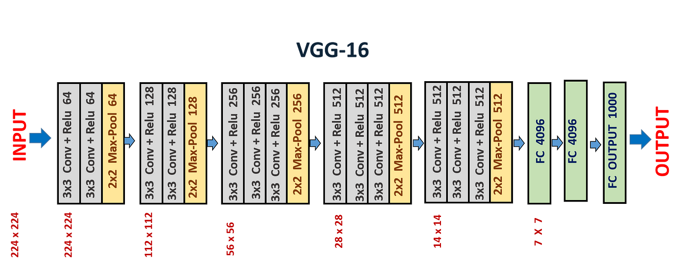
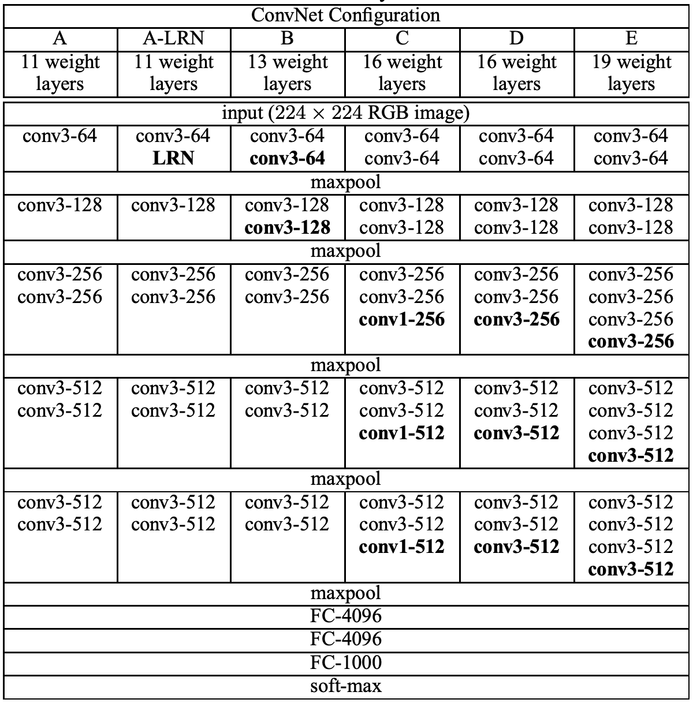

# VGG

VGGnet是由牛津大学视觉几何组（Visual Geometry Group）的研究人员于2014年提出。VGGnet的主要贡献在于提出了深度卷积神经网络的一种通用架构，以及通过不断加深网络结构来提高图像分类性能的思路。
VGGnet的网络结构非常简单和规整，易于理解和实现。同时，VGGnet的表现非常出色，在ImageNet数据集上达到了当时最好的分类准确率，成为了深度学习图像分类领域的经典算法。VGGnet的成功也为后来更深、更复杂的卷积神经网络的发展奠定了基础。

## VGG特点
1、使用网络块并堆叠设计网络。

2、采用多个3x3卷积替代大kernel卷积

## VGG结构

VGGnet的基本结构由多个卷积层和池化层组成，最后是若干个全连接层。VGGnet的特点是将多个小卷积核组合起来构成一个大卷积核，使得网络中的卷积层变得更深，从而提高了网络的准确性和泛化能力。
VGGnet网络的深度可以达到16层或19层，其中VGG16和VGG19是最为流行的版本。VGG16的结构如下所示。



## 使用网络块堆叠

从图中可以发现，每个箭头分隔开的几个网络层都是类似的内容，而这就是VGG设计时候的主要思想，**不断重复类似的块来加深网络结构**。
回想一下上节AlexNet的内容，是不是每层使用什么卷积，卷积的kernel都是不固定的。这样的问题就是导致网络设计异常复杂，这限制了网络深度的增加。
但VGG将卷积，激活，池化包装为一个整体的VGG块，不同块之间只需要通过变量修改卷积层个数和输出通道数即可，这样可以方便的堆叠进而加深模型。

如下图所示，作者可以将不同结构的网络通过表格直观呈现出来，主要原因就是通过VGG块设计网路简洁明了。



- VGG16包含了16个隐藏层（13个卷积层和3个全连接层），如上图中的D列所示

- VGG19包含了19个隐藏层（16个卷积层和3个全连接层），如上图中的E列所示


## 采用多个3x3卷积替代大kernel卷积
在VGG块的实际中，作者统一采用了kernel size=3的卷积。一方面是为了简化模型，
另一方面是因为在参数量相同的情况下，堆叠多个深而窄的卷积比浅而宽的卷积效果更好。
接下来介绍一下为什么小kernel卷积堆叠可以替代大kernel卷积


如上图所示，如果采用两个3x3的卷积，layer3中黄色的特征图包含了Layer1中所有5x5块中的信息，而如果单独使用5x5卷积，其信息也是包含在最终一个特征图中。
所以可以具备替代作用。此时如果考虑一下参数量

- 两个3x3卷积的参数量为2*(3*3*C^2)
- 一个5x5卷积的参数量为(5*5*c^2)

显然替代后参数量更少了，你可以考虑考虑如果采用三层3x3的卷积替代7x7卷积的结果。

!!! Important

    感受野可以简单的理解为网络可以看到的输入图像的大小。如上图中Layer3中一个神经元可以获得Layer1的5x5范围内信息，我们就可以说其感受野为5。但如果深究有更复杂的内容与争论，我们之后会单独介绍。

需要注意的是，由于VGGnet的网络结构比较简单，参数量比较大，因此需要较大的计算资源和时间来进行训练。
同时，VGGnet的网络结构也有一些局限性，例如对于输入图像尺寸的限制等。因此，在实际应用中需要根据具体的任务和数据集进行调整和优化。

## 代码实现

通过以下代码我们可以很明显看出不再需要通过单独写每一层的网络结构。而是直接通过cfg查表修改每层卷积数及输入输出通道即可。

```python

import torch
import torch.nn as nn

cfg = {
    'A' : [64,     'M', 128,      'M', 256, 256,           'M', 512, 512,           'M', 512, 512,           'M'],
    'B' : [64, 64, 'M', 128, 128, 'M', 256, 256,           'M', 512, 512,           'M', 512, 512,           'M'],
    'D' : [64, 64, 'M', 128, 128, 'M', 256, 256, 256,      'M', 512, 512, 512,      'M', 512, 512, 512,      'M'],
    'E' : [64, 64, 'M', 128, 128, 'M', 256, 256, 256, 256, 'M', 512, 512, 512, 512, 'M', 512, 512, 512, 512, 'M']
}

class VGG(nn.Module):

    def __init__(self, features, num_class=100):
        super().__init__()
        self.features = features

        self.classifier = nn.Sequential(
            nn.Linear(512, 4096),
            nn.ReLU(inplace=True),
            nn.Dropout(),
            nn.Linear(4096, 4096),
            nn.ReLU(inplace=True),
            nn.Dropout(),
            nn.Linear(4096, num_class)
        )

    def forward(self, x):
        output = self.features(x)
        output = output.view(output.size()[0], -1)
        output = self.classifier(output)

        return output

def make_layers(cfg, batch_norm=False):
    layers = []

    input_channel = 3
    for l in cfg:
        if l == 'M':
            layers += [nn.MaxPool2d(kernel_size=2, stride=2)]
            continue

        layers += [nn.Conv2d(input_channel, l, kernel_size=3, padding=1)]

        if batch_norm:
            layers += [nn.BatchNorm2d(l)]

        layers += [nn.ReLU(inplace=True)]
        input_channel = l

    return nn.Sequential(*layers)


def vgg11_bn():
    return VGG(make_layers(cfg['A'], batch_norm=True))

def vgg13_bn():
    return VGG(make_layers(cfg['B'], batch_norm=True))

def vgg16_bn():
    return VGG(make_layers(cfg['D'], batch_norm=True))

def vgg19_bn():
    return VGG(make_layers(cfg['E'], batch_norm=True))
```


## 参考资料
https://medium.com/@siddheshb008/vgg-net-architecture-explained-71179310050f
https://github.com/weiaicunzai/pytorch-cifar100


