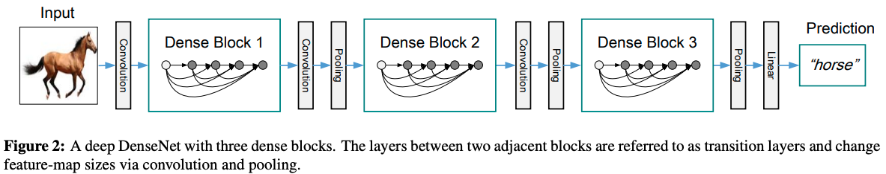
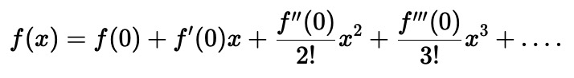
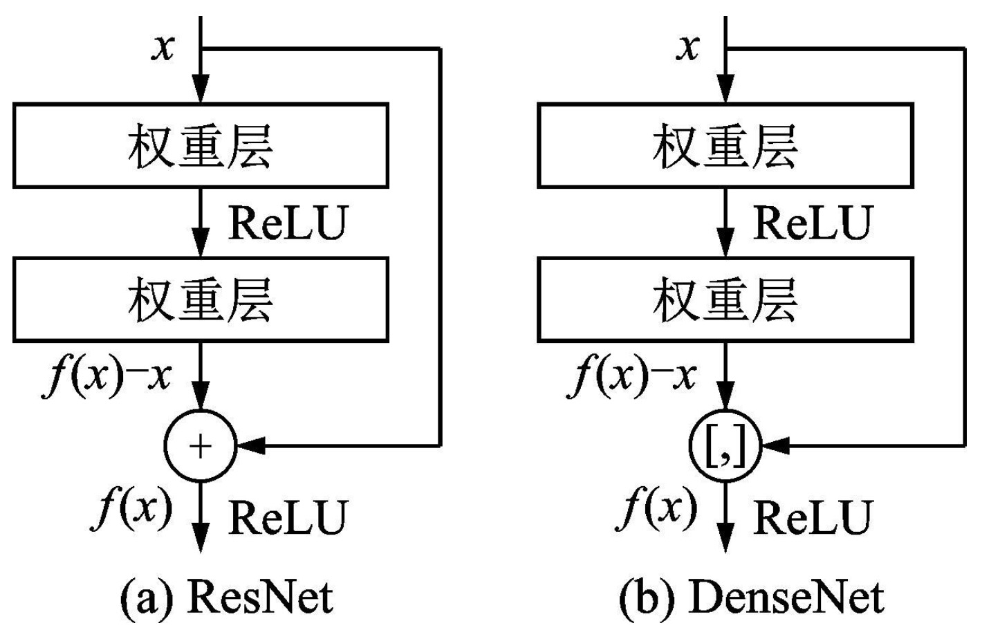
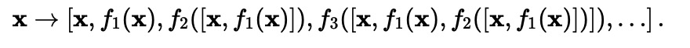

# DenseNet

DenseNet（Densely Connected Convolutional Networks）是一种深度卷积神经网络模型，由Zhuang Liu（清华大学）、Gao Huang（康奈尔大学）等人于2017年提出。
DenseNet的主要贡献在于提出了密集连接（dense connection）的思想，可以在保持网络深度和参数数量的同时，提高网络的准确性和泛化能力

## DenseNet特点
- 提出密集连接

## DenseNet引入
从网络结构及设计思路来说，DenseNet属于对ResNet的完善和补充，如果单独讲解其结构显得过于平淡。因此我希望能从不同角度来介绍一下这个网络。给您一个不一样的思考。

## 模型介绍
DenseNet的设计和ResNet类似，也是模块化复用。它包含三个密集块（ Dense Block）,两个相邻块之间的层称为过渡层，由1×1 Conv 和 2×2 平均池化构成。
在最后一个密集块结束时，执行全局平均池化，然后附加一个 softmax 分类器。

### DenseBlock

DenseBlock主要有两个设计特点，1）稠密连接 2）concat

在稠密模块内，为了能够保证前馈的特性，每一层将之前的所有层作为输入进行拼接，并将输出的特征图传递给之后的所有层。该好处是可以实现特征复用。
结构如下图所示。

因此，第l层有l个输入，这些输入是该层之前的所有卷积块（block）的特征图。如果每个函数 /( H_l /) 都产生 k 个特征图，之后的第层就有  /( k_0 + k*(l-1) /) 
个特征图作为输入，其中 /( k_0 /) 表示该层的通道数。而k即称为增长速率(Grow rate),也就是每层输出的特征数。

该设计的缺点是显而易见的，每层输入呈线性增加，极其耗费显存。因此相对于Resnet使用超大的输出特征数，作者将增长速率置为12，这样可以保证网络更少的参数。

另外一个问题就出现了，如此少的特征数量会不会影响网络的表达效果？答案是不会。因为作者认为传统的前馈网络，每层得到上层信息后要重新通过学习来保留有效信息。
对Resnet的研究也发现，网络通过加入自身来保留信息，很多层其实没有发生作用，可以随机丢弃掉。因此DenseNet每次只需要很少的特征图学习增加的信息即可，
之前需要保留的信息会通过短连接保留，两者共同组成"集体知识（collective knowledge）"，即concat后的输入。

## 从泰勒展开的角度
这个观点主要来自于李沐大佬。对于任意函数的泰勒展开式（Taylor expansion），它把这个函数分解成越来越高阶的项。在 x 接近 0 时，

上节ResNet的公式可以表达为：

$$ F(x) = x + H(x) $$

也就是一个简单的线性项和一个更复杂的非线性项，对比一下泰勒展开，我们可以认为ResNet是泰勒展开的前两项。如果我们想将 
f 拓展成超过两部分的信息呢？ 一种方案便是DenseNet。

ResNet 和 DenseNet 的关键区别在于，DenseNet 输出是连接（用图中的[,] 表示）而不是如 ResNet 的简单相加。 因此，在应用越来越复杂的函数序列后，我们执行从 
x 到其展开式的映射：

最后，将这些展开式结合到多层感知机中，再次减少特征的数量。 实现起来非常简单：我们不需要添加术语，而是将它们连接起来。 
DenseNet这个名字由变量之间的“稠密连接”而得来，最后一层与之前的所有层紧密相连。 稠密连接如下图所示

## 从HighWay Network 的角度

HighWay Network是15年一篇通过引入“Highway”机制，进而有效地训练非常深的网络的论文。
简单来说，论文中基于门机制引入了transform gate T 和carry gate C，输出output是由tranform input和carry input组成。

$$ y = H(x, W_H)*T(x, W_T) + x*C(x, W_C) $$

通过这种方式，HighWay网络可以很轻松的优化上百层的网络。旁路被认为是使深层网络容易训练关键因素。 随后的ResNet可以看作Highway 网络的一种特殊形式，
它通过使用本身作为通路，进一步验证了旁路的重要性。

受此启发，DenseNet通过密集连接使网络的每一层都可以通过旁路进行信息交流。

## 从深度监督的角度

作者提出DenseNets有一个优点是它改善了网络中信息和梯度的传递，这就让网络更容易训练。每一层都可以直接利用损失函数的梯度以及最开始的输入信息，
相当于是一种隐形的深度监督（implicit deep supervision）。这有助于训练更深的网络

回想一下GoogleNet使用的分类辅助器分枝，迫使中间层也学习判断特征。而前的深度监督网络（DSN）中在每一隐含层都加了分类器。

DenseNet通过短连接，让每一层都可以从损失函数中获得监督信息。

## 代码实现

