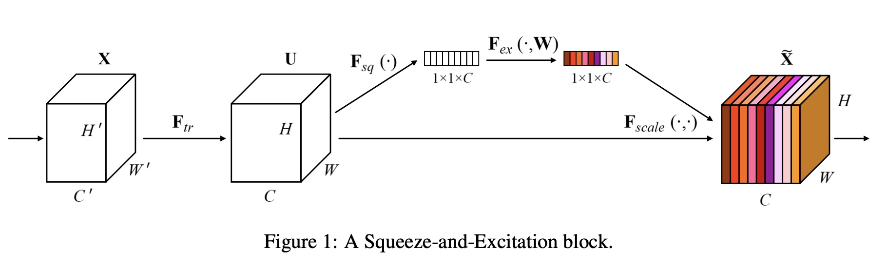
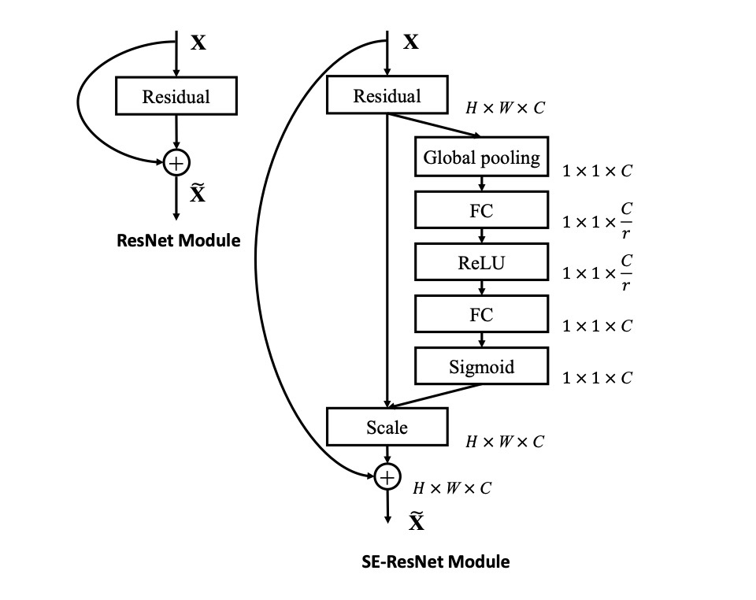

# Squeeze-and-Excitation Networks(SENet)

准确来说，SENet是一种即插即用的通道注意力机制。他可以用在绝大多数网络结构和任务中。通过引入Squeeze和Excitation模块来动态地调整特征图中不同通道的权重，从而提高模型的表达能力和泛化能力。

## 创新点

提出Squeeze和Excitation模块

## 注意力机制

注意力机制（Attention Mechanism）源于对人类视觉的研究。在认知科学中，由于信息处理的瓶颈，人类会选择性地关注所有信息的一部分，同时忽略其他可见的信息。


上图是人类在观察这张图像时关注的热点分布图，其中红色部分表示重点关注。从上图可以看出，人们会把注意力更多投入到人的脸部，文本的标题以及文章首句等位置。
这种注意力机制帮助我们利用有限的注意力资源从大量信息中快速筛选出高价值信息，进而极大地提高视觉信息处理的效率。

SENet希望通过注意力机制，对特征通道间的相关性进行建模，把重要的特征进行强化来提升准确率。

## Squeeze-and-Excitation block

该模块具体区分来说，包含Transformation、Squeeze、Excitation 和 scale 四个部分，模块的整体结构如下图所示



### transformation
transformation如图中 \( F_{tr} \) 所示，但是他仅仅表示一个特征转换，可以是其他网络的任意结构，也可以仅仅是一个卷积，所以这个模块并不重要。
但我们需要记一下经过该模块，输出特征图表示为U。

### Squeeze
作者认为一般的卷积中通过卷积核对局部感受野进行操作，因此特征图无法学习到感受野之外的上下文信息。在较低的网络层中，该问题更加明显。

所以作者采用**全局平均池化**来将全局空间信息压缩到一个通道，如果输入U为[HWC],则输出尺寸为[HW1]。
通过这一步，可以得到该层C个feature map 的数值分布情况，或者叫全局信息。我们称这一步输出为Z。

### Excitation

这一步通过全连接和非线性层来显式地建模特征通道间的相关性。具体实现可以表示为

$$ s = sigmoid(FC_2(ReLU(FC_1(z))))$$

s表示该模块输出。

- \( FC_1 \): 降维层，这一步最关键的一点在于**压缩**。原始的输入z为[1,1,c]，通过全连接层得到输出尺度为[1,1,c/r]。
其中r表示缩放参数，一般取16。
- \( FC_2 \): 升维层，恢复特征图维度，将输出映射为[1,1,c]。
- sigmoid: 该函数将输出特征中的每个值映射到[0,1]之间。

Excitation模块实际上是通过两个FC层构建了一个瓶颈（bottle neck）结构来参数化**门机制**。
最后的输出s可以用来显式地建模特征通道间的相关性。

### Scale
将 Excitation 的输出的权重s通过乘法逐通道加权到先前的特征U上，完成在通道维度上的对原始特征的重标定。


## SE模块为什么有效
SE模块是2017 ILSVR竞赛的冠军，top5的错误率达到了2.251%，比2016年的第一名还要低25%，所以该结构为何有效？

该模块通过特征重标定对每个特征进行加权。但关键在于SENet设计的加权方式，可以让网络通过loss进行学习。
使得有效的feature map权重大，无效的feature map权重小。就像是公司中引进了评价机制一样。

完整的SE Block用代码表示如下

```python
class SELayer(nn.Module):
    def __init__(self, channel, reduction=16):
        super(SELayer, self).__init__()
        self.avg_pool = nn.AdaptiveAvgPool2d(1)
        self.fc = nn.Sequential(
            nn.Linear(channel, channel // reduction, bias=False),
            nn.ReLU(inplace=True),
            nn.Linear(channel // reduction, channel, bias=False),
            nn.Sigmoid()
        )

    def forward(self, x):
        b, c, _, _ = x.size()
        y = self.avg_pool(x).view(b, c)
        y = self.fc(y).view(b, c, 1, 1)
        return x * y.expand_as(x)

```
## 嵌入网络

作者在文中将SENet block插入到现有的多种分类网络中，都取得了不错的效果，现在我们看看如何嵌入的。



该图展示了SE block嵌入到Res Block的结构。左图表示一般的Res Block的架构，相信你已经很熟悉了。有图表示SE Block
只对Residual输出的特征图进行加权，其他地方不变。

用代码表示如下：

```python
class SEBasicBlock(nn.Module):
    expansion = 1

    def __init__(self, inplanes, planes, stride=1, downsample=None, groups=1,
                 base_width=64, dilation=1, norm_layer=None,
                 *, reduction=16):
        super(SEBasicBlock, self).__init__()
        self.conv1 = conv3x3(inplanes, planes, stride)
        self.bn1 = nn.BatchNorm2d(planes)
        self.relu = nn.ReLU(inplace=True)
        self.conv2 = conv3x3(planes, planes, 1)
        self.bn2 = nn.BatchNorm2d(planes)
        self.se = SELayer(planes, reduction)
        self.downsample = downsample
        self.stride = stride

    def forward(self, x):
        residual = x
        out = self.conv1(x)
        out = self.bn1(out)
        out = self.relu(out)

        out = self.conv2(out)
        out = self.bn2(out)
        out = self.se(out)

        if self.downsample is not None:
            residual = self.downsample(x)

        out += residual
        out = self.relu(out)

        return out
```


