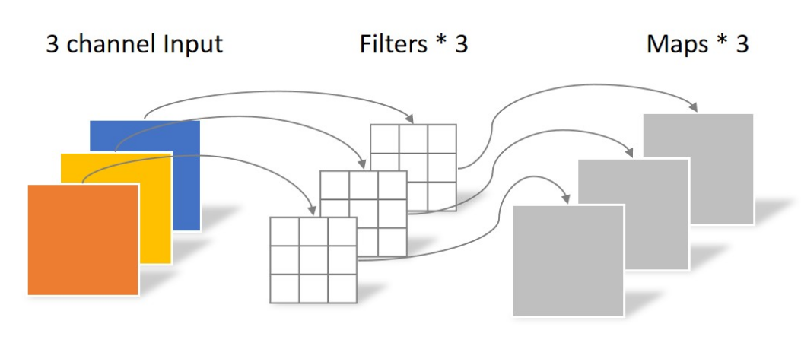

# MobileNet

MobileNet是由Google在2017年提出的一种轻量级神经网络模型，用于在移动设备上进行图像分类任务。
本节主要目的在于通过MoblieNet使您学习了解深度可分离卷积（Depthwise Separable Convolution）。他具体又包括逐层卷积（Depthwise Convolution，DW）和点卷积（Pointwise Convolution，PW）。
MobileNet系列包含V1-V3三个版本，我们主要介绍V1，V2两个版本，您可以接着自学V3版本。

## 创新点

使用DW卷积和PW卷积降低网络参数

## 逐层卷积

如果您还记得普通卷积的具体实现，你应该会记得加入输入是通道C，那我们需要同样C个通道的卷积核，才能得到一个输出的特征图。
但depthwise的则是采用C个卷积核与输入逐通道卷积得到C个输出，具体实现图如下



如上图所示，第i通道的输入特征图与第i个卷积核计算卷积，这样导致的问题是通道之间没有信息交流，因此紧接着就要使用PW Conv。

现在我们来计算一下DW卷积的参数量和计算量。
假设输入特征图尺寸是\( [W_in, H_in, C_in] \)，卷积核表示为\( [W_k, H_k, C_in] \)。

- 参数量: \( W_k * H_k * C_in \)
- 计算量: \( W_in * H_in * W_k * H_k * C_in \)

## 逐点卷积

逐点卷积（Pointwise Convolution）本质上就是使用1x1的卷积核对所有通道进行卷积。用来促进通道间的交流，同时进行升维或者降维。
逐点卷积的实现图示如下


现在我们来计算一下PW卷积的计算量。
假设输入特征图尺寸是\( [W_in, H_in, C_in] \)，卷积核为\( [1, 1, C_in] \)。输出通道数为\( C_out \)。

- 参数量: \( C_in * C_out \)
- 计算量：\( W_in * H_in * C_in * C_out \)

## 深度可分离卷积

之前我们提到深度可分离卷积（Depthwise Separable Convolution）由DW卷积和PW卷积两部分组成。在MobileNet中具体替换方式如下图所示：


如上图所示，左边表示标准卷积，右边表示替换掉的DW和PW卷积。首先3x3卷积替换为3x3的DW Conv。BN，ReLU不变。
之后紧接着使用一个1x1的卷积，BN，ReLU操作。

现在我们回想一下标准卷积的参数量和计算量

- 参数量：\( W_k * H_k * C_in * C_out \)
- 计算量：\( W_k * H_k * C_in * C_out * W_in * H_in \)

现在考虑一下当标准卷积替换为深度可分离卷积后参数量和计算量的变化。

- 参数量：

$$  \frac{W_k * H_k * C_in + C_in * C_out}{W_k * H_k * C_in * C_out} = \frac{1}{N} + \frac{1}{W_k * H_k}  $$

- 计算量：

$$  \frac{W_in * H_in * W_k * H_k * C_in + W_in * H_in * C_in * C_out}{W_k * H_k * C_in * C_out * W_in * H_in} = \frac{1}{N} + \frac{1}{W_k * H_k}  $$

所以如果是卷积核为3x3的标准卷积，参数量和运算量都会降为原来的1/9左右。
与GoogleNet和VGG16相比，其准确率一般降低1%左右。


## ReLU6
现在需要多提一下的是，在图示中的ReLU实际使用的是ReLU6，这里多加的一个6是用来将输出在[0, 6]之间截断，用公式表示为

$$ y = ReLU6(x) = min(max(0, x), 6) $$

ReLU6的好处主要包括以下几个方面：

- 防止梯度消失和梯度爆炸：ReLU6可以防止输出值过大，避免梯度消失和梯度爆炸等问题，从而提高模型的稳定性和泛化能力。

- 增强非线性特性：ReLU6增强了修正线性单元的非线性特性，可以提高模型的表达能力和泛化能力。

- 适用于移动设备：ReLU6可以用于移动设备上的神经网络模型，可以实现高效的计算和存储。

但在一些高精度的任务中，ReLU6可能会影响模型的精度和泛化能力


## 代码实现
深度可分离卷积的代码实现如下

```python
def conv_dsw(inp, oup, stride):
    return nn.Sequential(
        nn.Conv2d(inp, inp, 3, stride, 1, groups=inp, bias=False),
        nn.BatchNorm2d(inp),
        nn.ReLU(inplace=True),

        nn.Conv2d(inp, oup, 1, 1, 0, bias=False),
        nn.BatchNorm2d(oup),
        nn.ReLU(inplace=True),
    )
```
可以看到实现中dw conv实际就是将groups参数设置为输入的通道数。而pw conv就是卷积核为1的普通卷积。

## MobileNet V2

MobileNet V2是对V1版本的改进与提升，如标题所示，其创新点在于提出了Inverted Residuals and Linear Bottlenecks。

## 创新点

- Inverted Residuals
- Linear Bottlenecks

## Linear Bottlenecks

在DW Conv的使用过程中，发现训练完的卷积核存在大量为0的情况，进而是的神经元输出为0，而这个过程是不可逆的。
作者认为这是ReLU导致的问题。

首先作者定义经过一系列卷积和激活层的会输出兴趣流型(manifold of interest）。在下采样时，兴趣流型映射到低维子空间中。
在此过程中如果使用ReLU这种非线性激活函数，会导致信息坍塌。

为此作者尝试了一个简单的实验，如下图所示


将最左边的输入经过一个矩阵T映射到不同维度，然后使用ReLU进行激活，再利用\( T^{-1} \)映射回低维输入得到输出。该过程可以表达为：

$$ \hat{x} = T^{-1}ReLU(Tx) $$

从右侧不同的图像可以看出，经过ReLU函数后，当维度越高信息损失就越少。如dim=15/30时，经过relu映射回二维空间，信息损失较少。
当dim=2/3/5时，经过relu映射回二维空间，信息损失较多。

据此可认为，在低维空间使用relu会损失较多信息。这也解释了之前遇到的训练后的卷积核大量为0的情况。

针对这个问题，作者在Bottleneck模块的降维处采用linear作为激活函数，其结构如下图所示


至于为什么只在最后采用linear作为激活函数，是因为前面提到的从高维向低维转换，使用ReLU激活函数可能会造成信息丢失或破坏。

##  Inverted Residuals

此外，作者参考ResNet提出了Inverted Residuals结构。模块如下图所示：


- pw Conv: 与V1版本不同，作者在模块前后分别用一个1x1卷积进行维度控制。在输入时将维度拓展为输入的6倍，输出时转为输入维度。
- dw Conv：通过维度扩张，dw conv可以在一个更高维的空间中进行卷积操作来提取特征。避免低维的效果不好的问题。
- 激活层：作者在第一个pw conv和dw conv后依旧采用ReLU6激活函数，在第二个pw conv后使用线性激活函数。
- 残差连接：作者参考ResNet使用短连接结构复用输入特征。

因为Resnet是先降维再升维，而作者相反是先升维再降维，所以作者将这个结构命名为Inverted residuals。


## 讨论

MobileNet系列希望通过使用深度可分离卷积降低网络参数与运算量，提升网络在手机上的推理效果。
但Flops和运算时间并非简单的线性关系，很多时候网络推理会收访问内存的带宽限制。如果是在gpu端还好，一些专门的npu上可能dw conv甚至不如一般卷积。
此外，MobileNet也一直面临量化性能下降过多的影响。这里我先简单提一下，等之后有机会单独做成小节。


