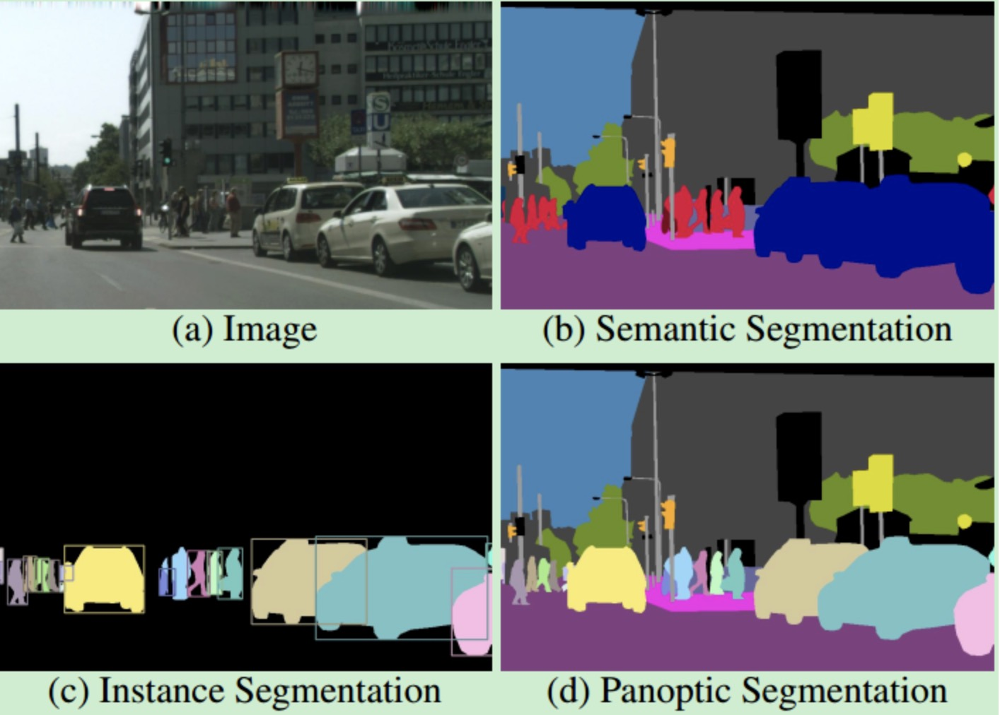

# 分割简介

分割任务是相对于分类任务稍微复杂一点的存在。之前的分类任务只希望知道整张图像里有什么内容，但是分割任务不仅希望知道图像里有什么，
还要区分出来哪里是什么，这个哪里需要精准到每一个像素。

## 分割任务分类

根据分割的粒度和对象，分割任务主要可以分为两种不同的类型：

1、<def>语义分割（Semantic Segmentation）</def>：语义分割是将图像分割成不同的区域，并将每个区域分配到相应的语义类别中。
例如，将自然图像分割成天空、道路、树木、车辆等语义类别。

2、<def>实例分割（Instance Segmentation）</def>：实例分割是将图像中的每个对象都分割出来，并将每个对象分配到相应的类别中。
例如，将自然图像中的每个人、车辆、建筑物等分割出来，并分配到相应的类别中。
但实例分割通常不会将天空、水、地面等无法分割出明确实例的区域单独划分出来作为实例进行标注。因为这些区域没有明确的实例对象，无法分配一个唯一的标签给它们，
用英语来说就是这些是不可数的。

3、<def>全景分割（Panoptic Segmentation）</def>：它旨在将图像分割成不同的区域，并将每个区域分配到相应的语义类别中，并且对于每个实例，
都应该被分配到相应的类别中。全景分割任务的目标是对整个场景进行像素级别的分割，并对每个像素进行类别和实例标注。

下图展示的是三种分割的区别

大概来说就是语义分割以类别划分，比如车辆都划分到一类，在图中以相同颜色表示。实例分割以单个物体划分，比如不同车辆互相区分，归到不同类别。
全景分割就是既要语义分割把所有物体都划分成类，又要向实例分割一样把其中可区分的人，车等单独分成不同列别。

## 损失函数-BCE loss
交叉熵损失函数是分割任务中常见的一类损失函数，和之前介绍过的分类任务中使用的<def>交叉熵</def>是一样的，区别在于拓展到二维。
交叉熵损失函数的计算公式如下：

$$ L_{CE} = -\frac{1}{N}\sum_{N}^{i=1}\sum_{M}^{j=1}y_{ij}log(p_{ij}) $$

其中，N表示样本数，M表示类别数，y_{ij}表示第i个样本属于第j个类别的真实标签，p_{ij}表示模型对第i个样本属于第j个类别的预测概率。

!!! Important

    BCE和交叉熵是什么关系？

    BCE是二元交叉熵（Binary Cross Entropy）的简称，可以看作是交叉熵的一种特殊情况。当分类问题只有两个类别时，使用交叉熵损失函数等价于使用 BCE 损失函数。

## 损失函数-Dice loss

<def>Dice Loss</def>是一种常用的图像分割损失函数，它基于<def>Dice系数（Dice Coefficient）</def>来度量预测结果与真实标签之间的相似度。Dice Loss的优点是可以对小目标进行有效的惩罚，并且可以用于多类别图像分割任务。

Dice系数是一种用于度量两个集合相似度的指标，其计算公式如下：

$$ DICE = \frac{2\left | X\bigcap Y \right |}{\left | X \right | + \left | Y \right |} $$

其中，X和Y分别表示两个集合，\( \left | X \right | \)和 \(\left | Y \right | \)分别表示两个集合的元素个数，
\( \left | X\bigcap Y \right | \)表示两个集合的交集元素个数。

Dice系数可以用来衡量模型预测结果和真实标签之间的相似度，越接近1表示预测结果和真实标签越相似。

如果将其修改为Dice loss，需要将上式改为

$$ DICE loss =1 -  \frac{2\left | X\bigcap Y \right |}{\left | X \right | + \left | Y \right |} $$

此处X表示每个像素的预测概率，值为[0,1]之间的浮点数。Y为标签，取值0或者1，代表是否为该类别。

Dice Loss的优点是可以对小目标进行有效的惩罚，并且可以用于多类别图像分割任务。Dice Loss的缺点是在处理高度不平衡的数据集时，可能会出现梯度消失或者梯度爆炸的情况。

## 语义分割常用数据集

1、PASCAL VOC 2012 1.5k训练图像，1.5k验证图像，20个类别(包含背景)。[下载链接](http://host.robots.ox.ac.uk/pascal/VOC/voc2012/)

2、MS COCO COCO比VOC更困难。有83k训练图像，41k验证图像，80k测试图像，80个类别。

