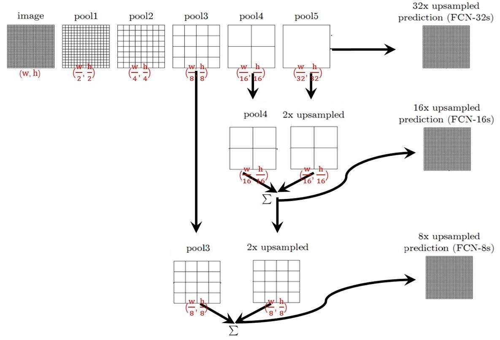

# FCN

用神经网络做分割一个很大的问题是，如果我们该怎么对2维图像的每个像素都进行分类预测？
之前我们在做分类任务时候，卷积后得到的feature map 越来越小，这和原图的尺寸就不匹配了。
一种想法是将输出的一维向量设置为原图宽乘高的长度，一维向量中每个输出代表原图中的一个像素。比如说输入是\( [256, 256] \)，那输出就是\( [1, 256^2] \)。但这样破坏了图像的空间信息，训练非常困难。
另一种想法是全部使用卷积，并且不使用pooling这种方式降低图像尺寸，这样的问题在于网络参数过多，且无法提取重要特征。


## 创新点
FCN的创新性有以下几点:

- 既然转为一维的全连接层对分割任务无效，那就抛弃掉替换成卷积层。
- 之前卷积和池化层使特征图变小了，那就使用上采样层使特征图和输入尺寸相同。
- 使用<def>跳跃连接（Skip Connection）</def>将上采样后的特征图和主干网络中提取的特征图进行融合。

通过以上三点创新，FCN可以得到和原图一样尺寸的输出，实现端到端的训练和预测。 
得益于该网络使用全卷积设计，可以对任意大小的输入图像进行像素级别的预测。FCN已经成为语义分割的基本框架，后续算法其实都是在这个框架中改进而来。


## 上采样

首先我们先介绍一个新的组件：<def>上采样</def>。

一般来说上采样可以采用两种方式，一种是采用插值等方式扩大特征图的尺寸。另一种是采用反卷积。

### 最近邻插值上采样

<def>最近邻插值（Nearest Neighbor Interpolation）</def>是最简单的一种插值方式，只需要通过映射，将原始图片中的像素值映射到放大后的图片中的每一个位置上即可。


如上图所示，原始的2*2的特征图如果想扩大两倍，就先构建一个\(4*4\)的特征图。并将原始坐标（x, y）处的值赋给
\( [(x*2, y*2), (x*2+1, y*2), (x*2, y*2+1), (x*2+1, x*2+1)] \)等四个坐标。

如果将原始坐标表示为\( (x_{src}, y_{src}) \), 目标坐标表示为 \( (x_{dst}, y_{dst}) \), 放大尺寸为scale，则最近邻插值更通用的表示为：

$$ x_{src} = x_{dst} / scale, y_{src} = y_{dst} / scale $$

这里的符号 "/" 表示整除。


最近邻插值的优点是计算速度快、实现简单、不会出现模糊和不连续的情况。

但是，最近邻插值也有一些缺点，包括以下几点：

1、 采样点不连续：最近邻插值是通过选择最近的像素值来进行插值，因此插值点不一定与原始像素点的位置相邻。这会导致采样点不连续，从而可能会出现锯齿状的图像边缘。

2、像素值不连续：最近邻插值是通过选择最近的像素值来进行插值，因此插值点的像素值不一定连续。这会导致图像出现明显的块状效应，从而影响图像的视觉效果。

3、不适用于大尺寸缩放：最近邻插值是通过选择最近的像素值来进行插值，因此对于大尺寸的缩放，可能会出现过度像素化或者模糊的情况。因此，在进行大尺寸的缩放时，最近邻插值可能不是最佳的选择。

### 双线性插值上采样

<def>双线性插值（Bilinear Interpolation）</def>的思想是通过计算特征图中像素的加权平均值来进行上采样。具体来说，双线性插值会对特征图中每个像素周围的4个像素进行加权平均，从而得到上采样后的像素值。
这个加权平均的权重是通过距离像素位置的远近来计算的，距离越近的像素权重越大，距离越远的像素权重越小。


我们先来看如下一条线段，左边端点a=3，右侧端点b=8。现在想预测蓝色点的值，我们还知道蓝色点距a的距离为2，距b的距离为4。
那你肯定知道靠加权平均就可以最科学的猜到蓝色点的值，离得越近权重越大。即

$$ v_{blue} = a * \frac{y}{x+y} + b * \frac{x}{x+y} = 14/3 $$

没错恭喜你，你已经会一次线性插值了。但我们需要更通用一点，我们令a的坐标为x1，值为y1，记作(x1, y1)。
b(x2,y2), 蓝色点(x,y)。

$$ \frac{x-x1}{y-y1} =  \frac{x2-x1}{y2-y1}  $$

化简的

$$ y = \frac{x2-x}{x2-x1}y1 + \frac{x-x1}{x2-x1}y2  $$


那双线性插值就是将刚才的一维操作扩展到二维。如下图所示


现在我们考虑一下上图这种二维的情况。我们如果已知a,b,c,d四个值，想求T的值该怎么办？
确实，先用两次线性插值得到R1，R2的值，再通过一次插值得到T就好了，没错，我们用数学公式表达一下这个过程

首先我们已知的a,b,c,d这些是坐标，所以我们希望用函数f表示对这个坐标在图像中取值,如f(a)。则

$$ f(R1) = \frac{x2-x}{x2-x1}f(a) + \frac{x-x1}{x2-x1}f(b)  $$

$$ f(R2) = \frac{x2-x}{x2-x1}f(c) + \frac{x-x1}{x2-x1}f(d)  $$

$$ f(T) = \frac{y2-x}{y2-y1}f(R1) + \frac{y-y1}{y2-y1}f(R2)  $$

将f(R1), f(R2)代入f(T)可得:

$$ f(T) = \frac{y2-x}{y2-y1}\frac{x2-x}{x2-x1}f(a) + \frac{y2-x}{y2-y1}\frac{x-x1}{x2-x1}f(b) + \frac{y-y1}{y2-y1}\frac{x2-x}{x2-x1}f(c) + \frac{y-y1}{y2-y1}\frac{x-x1}{x2-x1}f(d) $$

又因为我们一般在做双线性插值时，a,b,c,d四个点是相邻的四个像素，所以存在y2-y1=1, x2-x1=1。代入上式的：

$$ f(T) = (y2-x)(x2-x)f(a) + (y2-x)(x-x1)f(b) + (y-y1)(x2-x)f(c) + (y-y1)(x-x1)f(d) $$


相对于最近邻插值和<def>bicubic插值</def>，双线性插值的计算需求，上采样后图像质量达到了均衡，因此使用场景最多。
但是在进行像素级别的预测时，它可能会出现模糊和不连续的情况。

!!! note "拓展"
    
    你可以自己进一步了解一下bicubic插值的实现。

### 反卷积上采样

<def>反卷积(Transposed Convolution)</def>，也被称为<def>转置卷积</def>。是一种卷积的逆操作，可以将特征图进行上采样。

在具体实现上，就是将特征图中的每个像素进行扩展，并将扩展后的像素与卷积核进行卷积，从而得到上采样后的特征图。而这里所说的拓展一般以补0的形式呈现。

如下图所示


如果希望对2*2的特征图进行反卷积，首先将它周围各自加两个padding，然后再利用3x3的卷积核进行卷积，可以得到深绿色4x4的特征图输出。
那是不是所有反卷积都是这样对周围进行padding呢？当然不是，因为如果只对最外缘做padding，很多时候得到的输出是没有信息的。
所以也经常会对特征图中间做padding，类似于


这样对特征图中间加了一行和一列的0值。得到的输出为5x5。那怎么控制边缘和中间增加的padding数目呢？ 在具体代码实现上，反卷积torch函数表达为

```python
class torch.nn.ConvTranspose2d(in_channels, out_channels, kernel_size, stride=1, padding=0, output_padding=0, bias=True)
```

- in_channels, out_channels, kernel_size 与一般卷积相同，这里不再赘述。
- stride:步长。这里与卷积不同的地方在于，他控制输入特征图每行/列之间插入**stride-1** 行/列padding。而实际卷积得到输出的时候对补零后特征图执行步长为1的卷积。
- padding:这个也比较难以理解，当padding=0时，卷积核的起始位置和输入层相交一个像素，当padding=1时，卷积核的起始位置和输入层相交2个像素，以此类推。
如果用数学公式来表达的话，我们令反卷积中padding为p_{dec}, 一般卷积中padding为p，卷积核为k，则\( p_{dec} = k - 1 - p\)
- outpadding: 这个是我们常理解的padding，对**输出的特征图**边缘补多少0。


## 全连接层替换

FCN将分类网络中三层全连接层替换为卷积层，卷积核的大小[通道数，宽，高]分别为[4096, 7, 7]、[4096, 1, 1]、[1000, 1, 1]。
又由于网络中所有的层都是卷积层，故称为<def>全卷积网络</def>，这种网络可以接受任意尺度的输入。


## 上采样与短连接



我们可以看到这个网络整体有三层，我们依次介绍每层的工作。

- FCN-32s，直接对pool5 feature进行32倍上采样获得32x upsampled feature，再对32x upsampled feature每个点做softmax prediction获得32x upsampled feature prediction（即分割图）。
- FCN-16s，首先对pool5 feature进行2倍上采样获得2x upsampled feature，再把pool4 feature和2x upsampled feature逐点相加，然后对相加的feature进行16倍上采样，并softmax prediction，获得16x upsampled feature prediction。 
- FCN-8s，首先进行pool4+2x upsampled feature逐点相加，然后又进行pool3+2x upsampled逐点相加，即进行更多次特征融合。具体过程与16s类似，不再赘述。

这里的上采样采用反卷积实现。

三者的结果如下图所示：


可以看出效果：FCN-32s < FCN-16s < FCN-8s，即使用多层feature融合有利于提高分割准确性。

