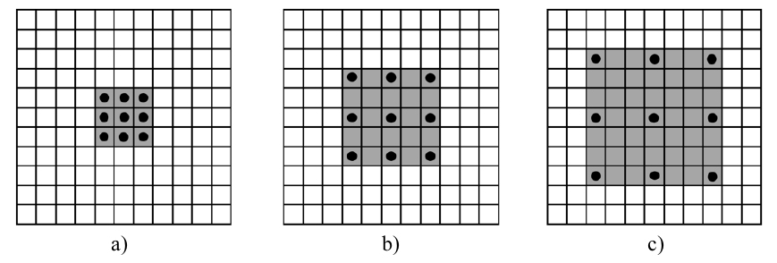
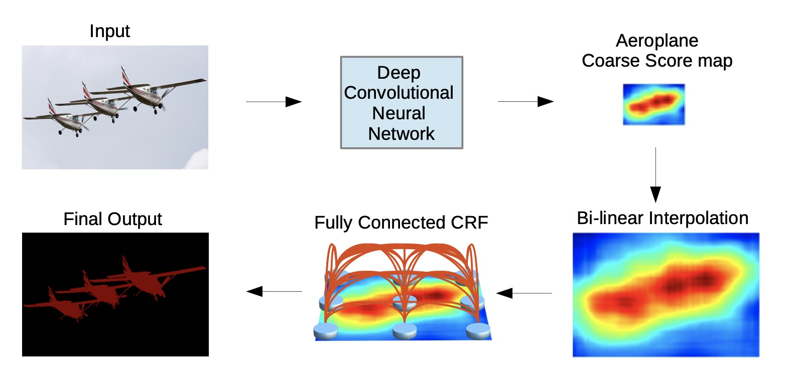

# DeepLab系列

不知你是否记得我们开始引入分割时候提过一个想法，全部使用卷积，不降低图像尺寸来训练网络。这种方法的缺点是训练所耗参数量极大，更关键的是，他无法有效提取<def>高层语义信息</def>。
也就是说卷积只能看到附近的像素，无法从更高的感受野去了解图像中有什么类别。所以前面介绍的FCN和Unet都采取编解码结构。

但是DeepLab系列认为：多次池化下采导致图像的细节和位置信息丢失。因此采用<def>空洞卷积</def>来扩展感受野，获取更多的语境信息。


## 创新点
- 空洞卷积
- 条件随机场，但这个在系列后来论文中就删除了。

## 空洞卷积

<def>空洞卷积(Dilated Convolution)</def>，也被称为<def>扩张卷积（Atrous Deconvolution）</def>。其实现是对**卷积核补0**。
下图展示的是空洞卷积中卷积核:



其中黑色得点表示卷积核中有效值的位置。灰色表示整个卷积核的大小，如果灰色里面没有黑色的点，代表这个地方值为0。

a）代表<def>空洞率（dilated rate）</def>为1，

b）空洞率=2， 

c）空洞率=3。

如此可以看出空洞率即为在原始卷积核元素之间补充（dilated rate-1）行/列零值。
在卷积实现中，使用整个灰色的卷积核对输入计算卷积。

需要注意的是，单个卷积中感受野即为该卷积可以看到的原图大小。所以空洞卷积的<def>感受野</def>为：

$$ K=k+(k-1)(r-1) $$ 

其中，k为原始卷积核大小，r为空洞卷积参数空洞率；

空洞卷积有什么作用呢？

- 扩大感受野：空洞卷积可以在不丢失分辨率的情况下，扩大感受野。这在检测，分割任务中十分有用。一方面感受野大了可以检测分割大目标，另一方面分辨率高了可以精确定位目标。
- 捕获多尺度上下文信息：可以通过设置不同dilation rate时，感受野就会不一样，也即获取了多尺度信息。

但是该结构在实际中不好优化，速度会大大折扣。

## deeplabV1

deeplabV1的整体架构如下所示:



首先采用深度神经网络提取特征，然后使用双线性插值得到原图尺寸的特征图，最后采用全连接条件随机场细化结果。
这里你可能怀疑，这不还是将采样的套路吗？的确如此，但是区别在于他并没有降太多层。

对于主干网络，deeplabV1采用的VGG19结构，但是将最后两层pooling改为步长为1的pooling，避免尺度变化，所以最终结果只到原始尺寸的1/8。
此外，在倒数第二个pooling后接3个空洞率=2的空洞卷积，在倒数第一个pooling后接一个空洞率=1的空洞卷积

### 条件随机场CRF
为图像在CNN里面通过不断下采样，原来的位置信息会随着深度减少甚至消失。最后会导致分类结果变得十分平滑，但是我们需要细节更加突出的结果。因此采用CRF作为后处理。
具体可以看：http://note4lin.top/post/densecrf小计/


## deeplabV2

deeplabV2的改进有：

- 用多尺度获得更好的分割效果（ASPP）

- 基础层由VGG16改为ResNet

- 使用不同的学习率

### ASPP

<def>空洞空间金字塔池化（Atrous Spatial Pyramid Pooling, ASPP）</def>。其结构如下图所示：


其主要思想是采用<def>空洞卷积（Dilated Convolution）</def>来对特征图进行多尺度的特征提取，从而可以捕获不同尺度的特征信息。ASPP的具体实现包括以下几个步骤：

1、对输入特征图进行多尺度的空洞卷积操作，从而可以捕获不同尺度的特征信息。

2、对不同尺度的特征图进行池化操作，从而可以提取全局的特征信息。

3、将不同尺度的特征图进行concat，并通过卷积操作进行融合，从而得到最终的特征表示。

## deeplabV3

DeepLabv3重新考虑了空洞卷积的使用，同时改进了ASPP模块，并删除了后处理中的CRF，使网络可以达到端到端训练。
说实话，我写这段看了无数网上讲解，但基本没一个讲的清的，最后看代码大概理解懂了，所以这里我尽量讲清楚一点。


### 改进ASPP

作者设计了串行和并行的空洞卷积模块，引入BN，并采用多种不同的<def>atrous rates（空洞率）</def>来获取多尺度的内容信息。

1、串行空洞卷积

串行是应用在Resnet主干提取网络。


图中(a)表示常见的连续下采样主干网络。但连续的stride对语义分割是有害的，会造成细节信息丢失。
(b)表示作者使用的带空洞卷积的卷积层来构建更深的网络。通过级联空洞卷积block，在控制特征图分辨率的同时引入较大感受野。

需要注意的是，block4（即图中rate=2的特征图,我们称这个图中每个block上的rate为<def>单元步长(Unit rate)）</def>到block7的结构是相同的。
每个block包含三个卷积，三个卷积的最终空洞率等于<var>unit rate</var>和<var>multi grid</var>的乘积。
例如，当输出步长为16，Multi_Grid = （1，2，4），模块4中三个卷积的步长将会分别等于2×( 1，2，4 ) =（2，4，8）。

但是这个结构在代码实现中，有些是直接丢弃了，有些只简单的包含block4。代码如下所示

```python

def make_layer(block, in_channels, channels, num_blocks=3, stride=1, dilation=2):
    # (stride == 1, num_blocks == 3 --> strides == [1, 1, 1])
    strides = [stride] + [1]*(num_blocks - 1) 

    blocks = []
    for stride in strides:
        blocks.append(block(in_channels=in_channels, channels=channels, stride=stride, dilation=dilation))
        in_channels = block.expansion*channels

    layer = nn.Sequential(*blocks) # (*blocks: call with unpacked list entires as arguments)

    return layer

```


2、并联空洞卷积

作者对DeepLabV2 中的 ASPP进行了改进，改进内容有三点。

- 引入了一个1x1卷积
- 添加全局平均池化，用于表示图像级特征
- 添加BN

改进后ASPP如下图所示


网络代码如下:
```python
Class ASPP(nn.Module):
    def __init__(self, num_classes):
        super(ASPP, self).__init__()

        self.conv_1x1_1 = nn.Conv2d(512, 256, kernel_size=1)
        self.bn_conv_1x1_1 = nn.BatchNorm2d(256)

        self.conv_3x3_1 = nn.Conv2d(512, 256, kernel_size=3, stride=1, padding=6, dilation=6)
        self.bn_conv_3x3_1 = nn.BatchNorm2d(256)

        self.conv_3x3_2 = nn.Conv2d(512, 256, kernel_size=3, stride=1, padding=12, dilation=12)
        self.bn_conv_3x3_2 = nn.BatchNorm2d(256)

        self.conv_3x3_3 = nn.Conv2d(512, 256, kernel_size=3, stride=1, padding=18, dilation=18)
        self.bn_conv_3x3_3 = nn.BatchNorm2d(256)

        self.avg_pool = nn.AdaptiveAvgPool2d(1)

        self.conv_1x1_2 = nn.Conv2d(512, 256, kernel_size=1)
        self.bn_conv_1x1_2 = nn.BatchNorm2d(256)

        self.conv_1x1_3 = nn.Conv2d(1280, 256, kernel_size=1) # (1280 = 5*256)
        self.bn_conv_1x1_3 = nn.BatchNorm2d(256)

        self.conv_1x1_4 = nn.Conv2d(256, num_classes, kernel_size=1)

    def forward(self, feature_map):
        # (feature_map has shape (batch_size, 512, h/16, w/16)) (assuming self.resnet is ResNet18_OS16 or ResNet34_OS16. If self.resnet instead is ResNet18_OS8 or ResNet34_OS8, it will be (batch_size, 512, h/8, w/8))

        feature_map_h = feature_map.size()[2] # (== h/16)
        feature_map_w = feature_map.size()[3] # (== w/16)

        out_1x1 = F.relu(self.bn_conv_1x1_1(self.conv_1x1_1(feature_map))) # (shape: (batch_size, 256, h/16, w/16))
        out_3x3_1 = F.relu(self.bn_conv_3x3_1(self.conv_3x3_1(feature_map))) # (shape: (batch_size, 256, h/16, w/16))
        out_3x3_2 = F.relu(self.bn_conv_3x3_2(self.conv_3x3_2(feature_map))) # (shape: (batch_size, 256, h/16, w/16))
        out_3x3_3 = F.relu(self.bn_conv_3x3_3(self.conv_3x3_3(feature_map))) # (shape: (batch_size, 256, h/16, w/16))

        out_img = self.avg_pool(feature_map) # (shape: (batch_size, 512, 1, 1))
        out_img = F.relu(self.bn_conv_1x1_2(self.conv_1x1_2(out_img))) # (shape: (batch_size, 256, 1, 1))
        out_img = F.upsample(out_img, size=(feature_map_h, feature_map_w), mode="bilinear") # (shape: (batch_size, 256, h/16, w/16))

        out = torch.cat([out_1x1, out_3x3_1, out_3x3_2, out_3x3_3, out_img], 1) # (shape: (batch_size, 1280, h/16, w/16))
        out = F.relu(self.bn_conv_1x1_3(self.conv_1x1_3(out))) # (shape: (batch_size, 256, h/16, w/16))
        out = self.conv_1x1_4(out) # (shape: (batch_size, num_classes, h/16, w/16))

        return out
```

