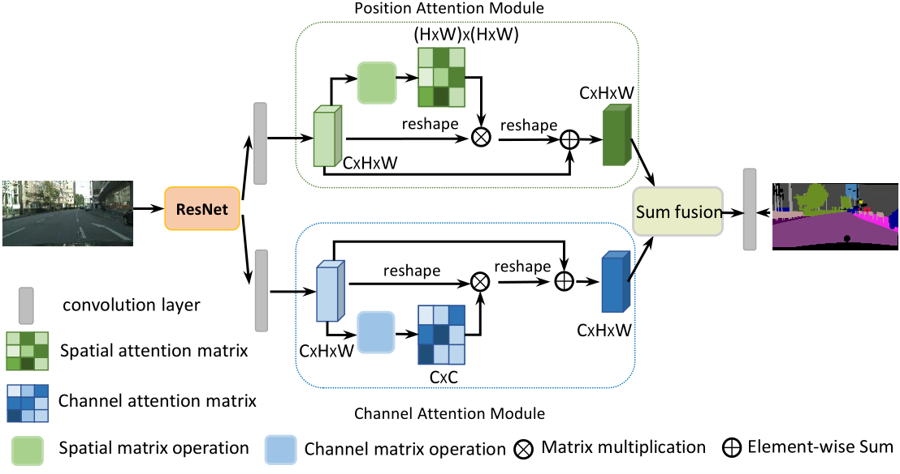

# DANet

DANet是将注意力机制与分割结合的典型作品，我希望能通过该论文的讲解给您引入对注意力的理解。

## 创新点
引入空间注意力和通道注意力

## 注意力

之前我们在学习SENet的时候了解过通道注意力机制，其目的在于使网络对通道级特征进行重标定。
本文意在通过空间注意力和通道注意力，对分割网络的空间特征和通道特征都进行重标定，优化网络特征表示。

## 整体结构

网络的整体结构示意图如下所示



1、网络首先使用Dilated ResNet作为主干网络，用于特征提取。和DeepLab V2一样，最终获得1/8将采样尺寸的特征图。

2、将特征图同时送入空间和通道注意力机制，得到加权后的特征图。

3、通过元素相加融合两个特征图，进而通过卷积得到最终的预测输出。


## Position Attention Module

位置注意力模块如下图所示，目的在于获得空间加权的特征输出E。


该模块具体流程如下:

1、特征图A(C×H×W)首先分别通过3个卷积层得到3个特征图B,C,D。输出尺寸为(C×H×W)

2、将B，C先reshape为C×(H×W),再将B进行转置，获得输出维度(H×W)×C。将两者相乘，再通过softmax获得空间特征映射S（Spatial Attention map）,尺寸为(H×W)×(H×W)。

3、将D reshape为C×(H×W)，再和S的转置进行矩阵乘，获得C×(H×W)的输出，再乘以尺度系数α，最后reshape 为 C×H×W。
此处α 初始化为0，并在训练过程中逐渐增加。

4、将步骤3的输出与输入A相加，得到最终输出E。

该模块代码实现如下
```python
class PAM_Module(Module):
    """ Position attention module"""
    def __init__(self, in_dim):
        super(PAM_Module, self).__init__()
        self.chanel_in = in_dim

        self.query_conv = Conv2d(in_channels=in_dim, out_channels=in_dim//8, kernel_size=1)
        self.key_conv = Conv2d(in_channels=in_dim, out_channels=in_dim//8, kernel_size=1)
        self.value_conv = Conv2d(in_channels=in_dim, out_channels=in_dim, kernel_size=1)
        self.gamma = Parameter(torch.zeros(1))

        self.softmax = Softmax(dim=-1)
    def forward(self, x):
        """
            inputs :
                x : input feature maps( B X C X H X W)
            returns :
                out : attention value + input feature
                attention: B X (HxW) X (HxW)
        """
        m_batchsize, C, height, width = x.size()
        proj_query = self.query_conv(x).view(m_batchsize, -1, width*height).permute(0, 2, 1)
        proj_key = self.key_conv(x).view(m_batchsize, -1, width*height)
        energy = torch.bmm(proj_query, proj_key)
        attention = self.softmax(energy)
        proj_value = self.value_conv(x).view(m_batchsize, -1, width*height)

        out = torch.bmm(proj_value, attention.permute(0, 2, 1))
        out = out.view(m_batchsize, C, height, width)

        out = self.gamma*out + x
        return out

```

## Channel Attention Module

通道注意力模块如下图所示，目的在于对通道维特征进行筛选加权。


该过程类似与PAM，区别在于获得通道注意力特征图X，尺寸为(C×C)。

接着把X的转置(CxC)与reshape的A(CxN)做矩阵乘法，再乘以尺度系数β，再reshape为原来形状，最后与A相加得到最后的输出E

CAM的代码实现如下
```python
class CAM_Module(Module):
    """ Channel attention module"""
    def __init__(self, in_dim):
        super(CAM_Module, self).__init__()
        self.chanel_in = in_dim


        self.gamma = Parameter(torch.zeros(1))
        self.softmax  = Softmax(dim=-1)
    def forward(self,x):
        """
            inputs :
                x : input feature maps( B X C X H X W)
            returns :
                out : attention value + input feature
                attention: B X C X C
        """
        m_batchsize, C, height, width = x.size()
        proj_query = x.view(m_batchsize, C, -1)
        proj_key = x.view(m_batchsize, C, -1).permute(0, 2, 1)
        energy = torch.bmm(proj_query, proj_key)
        energy_new = torch.max(energy, -1, keepdim=True)[0].expand_as(energy)-energy
        attention = self.softmax(energy_new)
        proj_value = x.view(m_batchsize, C, -1)

        out = torch.bmm(attention, proj_value)
        out = out.view(m_batchsize, C, height, width)

        out = self.gamma*out + x
        return out


```

## 优缺点
DANet中的注意力机制设计简单明了，可以适应不同尺寸输入。 可以根据输入的特征图动态地调整权重，从而使模型更加关注有用的信息，忽略无用的信息。

但DANet计算量过大，参数过多，所以难以向SE Block一样用在网络的多个位置，仅可使用在特征提取的高维来减少计算量。
此外还可以在第一步获得特征图B，C，D的时候通过卷积降低通道维度，减少计算量。上文中PAM的代码就是这样实现的。


## 讨论
等后续学习Transformer之后可以感觉本文提出的注意力机制和Transformer有一定相似度。你可以把三个特征图B，C，D作为Q，K，V。
同样是Q和K的转置相乘，然后通过softmax，最后和V相乘。

如果使用公式表示就更明显了，DANet在获得空间权重映射的操作可以表示为：

$$ Att_p = softmax(CB^T)^TD $$

而Transformer的注意力机制可以表示为：

$$ Att = softmax(\frac{QK^T}{\sqrt{d_k}})V  $$


## 参考
https://github.com/junfu1115/DANet