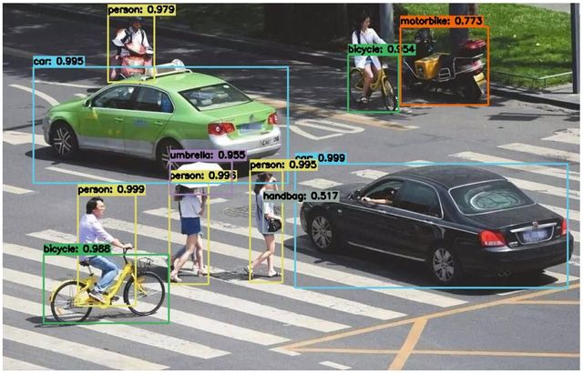
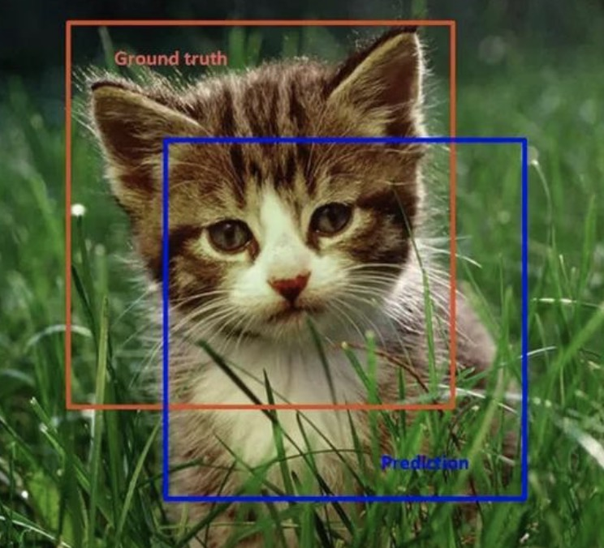

# RCNN

## 简介
目标检测是计算机视觉中的一项重要任务，它的目标是在图像或视频中自动检测和识别出感兴趣的目标物体，并给出它们的位置和类别。
如下图所示，目标检测需要在图像中标出多个目标物体的位置，并对它们进行分类。

目标检测在许多领域中得到了广泛的应用，如自动驾驶、智能安防、无人机、医疗影像等。

## 分类
目标检测的算法可以分为两大类：基于区域提议的方法和单阶段方法。

- 基于区域提议的方法：首先生成一些候选区域，然后对每个候选区域进行分类和回归，以得到最终的目标检测结果。常见的基于区域提议的方法包括R-CNN、Fast R-CNN、Faster R-CNN等。
- 单阶段方法：直接在图像上预测目标的位置和类别，常见的单阶段方法包括YOLO、SSD等。
- 目标检测+实例分割：此类的主要代表是Mask R-CNN，它们不仅可以进行目标检测，还可以进行实例分割，即对每个目标物体的像素进行标注。

## IOU
IOU是目标检测中常用的一种评价指标，用于衡量模型检测结果与真实标注之间的重叠程度。它可以有效地评估模型检测结果的准确性和鲁棒性。

如上图所示，橙色为真实标注框，蓝色为预测标注框。IOU = (检测框和真实标注框的交集面积) / (检测框和真实标注框的并集面积)

IOU的取值范围为0到1，如果IOU等于1，则表示检测框和真实标注框完全重合；如果IOU等于0，则表示检测框和真实标注框没有重叠部分。

## 精度

精度（Precision）指的是模型检测出的目标中，真正属于目标的比例。用于衡量模型的准确性。

精度 = 正确检测的目标数量 / 总检测的目标数量

## 召回率

召回率（Recall）指的是真实目标中，被模型检测出来的比例。衡量模型的鲁棒性。

召回率 = 正确检测的目标数量 / 真实目标的数量

## F1值

F1值是精度和召回率的调和平均值，它综合考虑了模型的准确性和鲁棒性，可以更全面地评价模型的性能。

F1值 = 2 * 精度 * 召回率 / (精度 + 召回率)

## NMS

非极大值抑制（Non-Maximum Suppression，简称 NMS）是目标检测中常用的一种算法，用于抑制重叠的候选框，从而得到最终的目标框。

如上图所示。目标检测的过程中在同一目标的位置上会产生大量的候选框，这些候选框相互之间可能会有重叠，此时我们需要利用非极大值抑制找到最佳的目标边界框，消除冗余的边界框。

具体来说，NMS 算法的实现步骤如下：

对所有候选框按照得分进行排序，选择得分最高的候选框作为最终的目标框。

计算剩余候选框与该目标框的 IoU 值，将 IoU 值大于一定阈值的候选框去除。

从剩余候选框中选择得分最高的候选框，重复上述过程，直到所有候选框都被处理完毕。

