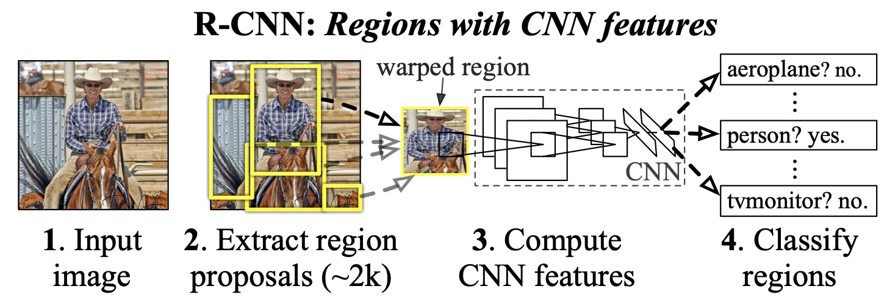
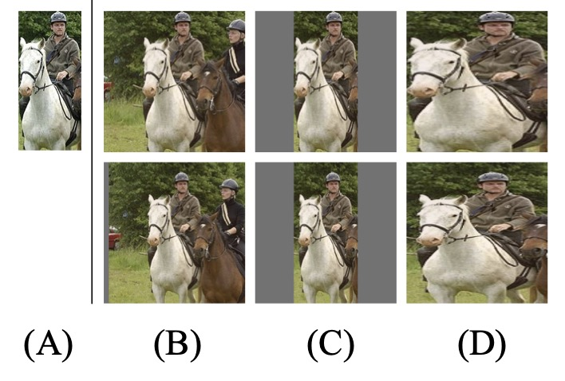

# RCNN

[论文](https://arxiv.org/pdf/1311.2524.pdf)

R-CNN（Regions with CNN features）是第一篇将CNN引入检测领域的论文。作为开山鼻祖，他最自然的采用<def>区域提议</def>的方法。
首先将图像划分出许多不同的框作为候选区域，然后通过CNN对这些框进行分类和回归，以得到最终的目标检测结果。

R-CNN是目标检测领域中的一项里程碑式的工作，为后续的目标检测算法奠定了基础。

## 总体架构

模型的总体架构如下图所示，主要包含四个步骤：

1、候选区域生成：使用<def>Selective Search（SS）</def>方法从图像中生成约2k个候选框。

2、特征提取： 对每个候选区域，使用CNN提取特征。

3、类别判断：利用SVM对提取的特征进行分类。

4、位置精修：使用回归器精细修正候选框位置。

## 候选区域生成

作者首先通过<def>Selective Search</def>方法从图像总生成约2k个候选框，但由于这些候选框尺寸不同，而作者那个时代的CNN还无法处理这种不同尺寸输入的情况。
因此将这些可能的候选框首先进行padding=16的填充，然后通过<def>各向异性</def>缩放直接拉伸，组成矩形作为网络的输入。

结果如上图D列第二行所示。

!!! note "拓展"

    **各向异性（Anisotropy）**和**各向同性（Isotropy）**是两个常用的物理概念，它们在不同的领域和应用中有不同的含义。在图像处理和计算机视觉中，

    **各向同性**通常指图像中的像素在各个方向上具有相同的特征，例如灰度、颜色等。

    **各向异性**则指图像中的像素在不同的方向上具有不同的特征，例如边缘、纹理等。上文的的各向异性指缩放操作对图像每个方向的比例不同。

    

## 特征提取

特征提取采用alexnet作为特征提取器。

AlexNet之前已经在分类任务上进行了训练。在训练之后，他们移除了最后一个softmax层。现在最后一层是完全连接的4096维度层。
由此得到一个4096的输出特征向量。

此外作者还使用SS提取的框对网络进行finetune，将最后的输出替换为21个神经元，代表20个类别+1个背景。

那什么算背景呢？

我们将2000个候选框与gt进行计算IOU，如果IOU>0.5,就把这个候选框标注成<def>物体类别（正样本）</def>，否则我们就把它当做<def>背景类别（负样本）</def>。

!!! Important

    在不同文章中，对正样本和负样本的判定标准是不同。

## 类别判断

现在我们需要对这些特征向量进行分类，以检测它们所代表的物体类别。为此，我们使用SVM分类器，且每个物体类别都有一个SVM。
这意味着对于一个特征向量，送入n个SVM中得到对应的n个置信度分数输出，其中n是我们想要检测的不同物体的数量。该输出反应我们有多大的置信度认为这个特定的特征向量代表这个类别。

这里有个问题，为啥不直接让cnn预测对应的类别呢？非要再加个SVM。

因为论文中CNN和SVM对IOU判断正负样本的标准不同。

cnn在训练的时候，IOU>0.5就把这个bounding box标注为正样本用于训练cnn，这样可以产生大量数据避免过拟合。
svm训练的时候，只有当bounding box把整个物体都包含进去了，才把它标注为正样本，IOU<0.3为负样本，用来训练svm。

## 位置精修

其实通过回归器对位置精修不是R-CNN系统的基本构建块，但是它是一个很好的想法，作者发现它可以将平均精度提高3%。

对每一类目标，使用一个线性脊回归器进行精修。正则项λ=10000。 输入为深度网络pool5层的4096维特征，输出为xy方向的缩放和平移。 

## 不足

R-CNN算法也存在一些不足之处。

首先，R-CNN算法的训练是多阶段的，特征提取网络的训练微调，svm的训练以及检测框回归各自是单独的步骤，这导致训练非常麻烦。
此外，提取的特征要存储在硬盘中，然后才能给svm使用，这导致物理存储空间的消耗。

其次，推理速度较慢，主要原因是需要对每个候选区域进行单独的特征提取和分类，这导致算法的速度较慢,消耗资源多。

最后，R-CNN算法的训练过程需要先生成大量的候选区域，然后对每个候选区域进行分类和回归，这导致算法的内存占用较大。

为解决该问题，[Fast R-CNN](./03%20Fast%20RCNN.md)将特征提取和分类合并到了一个网络中，以减少特征提取的时间；[Faster R-CNN](./04%20Faster%20RCNN.md)提出了基于<def>区域提议网络（RPN）</def>的思想，以快速生成候选区域；
接下来我们将介绍这两个网络。

## 参考
[1] https://zhuanlan.zhihu.com/p/23006190

[2] https://medium.com/@selfouly/r-cnn-3a9beddfd55a

