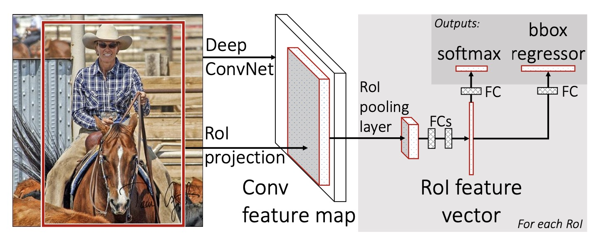
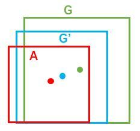

# Fast RCNN

针对RCNN的问题，Fast RCNN使用一个网络统一了特征提取，分类，回归三个步骤。
不再需要对每个候选区域进行单独的特征提取和分类，而是可以在一个前向传播中同时处理所有的候选区域，从而大大提高了训练和测试的速度。

## 整体结构

网络的整体结构如下图所示

1、对输入图像进行卷积神经网络的前向传播，以得到图像的特征图。

2、对每个候选区域进行 RoI 池化操作，以得到每个区域的特征向量。

3、将每个特征向量送入一组全连接层中，以得到每个区域的类别和位置信息。

4、对每个区域的类别和位置信息进行损失计算，并将两个损失相加，以得到总的损失。

## 特征提取

RCNN是对每一个特征图使用网络提取特征，这样会导致非常多的冗余计算。因此Fast RCNN对整张图像输入网络计算特征。
然后将SS算法得到的坐标信息对应到特征图上截取特征表示。这一步的默认前提是：图像经过网络提取特征后对应的空间信息没有变化。

由于提取的特征不是相同的尺寸，因此使用ROI层得到统一维度的特征向量。

## ROI池化

如下图所示,

[//]: # (![]&#40;../img/05/03/roi.jpg&#41;)

RoI最大池化层首先将原来W x H尺寸的窗口划分为m x n的网格大小，然后在每个小格子范围内通道独立的做最大池化得到 维度为m x n x C的特征。

它的好处是无论输入尺寸是什么样的，都可以得到相同维度的输出。且避免了拉伸对图像带来的扭曲。

## 检测头

Fast RCNN在获得ROI的输出后，通过全连接提取特征，然后输入两个并行层得到分类和回归结果。其中分类层由全连接和softmax组成，softmax得到(n+1)个输出，其中n表示类别。1表示前后背景。
回归层得到输出边框回归的偏移量，对每个类k都输出四个偏移量。

$$ t^k = (t_x^k, t_y^k, t_w^k, t_h^k) $$

## 损失函数

分类枝干的损失函数表示为

$$ L_{cls}(p, u) = -log(p_u) $$

其中p表示网络预测值，u表示标准输出类别。

回归枝干的损失函数表示为：

$$ L_{loc}(t^u, v) = \sum_{i={x,y,w,h}} smooth_{L1}(t^u_i - v_i) $$

之前提到回归对每个k输出4个偏移量，在计算回归损失时只使用标准输出类别的那四个偏移量。smooth L1 loss表示为

$$
smooth_{l1}(x) = \{
\begin{matrix}
 0.5x^2 & if|x|<2 \\ 
 |x| * 0.5 & otherwith
\end{matrix}
$$

总的loss为

$$ L(p,u,t^u,v) = L_{cls}(p, u) + \lambda[u \geq 1]L_{loc}(t^u, v) $$

其中\( [u \geq 1] \)表示gt为背景类的话不计算他的损失函数， \( \lambda \) 用于权衡两者损失，一般置1。

## 边界框回归原理

在RCNN中提到边界框回归，但没有细讲他是怎么实现的。现在我们仔细介绍一下具体是怎么实现的。

如上图所示，绿色框为飞机的gt，红色为预测的<def>positive anchor</def>。但由于红框定位不准，如果iou过低会当作负样本。
因此现在希望对红框进行微调，使他和GT更接近。

现在我们利用一个四维向量(x,y,w,h)定义一个窗口，分别表示窗口的中心坐标、宽和高。
如下图所示，我们希望找到一种关系，使得输入原始的anchor A经过映射得到一个跟真实窗口G更接近的回归窗口 \( G^/ \)。

- 定义原始框 \( A = (A_x, A_y, A_w, A_h) \)
- 定义目标框 \( G = (G_x, G_y, G_w, G_h) \)
- 定义回归后的框为 \( {G}^/ = {G_x}^/, {G_y}^/, {G_w}^/, {G_h}^/ \)
- 寻找一种变换F。 
$$ F(A) = {G}^/ $$
使 \( {G}^/ \) 接近 G。

F应该怎么映射呢？简单的想法是先平移，在缩放。

- 平移x： $$ {G}^/_x = A_w \cdot d_x(A) + A_x $$
- 平移y： $$ {G}^/_y = A_h \cdot d_y(A) + A_y $$
- 缩放w： $$ {G}^/_w = A_w \cdot exp(d_w(A)) $$
- 缩放h： $$ {G}^/_h = A_h \cdot exp(d_h(A)) $$

所以，我们需要学习\( (d_x(A), d_y(A), d_w(A), d_h(A)) \)四个变换。当且仅当anchor A和GT相差较小时，可以认为这种变换是一种线性变换， 那么就可以用线性回归来建模对窗口进行微调。

现在我们利用线性回归，给定输入网络的特征图，定义为\( \phi(A) \),线性映射权重为\( W^T \),映射结果为\( d_(A)) \)。用*表示{x,y,w,h},则映射关系可以表示为
$$ d_*(A) = W_*^T \cdot \phi(A) $$

又目标为\( t_* \)， 所以可定义损失函数L1 loss 为：

$$ Loss = \sum_{i}^{N}| t_*^i - d_*^i | = \sum_{i}^{N}| t_*^i - W_*^T \cdot \phi(A) |  $$

为了方便描述，这里以L1损失为例介绍，而真实情况中一般使用smooth-L1损失。

那目标映射关系\( t_* \)又是怎么来的呢？可以通过

$$ t_x = (x - x_a)/w_a $$
$$ t_y = (y - y_a)/h_a $$
$$ t_w = log(w/w_a) $$
$$ t_h = log(h/h_a) $$

