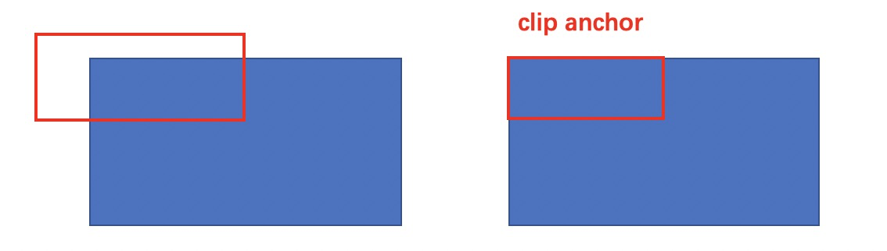

# Faster RCNN

Fast RCNN是对RCNN的后半段进行改进，而Faster RCNN是要对RCNN的前半段进行改进。
它不再需要使用选择性搜索等算法来生成候选区域，而是使用 RPN 网络直接生成候选区域，从而大大提高了算法的速度和准确率。

## 整体架构

网络的整体架构如下图所示：

[//]: # (![]&#40;../img/05/04/all.jpg&#41;)


1、特征提取。Faster RCNN首先使用一组基础的conv+relu+pooling层提取image的feature maps。该feature maps被共享用于后续RPN层和全连接层。

2、Region Proposal Networks。RPN网络用于生成region proposals。该层通过softmax判断anchors属于positive或者negative，再利用bounding box regression修正anchors获得精确的proposals。

3、Roi Pooling。该层收集输入的特征图和提议框，综合这些信息后提取proposal feature maps，送入后续全连接层判定目标类别。

4、分类回归。利用proposal feature maps计算proposal的类别，同时再次bounding box regression获得检测框最终的精确位置。

总的来说，除了RPN替代了SS，其他和Fast RCNN一模一样，所以会主要讲解RPN部分。

## 特征提取

网络使用13个conv层+13个relu层+4个pooling层，将输入[M, N]的图像转为[M/16, N/16]的特征图。

## RPN


图示其实不太容易理解，我们可以将RPN简单分为三步

1、使用3*3卷积得到一个256层的特征图，尺寸为 [M/16, N/16]。

2、将步骤1的特征图分别得到分类层和回归层。

3、用Proposal Layer将分类与回归信息融合筛选得到用于训练的anchor。

接下来细讲步骤2和3。

### anchor

步骤1得到了尺寸为[M/16, N/16]的特征图，然后会对每个点生成k个anchor，k一般为9。9个anchor包含3种尺度，W:H = {1:2, 1:1, 2:1}共3种比例。
具体为

```python
[[ -84.  -40.   99.   55.]
 [-176.  -88.  191.  103.]
 [-360. -184.  375.  199.]
 [ -56.  -56.   71.   71.]
 [-120. -120.  135.  135.]
 [-248. -248.  263.  263.]
 [ -36.  -80.   51.   95.]
 [ -80. -168.   95.  183.]
 [-168. -344.  183.  359.]]

```

这是预先定义好的，如果显式可见的话如下图所示

[//]: # (![]&#40;../img/05/04/anchor.png&#41;)


通过该方法可以生成[M/16, N/16, 9]个候选框，足以覆盖图中的绝大多数目标。

### 分类层和回归层

现在特征图每个点上有k=9个候选框，然后分类层要将每个anhcor要分positive和negative，所以该层输出通道为\( cls=2*k \)的特征图；
而每个anchor都有\( {d_x(A), d_y(A), d_w(A), d_h(A) } \)对应4个偏移量，所以回归层输出通道为\( reg=4*k \)的特征图。

### Proposal Layer

Proposal Layer负责综合所有\( {d_x(A), d_y(A), d_w(A), d_h(A) } \)变换量和positive anchors，计算出精准的proposal，送入后续RoI Pooling Layer。

该层接受三个输入：

- rpn_cls_prob_reshape： 分类器对positive vs negative anchors的分类结果。
- rpn_bbox_pred：边界框回归的输出\( {d_x(A), d_y(A), d_w(A), d_h(A) } \)。
- im_info: 对于一副任意大小PxQ图像，传入Faster RCNN前首先reshape到固定MxN，im_info=[M, N, scale_factor]则保存了此次缩放的所有信息。

Proposal Layer处理流程如下：

1）生成修正位置后的anchors。利用 \( {d_x(A), d_y(A), d_w(A), d_h(A) } \) 对所有的anchors做bbox regression回归。

2）提取修正位置后的positive anchors。 照输入的positive softmax scores由大到小排序anchors，提取前N个。

3）限定边框。对超出图像边界的anchor更新其为图像边界，具体如下图所示。



4)剔除尺寸非常小的positive anchors。

5）对剩余的positive anchors进行NMS。

6）输出proposal=[x1, y1, x2, y2]，用于后续RoI。

注意，由于在第三步中将anchors映射回原图判断是否超出边界，所以这里输出的proposal是对应MxN输入图像尺度的。

总的来说在 Faster R-CNN 中，区域提议网络（RPN）负责生成候选区域， Fast R-CNN 负责对每个候选区域进行分类和回归。
RPN 网络和 Fast R-CNN 网络都是深度卷积神经网络，但它们的结构和目标不同。

R-CNN系列的双阶段检测可以质量很高的检测结果，但随着深度学习的发展，其复杂性及推理的耗时变得不可接受，单阶段的端到端检测在不断演进中准确率也在不断提升，成为检测的主力。

## 参考
https://zhuanlan.zhihu.com/p/31426458
https://arxiv.org/pdf/1504.08083.pdf


