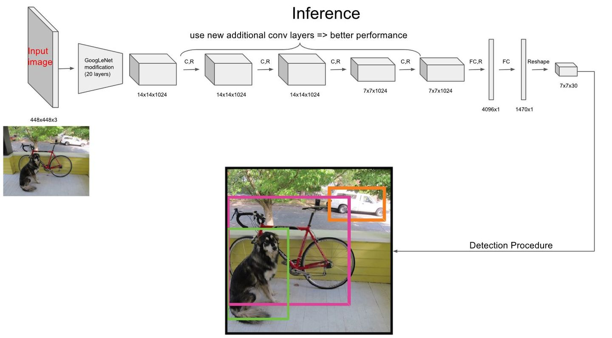
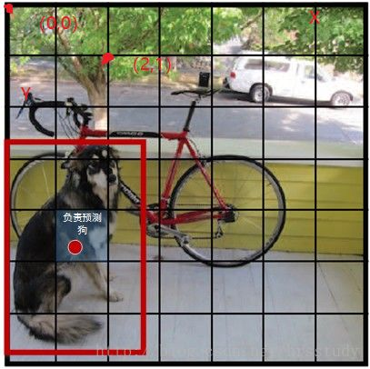
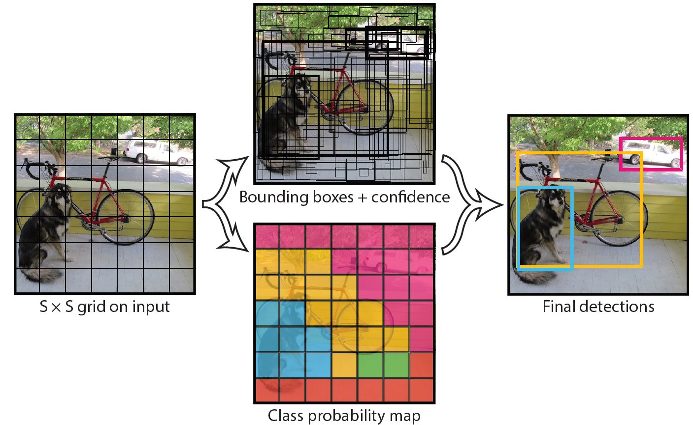
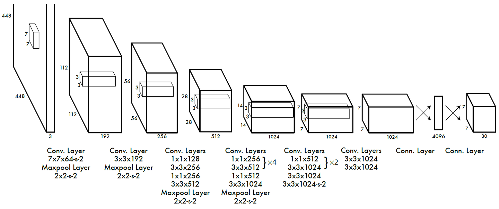
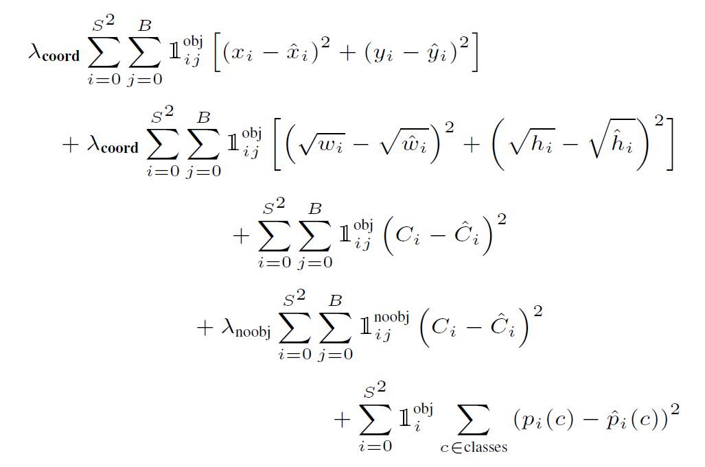

# YOLOv1

YOLO（You Only Look Once）是一种单阶段的目标检测算法，它的主要思路是通过一个卷积神经网络直接对整张图像进行检测，直接输出分类结果和目标框信息。从而实现快速、准确的目标检测。

## 主体结构

网络主体结构如下图所示，主要步骤可以分为：

1、将输入图像resize为448 × 448， 然后划分成 S × S 个网格。

2、主干网络对原图提取特征，生成尺寸为 S × S 个n维向量。

3、 每个n维向量预测该网格内是否包含目标以及目标的位置和类别。

## 网格划分

对原图的网格划分如下，  

但其实并非真的要对图像切块，而是一种示意图。 因为图像在resize后会进入网络提取出S × S的特征，
对图像切块就可以很明显的将图像块和特征图一一对应，每个特征向量预测 中心坐标 落在 对应图像块 的目标。

比如图中狗狗的中心坐标落在（1，4）的网格中，则特征图中（1，4）中的特征向量用来预测狗的边界框等信息。

## 特征向量

每个特征向量预测类别概率，置信度，框共三个信息。

- 类别概率\( Pr(class_i|object) \)。表示的为条件概率，即我要画的这个框中如果如目标的话，该类别对应的概率是什么？这个信息占用的向量长度为C，C为类别数。
- 边界框置信度\( Pr(Object)*IOU_pred^truth \)。Pr(Object)用于预测框中是否含有目标，有的话为1，无目标的话为0；有目标的话\( IOU_pred^truth \)表示该框与gt的iou是多少。这个信息对应向量长度为B，B为预测的框数量。
- 框。包含位置和大小信息，使用长度为4B的向量表示，分别代表(x,y,w,h)。其中(x,y)表示框的中心坐标，是相对于每个单元格左上角坐标点的偏移值。值的单位是相对于单元格大小的，故值介于[0,1]之间。
w和h的预测值是相对于整个图片的宽与高的比例，因此值也是介于[0,1]之间。

综上，每个特征向量包含C + B * (1+4)的信息，由于PASCAL VOC数据类别C=20，B=2，即预测两个框，所以向量长度为30。
而网络划分为的网格数S = 7，故输出的特征向量为[7, 7, 30]。

这里有个问题，假如两个框的预测的类别不同怎么办？由于只有一个C表示类别信息，所以这也是YOLOv1的限制所在，它每个网格只能预测一个类别，对重叠场景无法解决。

通过综合以上信息，网络预测得到最终的结果图。如下图所示

图中"Bounding boxes + confidence"表示所有框的可视化，由于总共7*7个网格，每个网格预测B=2个框，所以总共有7*7*2=98个候选框。图中框边缘的深浅表示置信度，置信度越高框越黑。
"Class probablity map"表示中心落在该网格的目标类别。

将目标类别概率与置信度相结合，可以得到各个边界框类别置信度（class-specific confidence scores）,用来表示该边界框中目标属于各个类别的可能性大小以及边界框匹配目标iou的好坏。

$$ Pr(class_i|object) * Pr(Object) * IOU_pred^truth = Pr(class_i) * IOU_pred^truth $$

最后会通过边界框类别置信度和NMS算法对目标进行筛选，得到最终输出。

## 网络结构

网络结构如下图所示

网络结构参考GooLeNet模型，包含24个卷积层和2个全连接层。对于卷积层，主要使用1x1卷积来做channle reduction，然后紧跟3x3卷积。
对于卷积层和全连接层，采用Leaky ReLU激活函数：max(x, 0.1x)。

网络的最后输出为[7,7,30]大小的张量。我们现在说说向量的排布。[0:20]表示是类别概率值,[20:22]两个表示边界框置信度，[22:26]第一个边界框的坐标宽高信息，[26:30]第二个边界框的坐标宽高信息。

实践中发现直接预测宽高信息[w,h]容易导致较小的边界框的坐标误差应该要比较大的边界框要更敏感。所以为同等对待大小不同的边界框，将网络的边界框的宽与高预测改为对其平方根的预测，即预测值变为\( (x,y,\sqrt{w}, \sqrt{h}) \)。

## 损失函数

训练中使用的损失函数如下所示，主要包括五项，每项占用一行。

1、位置坐标损失函数。采用均方误差对S*S*B个位置坐标逐个计算误差。其中\( \lambda_{coord}=5 \)。\( \1_{ij}^obj \) 代表的是这个grid里有物体,所以有目标为1，没有目标为0。

2、宽高损失函数。采用均方误差对S*S*B个宽高逐个计算误差。

3、包含目标的边界框的置信度误差项。

4、不包含目标的边界框的置信度误差项。其中其中\( \lambda_{noobj}=0.5 \)。 \( \1_{ij}^noobj \) 代表的是这个grid里没有物体,所以没有目标为1，有目标为0。

5、包含目标的单元格的分类误差项。

总的来说，当有检测框中有物体时，计算1，2，3，5，没有物体时计算第4项。

## 参考
https://arxiv.org/pdf/1506.02640.pdf
https://zhuanlan.zhihu.com/p/94986199
https://zhuanlan.zhihu.com/p/32525231

