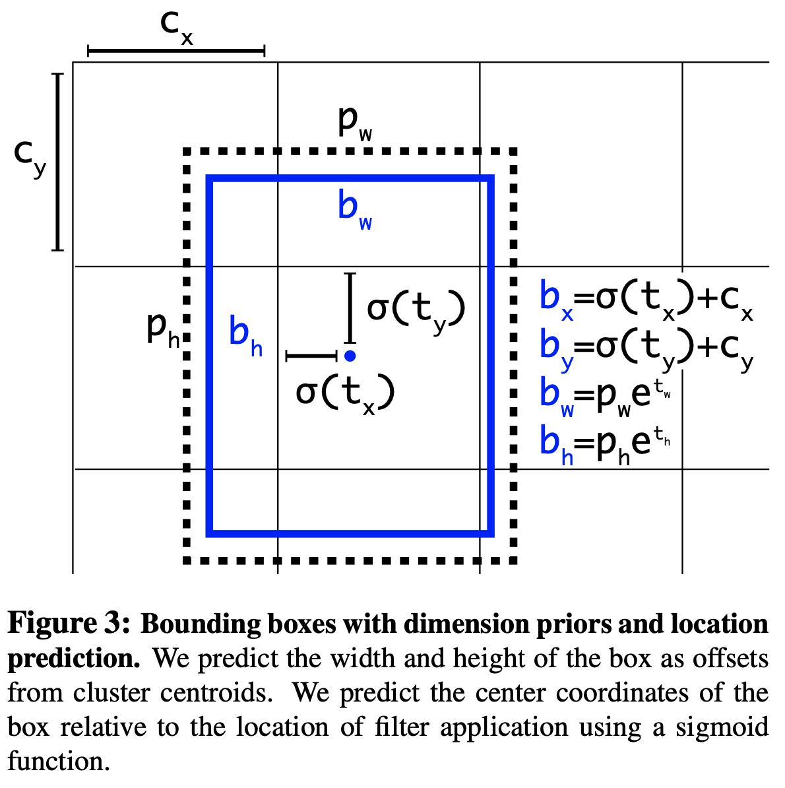

# YOLOv2

yolov2是YOLO算法的改进版本，相比于YOLO算法，YOLOv2在目标检测的精度和速度上都有所提高。

## 改进列表

- Batch Normalization
- High Resolution Classifier
- Convolutional With Anchor Boxes
- Dimension Clusters
- Direct location prediction
- Fine-Grained Features
- Multi-Scale Training

几种方法的效果对比如下图所示

## Batch Normalization

BN在15年提出后成功解决了训练难度大，网络每层分布变化的问题。因此yolov2在网络中引入了该技巧，并取得了mAP提升2%的收益。

## High Resolution Classifier

之前我们提过yolov1采用了448*448的输入分辨率，当时是考虑到原始imageNet采用的224*224的输入，而更大尺寸的输入更有利于检测。
在yolov2中作者认为之前存在一个问题：直接用224*224训练好的预训练模型作为backbone效果还是不好。所以作者在检测前用448*448的图像finetune分类网络。所以目前的步骤是：
- 使用224 * 224的imageNet图像训练分类网络大概160个epoch，这个分类网络是作者自定义的DarkNet19，含有19个卷积层和5个池化层。
- 使用448 * 448的imageNet图像finetune分类网络，训练10个epoch，以此来适应高分辨率输入。
- 使用448 * 448的检测数据集（例如coco）进行微调整个网络。
通过该方式提升了4%mAP

## Convolutional With Anchor Boxes

yolov1中首先经过全连接层，然后预测框的坐标和宽高信息。前者会导致丢失空间信息，定位不准，后者网络回归的难度较大。为此
yolov2借鉴了Faster R-CNN的思想，引入anchor。其主要改进如下

1、删除网络中的全连接层和池化层，确保输出的卷积特征图有更高的分辨率
2、缩减网络输入为416*416。这一步的目的是为了让后面产生的卷积特征图宽高都为奇数，这样就可以产生一个center cell。
因为作者发现很多大目标都在图像中间，如果是偶数的话中心的四个坐标都要用来预测该物体，但奇数只需要使用一个就好了。
最终yolov2将416*416的输入得到13*13的特征图。

加入anchor boxes后，网络可以预测13*13*9=1521个boxes，但之前只有7*7*2=98个，所以召回率上升，准确率下降。

## Dimension Clusters

Faster R-CNN的anchor是**精选的先验框**，尺度比例都预先定义好了，然后在训练中让网络学会调整boxes的宽高维度。
那有没有更好的预定义框呢？作者想通过K-means对训练集中的boxes进行了聚类，进而自动找到更好的boxes宽高维度。

但传统的K-means采用欧式距离衡量差异，box的尺寸越大误差越大，所以作者定义IOU为距离函数，使得误差和box的大小无关。

下图中左边为聚类结果，

横轴标志聚类中心数量，右边表示平均IOU，很自然的当聚类中心越多，IOU越高。综合考虑模型复杂度和召回率，作者最终选取5个聚类中心作为先验框。
右侧的图像显示了VOC和COCO相对质心的位置。两组先验框都更偏向于较细、较高的边界框，而COCO比VOC在大小方面有更大的变化。

通过该方式发现
（1）采用聚类分析得到的先验框比手动设置的先验框平均IOU值更高，因此模型更容易训练学习。
（2）仅选取5种box就能达到Faster RCNN的9种box的效果。

## Direct location prediction

每个检测模型中怎么回归框都是一个很重点的工作，在yolov2中，因为采用了Faster RCNN的anchor思想，因此开始也采用它回归框的计算。但后来发现该方法收敛不稳定，推断是预测anchor框中心位置（x，y）的问题。因此对其进行了改进。

!!! important

    bounding boxs：为网络预测的用于定位物体位置的框。
    anchor: 为了便于网络预测，提前定义的一组框。网络会对这些预定义的anchor进行回归得到bounding box。

在Faster RCNN中，中心(x, y)的预测公式如下：

$$ x = (t_x * w_a) + x_a $$
$$ y = (t_y * h_a) + y_a $$

这个公式是无约束的，预测的边界框很容易向任何方向偏移。当\( t_x = 1\)时，box向左偏移一个anchor的宽度；当\( t_x = -1\)时，box向右偏移一个anchor的宽度，\( t_y \)同理。
但这样导致的问题是，每个位置预测的框可以在图像的任何一个位置，导致模型不稳定。

所以在预测中心坐标的公式中，yolov2采用和yolov1相同的方法，即预测边界框中心点相对于对应cell左上角位置的相对偏移值。网络在最后一个卷积层输出13*13的特征图，每个位置通过anchor box先验预测5个bounding box，即上文聚类的结果，每个bounding box预测得到5个值。
分别是tx、ty、tw、th和to（类似YOLOv1的confidence）。

新的anchor box回归函数如下：

$$ b_x = \sigma(t_x) + c_x $$
$$ b_y = \sigma(t_y) + c_y $$
$$ b_w = p_w*exp(t_w) $$
$$ b_h = p_h*exp(t_h) $$
$$ Pr(object) * IOU(b, object) = \theta(t_o) $$

其中\( b_x， b_y，b_w， b_h \)为预测的bounding box相当于先验框anchor box的偏移。 \( \sigma \)表示sigmoid函数，用于将\( t_x， t_y \)约束在[0, 1]之间，\( c_x， c_y \)表示每个cell相对于图像左上角的距离，
这样经过约束，得到的anchor box中心坐标可以约束在当前cell中，稳定训练。

综上，yolov2在预测框中心坐标的时候采用yolov1的方法，预测宽高回归时候采用Faster RCNN的公式。该方法能够更准确地确定目标的位置和大小，并且能够更高效地进行目标检测。

## Fine-Grained Features
这点和后来的多尺度预测很接近了。仅在最终的13*13的尺度图上进行预测，缺少很多细节信息，对检测小目标不友好。因此一个直观的想法是将26*26尺度的信息拼接到
最终的特征图上。

所以作者采用了转移层（ passthrough layer），先将26*26*512的特征图通过space2depth变为13 * 13 * 2048的特征图，然后与网络后面的13*13*1024特征图concat在一起形成13*13*3072的特征图，最后在该特征图上卷积做预测。

space2depth的操作如下图所示，将相邻四个像素在通道维进行重排，获得空间为1/4，而通道数变为以前的4倍的特征图。

## Multi-Scale Training

由于YOLOv2中只有卷积层和池化层，因此不需要固定的输入图片的大小。所以作者采用了多尺度训练提升网络鲁棒性。
即在使用检测数据集finetune整个网络的过程中，每迭代一定的次数，随机选择新的图片大小训练网络。

作者采用32的倍数作为输入的size，具体采用320、352、384、416、448、480、512、544、576、608共10种size。
不同的输入，最后产生的格点数不同，比如输入图片是320*320，那么输出格点是10*10，如果每个格点的先验框个数设置为5，那么总共输出500个预测结果；如果输入图片大小是608*608，输出格点就是19*19，共1805个预测结果。

这种机制使得网络可以更好地预测不同尺寸的图片，意味着同一个网络可以进行不同分辨率的检测任务

## Faster 
作者采用Darknet-19作为新的分类网络结构，网络比较简洁，采用了较多的3*3卷积，参数量比VGG16小，但在ImageNet上，可以达到top-1 72.9%以及top-5 91.2%的精度。
网络结构组成如下图所示

## 参考
https://arxiv.org/pdf/1612.08242.pdf
https://blog.csdn.net/lwplwf/article/details/82895409

