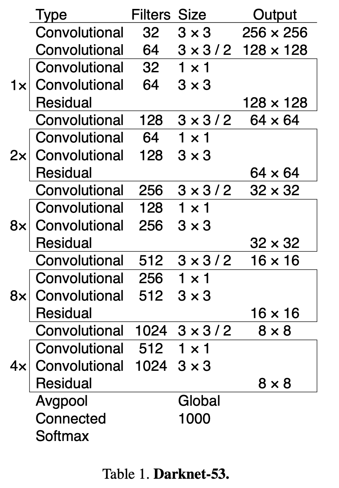
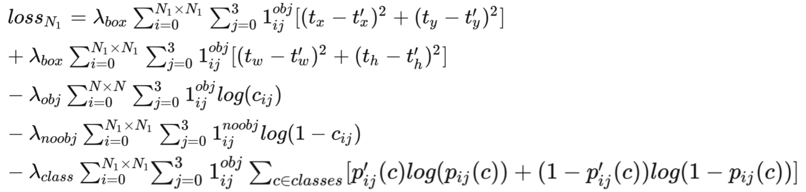

# YOLOv3

YOLOv3是yolo作者更新的第三个版本，此后便放弃了继续更新，因此现在提到的yolov4-v7 其实是其他作者在yolo后继续更新的工作，故而我也暂时先写到v3，以后想的话会继续做其他介绍。

## 改进内容
相对于yolov2， v3版本的改进如下：

- Backbone网络
- 多尺度预测
- 特征融合

## Backbone网路
YOLOv3使用了Darknet-53作为其主干网络，它比YOLOv2中使用的Darknet-19更深更强大，能够提取更丰富的特征。

DarkNet-53结构如下：

从中可以看出网络全部采用卷积实现，包括降采样也是通过控制卷积步长=2来实现。网络总共经过五次尺度衰减，最终获得输入尺寸1/32的特征图，所以希望输入为32的整数倍。当输入为416时，最后一层的输出为尺寸为13。
相比与Darknet-19，DarkNet-53借鉴了残差连接的思想，便于信息传递。

## 多尺度预测

在之前的yolov2中，是采用最后一层输出，每个cell预测5个bounding box。在yolov3的改进中，作者借鉴FPN的思想，利用金字塔结构，在网络降采样的三个不同尺度特征上，每个cell分别预测三个bounding box。
网络的具体结构如下：

从图中可以看出网络在不同尺度上输出了三个不同特征图，分别是\( y_1, y_2, y_3 \)。他们的通道数都是255，宽高分别为13，26，52。尺寸小的预测输出用来检测图像中的大目标，尺寸大的特征图用来检测图像中精细的小目标。

现在来介绍一下255的含义，在coco数据中包含80个类别，所以需要80个通道用来对每个类别进行预测。而每个预测的bounding box需要包含\( t_x， t_y， t_w, t_h, y_o \)五个值，这点和yolov2是一样的，所以需要5个通道来实现。
又因为同一个尺度的特征图里每个cell预测3个bounding box，所以需要 3 * (80 + 5) = 255个通道。

网络每层的特征图会预测N*N*3个bounding box，其中N=13，26，52。故总共会输出(13*13 + 26*26 + 52*52) * 3 = 10647个特征图。

此外，网络还需要三种尺度上3个不同的先验anchor box。作者同样采用k-means的思想进行聚类获得，他们的尺寸分别为
$$ 10,13,  16,30,  33,23,  30,61,  62,45,  59,119,  116,90,  156,198,  373,326 $$。

## 特征融合
在计算\( y_2, y_3 \)的时候，网络采用UNet融合深浅层特征图的思想，通过解码结构对主干网络中的高级特征进行上采样，然后与编码其中的低级语义特征concat融合后进而预测bounding box。

## 损失函数

计算第一个特征图f1的损失函数如下：

损失函数大致与yolov1类似，改动在最后一行分类损失上，将yolov1中的mse loss替换为交叉熵。这是因为yolov3在预测类别时，不再使用softmax而是采用sigmoid函数。

当预测框为正例时，计算前三行中预测框信息的中心坐标、宽高、置信度损失 和 第五行的分类损失函数。当预测框为反例时，计算第四行的置信度loss。最终的损失函数是三个尺度的损失函数之和。

网络总共预测的10647个框会被分为三类：正例，负例，忽略。

- 正例（positive）：任取一个ground truth，与所有10467个框全部计算IOU，IOU最大的预测框，即为正例。由于一个预测框只能预测一个gt，因此第二个gt只能和剩下的10466个框计算IOU并挑选正例。
- 负例（negative）：与全部ground truth的IOU都小于阈值（eg：0.5），则为负例。
- 忽略（ignore）：正例除外，与任意一个gt的IOU大于阈值（eg：0.5），则为忽略样例。

