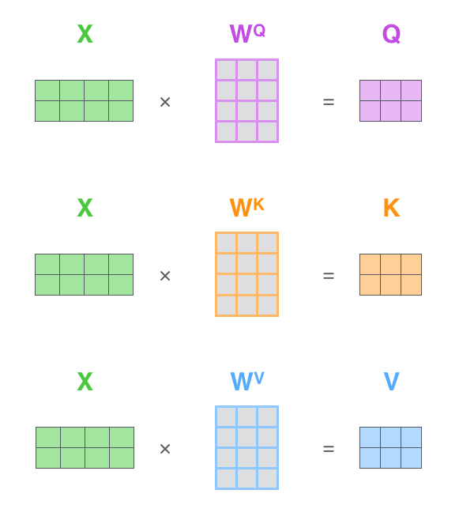
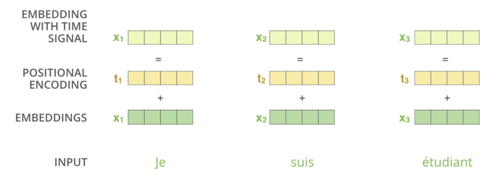
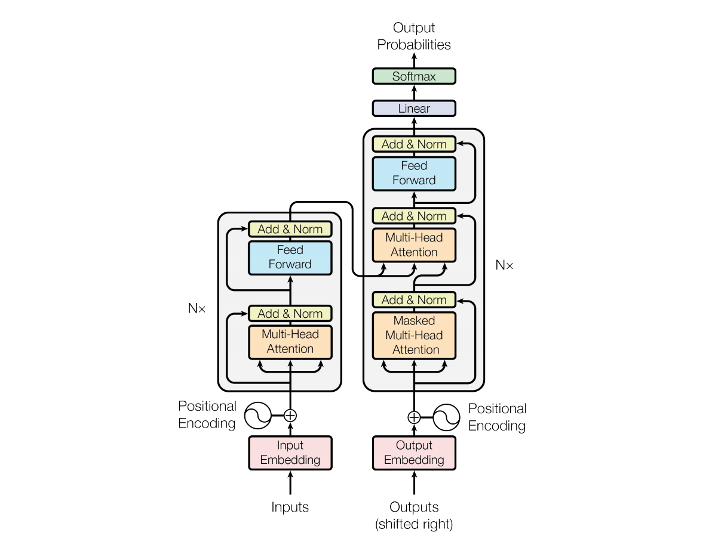

# Transformer

Transformer是目前深度学习领域最前沿的研究方向，虽说他从之前网络的Attention机制演化而来，但是却又和传统CNN，RNN之类完全不同。

Transformer在论文《Attention Is All You Need》中首次被提出，用来实现翻译任务。他通过使用注意力机制来处理序列中的长距离依赖关系，从而提高模型的表达能力和泛化能力。
此后拓展到图形处理领域，并在如今用于多模态学习，AIGC等。

本文将首先介绍其实现过程，然后再介绍其原理和有效性。

## 整体结构

我们可以先从整体来看Transformer的结构。现在我们来想象一个翻译的场景，

我们可以把他当作一个黑盒子，就像之前的CNN一样，给他一个输出，就能得到对应的输出。

然后我们将网络进一步展开，

Transformer包含Encoders和Decoders两个部分，进一步来说，这两部分又分别包含若干个小的编解码结构。

输入通过多个Encoder逐个处理，每个Encoder的输出会作为下一个Encoder的输入，最后一个Encoder的输出需要作为每一个Decoder的输入。

现在我们再来看看每一个Encoder和Decoder具体又包含了哪些东西

每一层的Encoder都是由一个Self-Attention层和一个前馈网络(Feed Forward Neural Network)组成。

而Decoder则是由Self-Attention、Encoder-decoder Attention和Feed Forward三个部分组成。多的Encoder-decoder Attention
主要是为了在解码时会考虑最后一层Encoder所有时刻的输出。

## Self-Attention

### 引入

首先我们考虑要翻译”The animal didn’t cross the street because it was too tired”(这个动物无法穿越马路，因为它太累了)。
现在想知道句中的"it"指代的是"animal"还是"street"，我们可以**根据后文**中的"tired"来判断it指代的是**前文**中的animal。
因为动物才可能累。这段理解对我们来说是很简单的，但是对之前的工作如RNN，LSTM等都无法实现，因为他们没有办法同时考虑前文和后文中的内容。

而self Attention的目的就在于，每次编码某个单词的时候，都要考虑句子中所有的其他单词。接下来我们看他是具体怎么做到的。

### 单个时间实现
如下图所示，我们先将输入的词进行embedding，得到词向量表示x1，x2。接着使用矩阵\( W^Q \), \( W^K \), \( W^V \)对输入进行变换，
得到向量\( q_1，k_1， v_1 \) 和 \( q_2，k_2， v_2 \)，其中 

$$ q_t = x_tW^Q $$

k,v类似。为了后续Q，K可以内积，我们需要\( W^Q \)和\( W^K \)维度相同。\( W^V \)则没有此要求。

得到 \( Q_t，K_t， V_t \)之后，我们可以计算self Attention了。即用Q去查询每一个V，我们以第一时刻为例，首先计算\(q_1\)和
\(k_1\), \(k_2\)之间的内积，这里的Score等于112和96是种假设值。

然后将Score除以8之后再进行softmax计算，把得分变为概率。至于为什么是除以8，是因为8是作者使用的\( \sqrt{d_k} \)计算而来的，\( d_k \)又是k向量的维度。
那为啥要除以k向量维度的平方根呢？是因为作者认为这样计算梯度时会更加稳定。

最后用softmax得到的概率对所有时刻的V求加权平均，得到输出Z，作者认为Z根据Self-Attention的概率综合考虑了所有时刻的输入信息，计算过程如下图所示。

以上演示了输入为Thinking这一个时间步的计算过程。计算其他时刻是一样的，我们将用矩阵形式描述该过程。

### 矩阵实现

对不同的时间步，我们通过将输入拼接为一个矩阵进行并行训练。如下图所示，

此处X为两维分别代表Thinking 和 Mechines 得到的两个向量输入。同时经过矩阵运算得到输出QKV，当然如果输入的词向量足够多，也可以是其他维度。

然后和之前完全相同，利用Q和K计算得到Score，除以\( \sqrt{d_k} \)后送入Softmax，最后加权平均得到输出。
该过程表示如下：

### Multi-Head Attention

通过矩阵实现，我们将输入经过**一组**QKV的计算过程表示了出来，但是接下来我们希望定义多组QKV，让他们分别关注不同的上下文，提升网络的表征能力。
每组的计算过程相同，变换矩阵表示为\( (W_i^Q, W_i^K, W_i^V) \), 其中i=(1,2,..,n)。这里n表示有几组Multi-Head。

图中展示了一组输入经过n=8的multi Head得到的8组输出\( (Z_0, Z_1, .. , Z_7) \)。

接下来我们将这8组输出通过维度拼接转为一个矩阵，然后利用线性变换（乘矩阵 \(W_0\)）对它进行压缩来减少维度，该过程具体如下

综上，self Attention过程介绍完了，我们用一个完整的图示表示如下

这里R在前面没有提起，因为之前X表示第一层encoder词向量的输入，之后用R表示其他层encoder的输入。

### 有效性

现在我们回头看来引言中的例子，看一看self Attention的作用。下图为第六层Encoder中不同Head Attention的可视化图。

可以看到不同的Head关注的重点是不同的，其中第一个图中it确实更为关注句中的"animal"。

## 位置编码(Positional Encoding)

正所谓尺有所短，寸有所长。RNN和LSTM这些结构虽然不能全面的看待句子中所有位置单词的信息，但他们对应的有点是本身包含了词向量的语义信息。
但self attention虽然可以对句子中任意位置的单词进行编码计算权重，但缺少位置信息。所以我们需要对self Attention的输入进行修改，嵌入位置信息。

通过引入一个新的位置向量，该向量与时间t相关。我们把Embedding和位置编码向量加起来作为模型的输入。图示如下，

这样的话如果两个词在不同的位置出现了，虽然它们的Embedding是相同的，但是由于位置编码不同，最终得到的向量也是不同的。

位置编码有很多方法，此处不再细讲。

## Encoder其他组成部分

之前我们提到Encoder可以分为Self Attention 和 Feed Forward两大部分，但这只是粗略的划分，其内部具体结构如下图所示

如图展示了其细节组成，可具体分为以下步骤：
- 1、输入和位置编码一同送入Encoder
- 2、x1，x2经过self Attention的到z1，z2。然后和短接的输入x1，x2相加，送入layerNorm层。
- 3、步骤2的输出再经过前馈层（feed forward）层，该层实际为全连接层。
- 4、前馈层的输出同样与短接的z1，z2相加，再利用layerNorm归一化。
- 5、最终的输出作为下一个Encoder的输入。

## Decoder

现在我们合起来看看Encoder和Decoder的结构

Decoder和Encoder是类似的，区别在于它多了一个Encoder-Decoder Attention层。他的Query来自下一层，而Key和Value则来自最后一层Encoder的所有时刻的输出。

可能你想问Encoder-Decoder Attention结构是什么样的，答案是和self Attention一模一样。他们只是输入有区别。

## 回到论文

现在我们来引入论文中，你可能会见过无数次的图。

现在你应该很容易理解每个部分的作用及结构了，但还有三点需要提一下。

1、最后一个Encoder的输出有两个箭头，送入Decoder的Encoder-Decoder Attention结构，他们就是刚说的key和value。

2、Decoder中的Masked Multi-Head Attention中Mask的作用是屏蔽掉未来的信息，从而避免在解码器中使用未来的信息来影响当前的预测结果。
因为在训练过程中，解码器是逐步生成输出序列的，每个时间步只能使用当前和之前的信息。如果使用未来的信息，就会导致模型出现信息泄漏的问题，影响模型的预测结果。

3、Decoder最终的输出经过一个线性层和一个softmax得到最终的预测输出。

## 总结

至此，Transformer的完整结构就讲完了，接下来我们会通过几篇CV领域应用Transformer的论文介绍其应用。
可以简单提一嘴的是这些论文一般只采用Encoder即可。

## 参考
http://jalammar.github.io/illustrated-transformer/