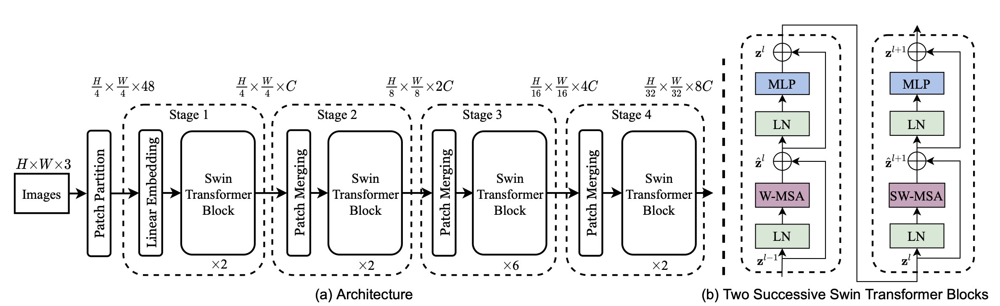
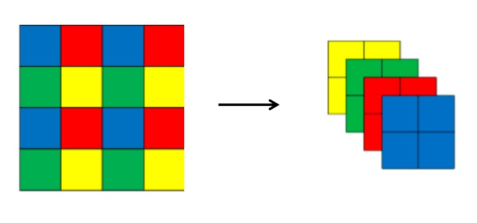
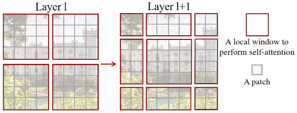
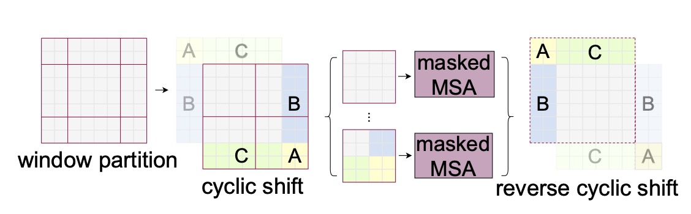

# Swin Transformer

ViT作为vision transformer的开创性工作，一直无法克服计算量大的问题，这就限制了transformer的应用。
Swin Transformer通过分层图像和Shifted Windows极大地解决了计算量大的问题，获得ICCV 2021的Best Paper。

## 创新点

- 层次化
- Shifted Windows

## 引入

在之前的ViT讲解中我们说到，将图像的输入转化为（N，D）图像嵌入。其中N=(W*H)/(P*P)。如此要对N个token做self attention。
Swin transformer将N个token拆为N/n组，每组n个token，每组单独进行self attention。

但这种方式又引入了新的问题。1）之前N个token可以获得全部输入的上下文信息，这也是transformer的优势，现在划分成组，组内的图像只能看到本组的图形信息。
也就是感受野被限制在了n。 2）组和组之间信息无法交流。

为了解决第一个问题，作者采用类似卷积神经网络中的层次化构建方法（Hierarchical feature maps）比如特征图尺寸中有对图像下采样4倍的，8倍的以及16倍的，
这样的backbone有助于在此基础上构建目标检测，实例分割等任务。而在之前的Vision Transformer中是一开始就直接下采样16倍，后面的特征图也是维持这个下采样率不变。
两者的对比如下图所示

为解决第二个问题，作者提出Shifted Windows Multi-Head Self-Attention(SW-MSA)的概念，通过此方法能够让信息在相邻的窗口中进行传递。

## 整体架构

网络的整体架构如下图所示

图中左侧为网络主干，包含了四个不同大小的特征图的Stage。Stage1先通过一个Linear Embedding，其他stage先使用patch merging进行下采。
然后经过Swin Transformer Block，模块由图（b）组成。注意图（b）中的两个block是前后出现的，而非二选一。

stage4之后根据任务不同接不同的层，如果是分类任务，接上一个LN层、全局池化层以及全连接层得到最终输出。

接下来将顺序的对Patch Partition，Linear Embeding，Patch Merging，W-MSA，SW-MSA进行介绍。

## Patch Partition

这一步就是对图像进行裁块，并转为向量表示。图像裁块为4x4的Patch，又由于每个Patch有3个通道，所以转为一维长度就是64。
原图宽高表示为W，H。则图像经过Patch Partition后shape为[W/4, H/4, 48]。

## Linear Embeding

这步通过一个卷积将图像shape由 [H/4, W/4, 48]变成了 [H/4, W/4, C]

## Patch Merging

Patch Merging的操作有点类似与unpixelShuffle。如下图所示对 2x2 组的特征向量进行融合和压缩。

如果输入为[H,W,C]，经过此步骤后变为[H/2, W/2, C*4], 此时的输出经过LN和linear层的变换，得到[H/2, W/2, C*2]的输出。

## W-MSA

Windows Multi-head Self-Attention（W-MSA）模块是为了减少计算量。

如下图所示，灰色为patch，红色为局部窗口。在这个例子中，原始MSA需要对N=8*8个token分别计算attention。

现在按照MxM（图中M=4）大小划分成一个个Windows，然后单独对每个Windows内部进行Self-Attention。就需要4*(4*4)个token计算attention。
具体差多少呢？论文中说是

$$ /omiga(MSA) = 4hwC^2 + 2(hw)^2C $$
$$ /omiga(W-MSA) = 4hwC^2 + 2M^2hwC $$

具体怎么算的等我之后有精力回头加上吧，目前太多要继续添加的内容了。

## SW-MSA

W-MSA虽好，但带来问题是划窗之间的信息相互不能交流，为解决该问题，作者提出了SW-MSA。
如前所述，但现在要重新复述一遍，W-MSA和SW-MSA所在的Transformer模块是顺序使用的。

SW-MSA是对W-MSA的窗口偏移了\( \left \lfloor \frac{M}{2} \right \rfloor \)个像素。
如上图举例所示，偏移后（右侧图像）划分的窗口可以使原始不同窗口间的信息互相交流。如，第二行第二列的4x4的窗口，他能够使第L层的四个窗口信息进行交流，

但一个很蠢的问题是，这样就从4个窗口变成了9个，所以作者提出了一种高效的计算方法：Efficient batch computation for shifted configuration

具体实现如下图所示：

简单来说就是将A，B，C移到cyclic shift图示中新的位置，然后再按红线的划窗方式得到4个划窗后结果，这样就能够保证计算量是一样的。

但问题又出来，把不同的区域合并在一起进行MSA，这信息不就乱窜了吗？

所以作者紧接着采用了masked MSA，通过设置蒙板来隔绝不同区域的信息。不让patch计算自己划窗之外的attention。

最后得到输出后，需要通过reverse cyclic shift将A，B，C继续放回原来的位置。

总的来说，这里主要包含了作者秀技术的操作，cyclic shift， masked MSA 和 reverse cyclic shift都是用来方便计算的，
最核心的还是第一步通过shift得到不同窗口融合W-MSA之间窗口的信息。

## 总结 
Swin Transformer 吸收了CNN的locality、translation invariance和hierarchical等优点，有效的降低了计算量的同时，模型在图像分类、目标检测、分割上全面超越SOTA。

## 参考
https://blog.csdn.net/qq_37541097/article/details/121119988
