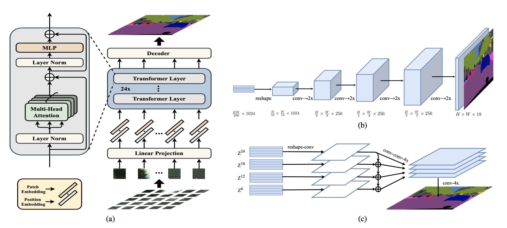
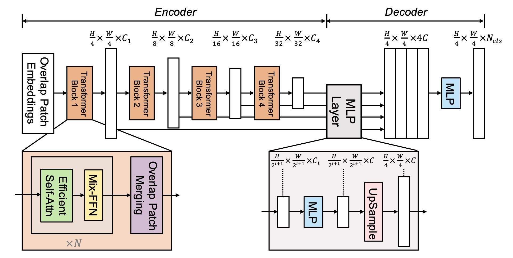
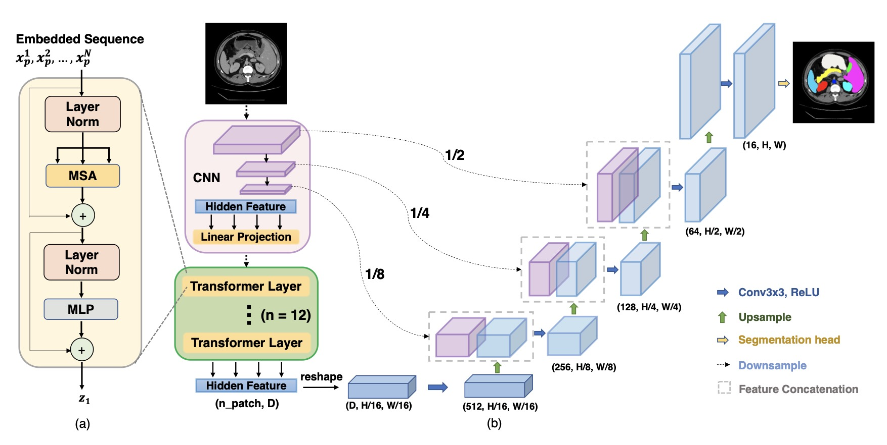

# transformer用于分割

分割中的Transformer其实还是蛮简单的，一般的思路是将Unet中的降采样部分替换为Transformer的Encoder。
所以本节简单介绍三个代表性网络进行讲解。

## SETR

SETR是第一篇基于Transfomer做语义分割的模型。网络的输入和编码部分与vit基本类似。但在Decoder部分作者对比了三种上采样方式。
网络的具体结构如下图所示

### Encoder
Encoder部分先将图像划分为[16, 16]尺寸的图像块，然后利用卷积获得[N, D]的图像embedding，其中\( N=（W*H）/（16*16）, D = 1024 \)。 再加上位置编码后送到transformer的Encoder中。
这部分和ViT基本相同，所以不再多介绍。Encoder部分最终会得到输出同样为[N, D]的输出。

### Decoder
作者对比了三种不同的Decoder方式

1、Naive Upsampling(Naive)。首先将[N, D]reshape为[H/16, W/16, D]的三维向量。然后通过两个卷积核为1的卷积得到[H/16, W/16, C]的输出，最后通过双线性插值得到[H, W, C]的输出。

2、Progressive UPsampling(PUP)。 如上图b所示，依旧是先reshape为[H/16, W/16, D]的三维向量，然后通过传统的卷积上采样得到输出。

3、Multi-Level Feature Aggregation(MLA)。如上图c所示，

- 从Eoncder中每隔6层抽取一个特征并reshape为[H/16, W/16, D]的三维向量。
- 四个向量都要通过三个卷积，卷积核分别是（1x1，3x3，3x3）， 且第1，3个卷积将通道减半。经过这三个卷积后得到[H/16, W/16, D/4]的输出。
- 然后进行4倍的双线性插值得到[H/4, W/4, D/4]的四个向量。
- 对这四个向量进行concat得到[H/4, W/4, D]的融合输出。
- 最后再通过4倍上采样和卷积得到[H, W, D]的最终分割输出。

网络最终虽然能取得最好的效果，但是所需要的计算量也增大了许多，仍无法避免早期ViT的缺陷。

## SegFormer

其实在Swin Transformer中使用<def>Hierarchical backbone</def>的时候，就能想象到类比于CNN，这是一个很适合用于分割中Unet编码器部分的主干。
而SegFormer就是利用这种主干构建的，其网络结构如下图所示。

网络在编码器大体是采用了Swin Transformer的结构，通过patch merging进行降尺寸，在采用改进的transformer提取尺寸不同，语义信息不同，细节不同的特征。
Decoder时将不同尺寸的特征送入MLP进行上采样，并进一步得到最终输出。

接下来将顺序介绍Overlap Patch Merging、 Efficient self-attention、 Mix-FFN等结构

### Overlap Patch Merging

我们想想Swin Transformer中的Patch Merging可以当作是个max pooling，所以导致了不同划分的patch之间没有信息交流。
作者采用步长不为1的conv思路作为Overlap Patch Merging。这样既可以不同patch之间有信息交融，同时也能降低特征图尺寸，防止丢失局部连续性。
在代码实现中，Stage1的实现是ks=7，stride=4的卷积，其他三个是ks=3，stride=2的卷积。通过这四个Overlap Patch Merging，得到1/4，1/8，1/16，1/32的特征图。

### Efficient Self Attention

这个部分其实是对self-attention的改进，用来降低self-attention的计算量。self-attention中Q，K，V的维度都是[N, C]，计算复杂度为\( O(N^2 )\)。
由于N与输入图像尺寸有关，所以图像越大，计算复杂度越高。

论文 Pyramid vision transformer: A versatile backbone for dense prediction without convolutions》提出将k进行变换。
首先将K reshape 为 [N/R, C*R] 的\( \hat{K} \)。然后送入一个线性层得到[N/R, C]的输出。Segformer中从第一层到第四层设置的R分别为 [64,16,4,1]。

通过该步骤，可以是self-attention的计算复杂度降为\( O(N^2/R )\)

### Mix-FFN

Mix-FFN是对FFN的改进，区别在于在两个线性层中间增加了一个卷积，其具体实现可以表示为。

$$ Out = MLP(GELU(Conv_{3x3}(MLP(X_{in})))) + X_{in} $$

至于为什么要使用一个卷积，需要先回顾一下论文[《Conditional Positional Encodings for Vision Transformers》](https://arxiv.org/abs/2102.10882)。

在这篇论文认为，ViT需要进行增加<def>位置编码(position embedding,PE)</def>来获得位置信息。但是PE的分辨率是固定的。因此，当测试分辨率与训练分辨率不同时，需要对位置码进行插值，这往往会导致精度下降。
所以文章提出了<var>Conditional Position Embedding</var>，通过卷积对不同Token进行位置关联。可以使PE达到空间不等价性。

而本文认为分割不需要PE，所以仅保留了卷积，且通过实验证明卷积就可以为Transformer提供位置信息。为了减少计算，采用Depth-Wide卷积。

### Lightweight All-MLP Decoder

作者采用了极简单的MLP作为Decoder模块，如上图右侧所示，具体包含4个步骤：

1、采用线性层将输入特征的通道数从\( c_i \)调整通道的数量为\( c \)。

2、采用上采样将Encoder短连接的4个特征统一上采样到[H/4, W/4, c]。

3、将4个特征从通道维进行Concat，然后在通过一个线性层得到[H/4, W/4, c]的输出。

4、最后通过一个线性层得到[H/4, W/4, \(N_{cls}\)]的预测掩模，\(N_{cls}\)表示最终的类别数。

## TransUnet

TransUnet是结合了Transformer和Unet的医学图像分割模型。其结构较为简单，网络结构图如下所示：

在输入部分，作者没有和其他Vit一样使用切块的方法，而是继续采用卷积提取不同层的特征，Transformer只作用在最高层语义特征处。
如果忽略Transformer部分，其他和Unet结构式完全相同的。

TransUNet使用Transformer来捕捉图像中的全局信息和长距离依赖关系，从而提高模型的表达能力和泛化能力。

