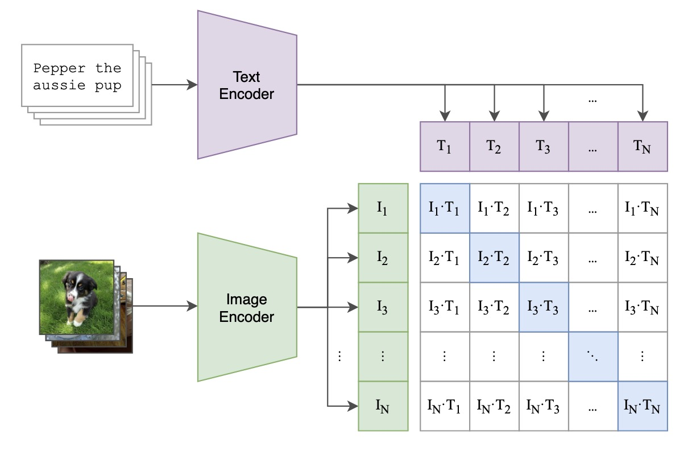
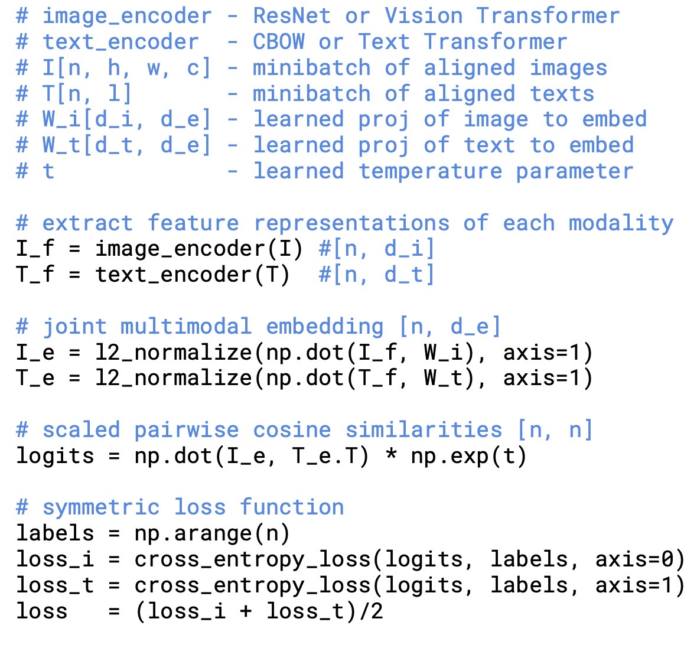

# CLIP

CLIP是一篇transformer用于多模态的经典论文，当然也可以归于zero-shot领域。

CLIP（Contrastive Language-Image Pre-Training）是由OpenAI提出的一种图像和文本联合训练方法，从标题可以看出，他是使用自然语言处理得到的监督信息，训练一个迁移性很好的视觉模型。
CLIP的目标是让模型具备对图像和文本的多模态理解和推理能力，从而提高模型的泛化能力和应用范围。

## 问题引入

传统cv训练需要大规模数据标注，且通过这种方式训练出来的网络只擅长一类任务。

## 解决方法

OpenAI从互联网收集了４亿（图像，文本）对的数据集。使用Transformer模型将图像和文本分别编码为一组向量，然后使用对比损失函数来训练模型，使得在同一类别的图像和文本之间的距离更近，而不同类别之间的距离更远。

## 网络结构

clip网络的训练结构整体示意图如下，



由于作者在网上收集了大量的图像-文本对，训练时候对一个batch的数据来说，包含以下部分

1、文本编码器，利用Transformer对文本编码，获得文本特征向量。 

2、图像编码器，作者尝试了两种网络，一种是ResNet50，并加入了transformer中的self-attention机制。另一种是直接采用vision transformer。

3、将所有的文本和图像特征分别计算内积，就能得到一个矩阵。

4、根据目标函数最大化同一对图像和文本特征的内积，也就是矩阵对角线上的元素，而最小化与不相关特征的内积。

该过程的伪代码如下所示




## 推理/Zero-shot 预测

网络推测的流程如下图所示


网络在预训练好之后，就可以直接在标准数据集上进行测试了。不需要finetune，所以也可以说是zero-shot。测试流程如下

1、对标签进行预处理。因为原始标签可能是单词，比如"cat"，需要对其转化为文本，如"a photo of a cat"。
然后将句子输入文本编码器得到所有类别的text embedding。

2、采样一个要预测的图像，经过图像编码器得到对应的image embedding。

3、以image embedding作为query，N个类别的text embedding作为key，计算cosine相似度，相似度最高的即为预测类别。

预测流程的代码如下所示:

```python
import torch
import clip
from PIL import Image

device = "cuda" if torch.cuda.is_available() else "cpu"
model, preprocess = clip.load("ViT-B/32", device=device)

image = preprocess(Image.open("CLIP.png")).unsqueeze(0).to(device)
text = clip.tokenize(["a diagram", "a dog", "a cat"]).to(device)

with torch.no_grad():
    image_features = model.encode_image(image)
    text_features = model.encode_text(text)
    
    logits_per_image, logits_per_text = model(image, text)
    probs = logits_per_image.softmax(dim=-1).cpu().numpy()

print("Label probs:", probs)  # prints: [[0.9927937  0.00421068 0.00299572]]
```

## 评价

通过这种简单有效的训练方式，作者解决了标注样本的费时费力的问题，同时不用再进行fintune或者重训练等步骤，即可在多种不同任务，不同数据集上进行测试。
且取得了不错的效果。

通过该工作也回答了之前无监督训练为什么不好的问题，因为之前的训练集数据都太少了，果然还是大力出奇迹。

但在更复杂的问题上泛化性仍较差。且需要大量资源是这类网络无法避免的固有问题

## 参考

https://github.com/openai/CLIP


