# paper list

记录一些[《Deep Learning on Image Denoising: An Overview》](https://arxiv.org/pdf/1912.13171.pdf)中提及的顶会论文，该综述目前引用240+，前面的传统算法我还不会，后面的大概讲讲摘要。
## 1、BM3D

Image denoising by sparse 3-d transform-domain collaborative filtering（BM3D，TIP2007）
[论文](https://ieeexplore.ieee.org/abstract/document/4271520/)  引用7000+
[翻译](https://zhuanlan.zhihu.com/p/146616286)
[代码](https://github.com/Ryanshuai/BM3D_py)
[讲解](https://blog.csdn.net/qq_33552519/article/details/108632146)

## 2、WNNM
Weighted nuclear norm minimization with application to image（WNNM，CVPR2014）
[论文](https://openaccess.thecvf.com/content_cvpr_2014/papers/Gu_Weighted_Nuclear_Norm_2014_CVPR_paper.pdf) 被引1400+

## 3、EPLL
From Learning Models of Natural Image Patches to Whole Image Restoration（EPLL，ICCV2011）
[论文](http://people.csail.mit.edu/danielzoran/EPLLICCVCameraReady.pdf) 被引1300+

## 4、Image denoising: Can plain Neural Networks compete with BM3D（CVPR2012）
将MLP引入到去噪领域
[论文](http://people.tuebingen.mpg.de/burger/neural_denoising/files/neural_denoising.pdf) 被引1200+

## 5、Shrinkage Fields for Effective Image Restoration（CVPR2014）
[论文](https://openaccess.thecvf.com/content_cvpr_2014/papers/Schmidt_Shrinkage_Fields_for_2014_CVPR_paper.pdf) 被引500+

## 6、Trainable nonlinear reaction diffusion: A flexible framework for fast and effective（TPAMI 2016）
[论文](https://arxiv.org/pdf/1508.02848.pdf) 被引800+

## 7、ECND

Enhanced CNN for image denoising（ECNDNet，TIT 2019）
[论文](https://arxiv.org/pdf/1810.11834.pdf) 被引74
文章认为CNN有两个问题1）难以训练2）性能饱和。因此提出enhanced convolutional neural denoising network (ECNDNet）。用残差学习和BN解决难以训练的问题，并加速收敛。用空洞卷积扩大上下文信息，减少参数。
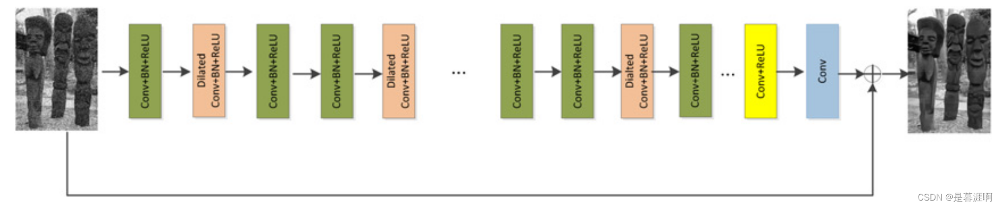

## 8、RED
Image Restoration Using Convolutional Auto-encoders with Symmetric Skip Connections（RED，NIPS 2016）
[论文](https://arxiv.org/pdf/1606.08921.pdf) 被引300+
作者提出了一个非常深的全卷积自动编码器网络用于图像恢复的，它是一种具有对称性的编码-解码框架。卷积层捕获抽象图像内容，同时消除损坏（corruption），反卷积上采特征图并恢复图像细节。并用连接对称层的跳连解决深层网络不容易训练的问题。跳连有两个优点，1）信息直接从底层传回，避免梯度消失，训练简单，恢复性能增益。2）将图像信息从Conv传递到Deconv，有利于恢复干净图像。作者将其应用到image denoising、 super resolution removing JPEG compression artifacts、non-blind image deblurring 和 image inpainting四个中取得最优效果。
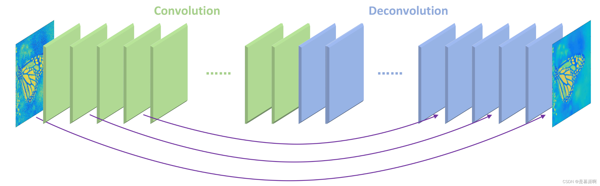

## 9、DnCNN
Byond a gaussian denoiser: Residual learning of deep cnn for image denoising（DnCNN，TIP 2017）
被引4300+
作者提出前馈去噪卷积神经网络 (feed-forward denoising convolutional neural networks，DnCNN) ，将非常深的架构、学习算法和正则化方法应用于图像去噪。残差（本文指学习噪声，并用原图减噪声得到干净图）和BN用于加速训练，提升效果。其他论文只能处理固定level的加性高斯白噪声（AGWN），本方法可处理任意level。DnCNN 使用残差学习策略，隐式去除隐藏层中潜在的干净图像。 这个属性促使我们训练单个 DnCNN
模型来处理几个一般的图像去噪任务，例如Gaussian denoising, single image super-resolution and JPEG image deblocking。

## 10、PHGMS
Beyond deep residual learning for image restoration: Persistent homology-guided manifold simplification（PHGMS，CVPRW2017）
[论文](https://arxiv.org/pdf/1611.06345.pdf) 引用120+
作者提出了一个特征空间的深度残差学习算法。其主要思想源于这样一种观察：如果输入流形and/or 标签流形可以通过到特征空间的解析映射在拓扑上变得更简单，那么学习算法的性能就可以提高。如下图所示，作者通过离散小波变换（DWT）将输入和GT解耦成四个自带（注：原始图像在水平和垂直方向上的低频分量 LL、水平方向上的低频和垂直方向上的高频 LH、水平方向上的高频和垂直方向上的低频 HL 以及水平和垂直方向上的的高频分量 HH，引自[博客](https://blog.csdn.net/daisy9212/article/details/49184271)） 简单的对小波变换的理解可以看[剑桥大佬的知乎文章](https://zhuanlan.zhihu.com/p/22450818)。
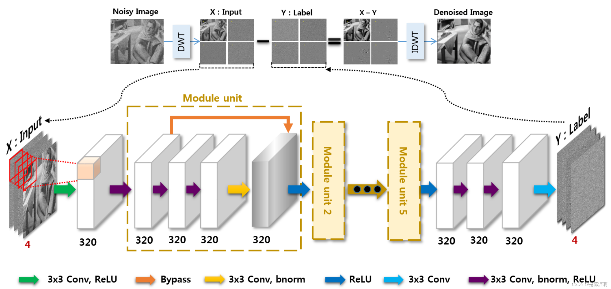

## 11、MeMNet
MemNet: A Persistent Memory Network for Image Restoratio（ICCV2017）
[论文](https://openaccess.thecvf.com/content_ICCV_2017/papers/Tai_MemNet_A_Persistent_ICCV_2017_paper.pdf) 被引1100+
作者认为随着深度的增加，非常深的模型很少实现长期依赖性问题，这导致先前的状态/层对后续的状态/层几乎没有影响。但人类的thoughts具有持续性，因此作者提出deep persistent memory network。通过引入memory block,该block包含一个递归（recursive）单元和一个门（gate）单元，通过自适应学习过程挖掘持久性记忆。递归单元学习不同感受野下当前状态的多层次表示，递归单元的表示和前一个memory block的输出concat后送入门单元，它自适应地控制应该保留多少以前的状态，并决定应该存储多少当前状态。在denoise、sisr、JPEG deblocking三个任务中取得最优。
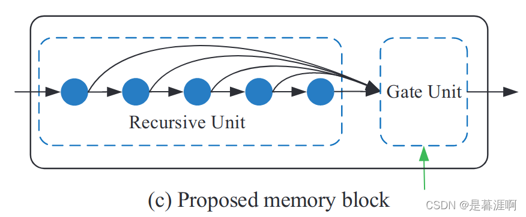
绿色箭头为前一个memory block的输出，gate unit通过一个Conv1x1实现。
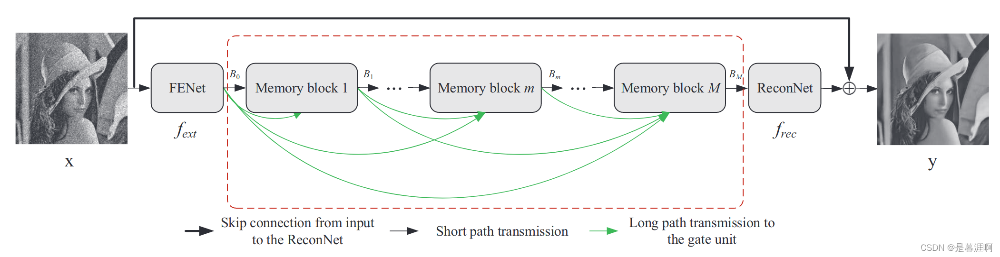
网络完整结构近似于一个DenseNet。如果使用辅助监督，将每个memory block的输出送到ReconNet然后加权。

## 12、MWCNN
Multi-level Wavelet-CNN for Image Restoration（MWCNN，CVPRW2018）
[论文](https://arxiv.org/pdf/1805.07071.pdf) 被引360
[MATLAB代码](https://github.com/lpj0/MWCNN)
和10有点像的一篇论文。作者认为感受野尺寸和计算量间的平衡是件很难的事。虽然空洞卷积略有缓解该问题，但它受到网格效应的影响，产生的感受野只是输入图像的一个稀疏采样，带有棋盘格图案。因此提出multi-level wavelet CNN（MWCNN）。在UNet基础上，将小波变换应用在收缩（contracting ）阶段用于减小特征图尺寸，同时一个网络用于减少特征图通道数。在拓展（expand）阶段，用小波逆变换重建高分辨率的特征图。作者证明该方法可以当做空洞卷积的特例，且不会产生网络效应。并将网络应用于denoise，sisr，JPEG deblock任务。
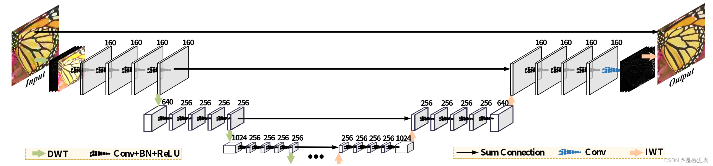
如上图所示，DWT会将特征图宽高变为原来1/2，通道数变为原来4倍，IWT则相反。且降采样的特征图是加到上采阶段的特征图上，而非Concat。作者图注说 The network depth is 24，我觉得应该是指上图中24个CONV+BN+ReLU。

## 13、IRCNN
Learning deep CNN denoiser prior for image restoration（IRCNN，CVPR2017）
[论文](https://arxiv.org/pdf/1704.03264.pdf) 被引1200+
[讲解1](https://www.cnblogs.com/ChenKe-cheng/p/11438967.html)  
[讲解2](https://www.cnblogs.com/smartweed/p/10444039.html)
       经过我将近一天的时间的努力阅读（其实就是疯狂划水） ，我终于大概比其他讲解稍微往前走了一丢丢。论文是这样子的设想的，基于模型的优化方法（model-based optimization methods）耗时，需要复杂的先验信息。但是可以通过更换先验H适应不同的任务。判别式学习方法（discriminative learning methods）灵活性差，但测试速度快。所以可以结合一下两者优点，将判别式学习作为基于模型的优化方法的一个模块，用来获得先验信息。
       这里说一下啥是判别式学习呢？就是不管啥映射分布啥的，直接通过数据对和损失函数，学习先验项，所以CNN就属于判别式学习的一种。对应的基于模型的优化方法就是通过图像先验，然后利用各种假设的方法，比如大名鼎鼎的BM3D。（这里有个问题，一般来说在传统ML领域判别模型对应的是生成模型，不懂作者提的基于模型的优化方法和生成模型啥区别）
       至于上面为什么能这么做，原理在于变量拆分技术，作者使用其中的半二次分裂方法（Half Quadratic Splitting）这个可以看讲解二。将IR拆分为迭代求解X和Z，其中X根据不同的任务，对应不同先验H，可以有不同的解，在已知Z的情况下可以通过求解公式7获得。Z对应的就是一个去噪器，也就是论文中采用空洞卷积的6层CNN。可以从讲解二的完整流程图看出，获得去噪器Z后，会通过公式7计算X，这样迭代。当去噪任务时，由于H为identity matrixs，公式7就化为$X=Y+Z$，在代码中就是直接噪声图Y-网络Z预测的残差。那对于deblur任务，就要进行FFT变换，H也会提前计算。SISR就更复杂了。
       其他可能的一些问题
       1）讲解一中的IR是病态逆问题（ill-posed inverse problem）？这个在SR中通俗理解就是说，知道降质后的LR图像，可以得到的HR图像不是唯一的，其他IR也差不多这个意思，所以需要用一个正则项约束解空间，免得得到的结果太离谱。同事伴随的还有保真项。
       2）所以总结来很神奇啊。其他IR问题可以转换成去噪器+公式7的求解。
       最后以上大部分是自己的理解，有不对的地方多多指教，轻喷啊，狗头保命。
       最后最后再BB几下，1）作者时隔4年将论文改成了期刊TPAMI2021[《Plug-and-Play Image Restoration with Deep Denoiser Prior》](https://arxiv.org/pdf/2008.13751v1.pdf)    2）CVPR2020有一篇跟这个简直一个模子出来的论文[《Deep Unfolding Network for Image Super-Resolution》](https://openaccess.thecvf.com/content_CVPR_2020/papers/Zhang_Deep_Unfolding_Network_for_Image_Super-Resolution_CVPR_2020_paper.pdf) 用来做SR的。3）这个提到的deep Unfolding貌似还被总结成一种整合传统先验和CNN的系列，详见[知乎](https://zhuanlan.zhihu.com/p/66127340)

## 14、FFDnet
FFDnet: Toward a fast and flexible solution for cnn-based image denoising （TIP2018）
[论文](https://arxiv.org/pdf/1710.04026.pdf) 被引1000+
[代码](https://github.com/cszn/FFDNet)
作者认为现在去噪大多数都是基于判别学习，但是这种模式只能处理特定噪声level，不具有应用性。因此提出了一个快速灵活的去噪CNN（Fast and flexible denoising convolutional neural
network）。网络首先将原图降采（reshape）为4个子图，同时将可调的（tunable）噪声level图一起作为输入。网络有以下特性：1）一个网络可以处理范围很广[0,75]的噪声level。2）通过指定非均匀噪声水平图来消除空间可变噪声（spatially variant noise）3）比BM3D速度还快，即使在CPU上。
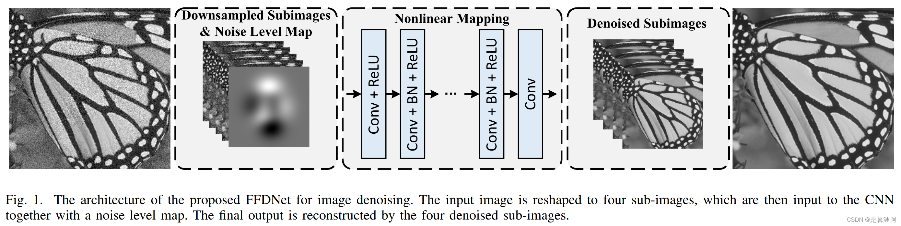
注意这里不再是学习噪声残差了，而是直接学习干净图，作者解释是因为噪声范围太广。

## 15、BRDNet
Image denoising using deep CNN with batch renormalization（BRDNet， Neural Networks 2020）
[代码](https://github.com/hellloxiaotian/BRDNet) [讲解](https://mp.weixin.qq.com/s/Jk6PlRBYorLI5FSa5xxOkw)  被引170+

作者为解决单层较深网络难以训练、性能饱和的问题，组合两个子网络来增加网络的宽度来获得更多特征。其中上层使用Conv+BRN+ReLU，下层使用DialtedConv+BRN+ReLU。作者采用batch renormalization（BRN）是用来解决内部协变量偏移（internal covariate shift）和mini batch问题。（这个BRN是BN作者后来提出的方法，在用每个batch的均值和方差来代替整体训练集的均值和方差之后，可以再通过一个线性变换来逼近数据的真实分布[引自知乎](https://www.zhihu.com/question/55890057)）。空洞卷积用来增加上下文感受野。
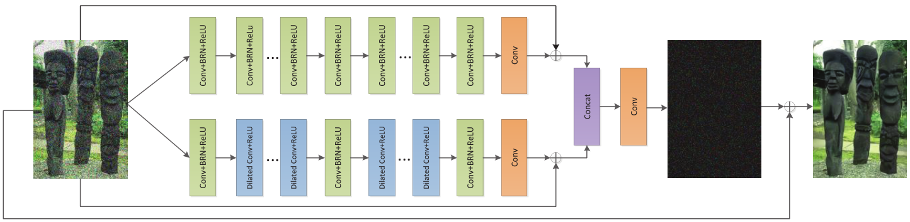

此外作者说自己是第一篇用于真实图像去噪的DNN论文。此外作者还有一篇跟这个很像的论文[《Designing and training of a dual cnn for image denoising》](https://arxiv.org/pdf/2007.03951.pdf)挂在arxiv上，被引22，但是暂时还没中。

## 16、ADNet
Attention-guided CNN for image denoising（ADnet，Neural Networks 2020 ）
[代码](https://github.com/hellloxiaotian/ADNet) [讲解](https://mp.weixin.qq.com/s/Debh7PZSFTBtOVxpFh9yfQ) 被引160+。 和15同一个作者，同一年发表在同一个期刊上。
作者认为增加网络深度会导致浅层特征对深层特征影响减弱，因此作者提出注意力引导的CNN（Attention-guided CNN ）用于图像去噪。网络包含了稀疏块sparse block (SB), 特征增强块feature enhancement block (FEB), 注意力块 attention block (AB) 和一个重建块 reconstruction block (RB) 。SB使用空洞卷积和卷积达到性能和效率间的平衡，FEB利用long-path集成全局和局部的特征信息来增强去噪模型的表达能力。AB是被用于提取隐藏在复杂背景中的噪声信息。对真实噪声和盲噪声等复杂噪声非常有效。FEB和AB共同提高训练去噪模型的效率并减少复杂度，最后RB通过获得的噪声映射和给出的噪声图像来重构干净的图像。作者在合成图、真实图、盲去噪上都进行了实验，效果不错。
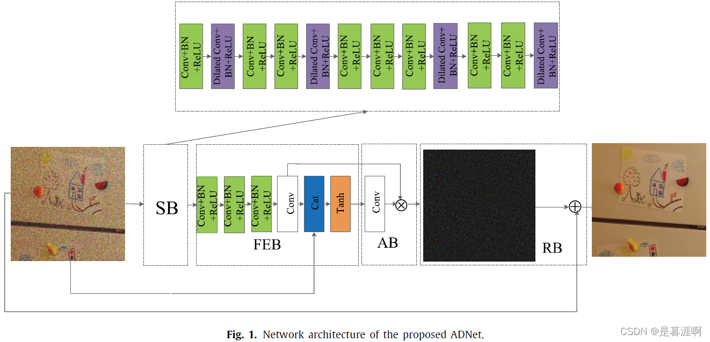
有意思的是作者两篇论文的实验互相没有自引对比。

## 17、FOCNet
Focnet: A fractional optimal control network for image denoising（CVPR2019）
[论文](https://openaccess.thecvf.com/content_CVPR_2019/papers/Jia_FOCNet_A_Fractional_Optimal_Control_Network_for_Image_Denoising_CVPR_2019_paper.pdf) 被引60+  [代码](https://github.com/hsijiaxidian/FOCNet)
[讲解](https://maxliu245.github.io/2021/03/24/%E3%80%90%E8%AE%BA%E6%96%87%E9%98%85%E8%AF%BB43%E3%80%91FOCNet%E2%80%94%E2%80%94%E7%BD%91%E7%BB%9C%E4%B8%8E%E5%88%86%E6%95%B0%E9%98%B6%E6%96%B9%E7%A8%8B%E7%9A%84%E7%BB%93%E5%90%88/)  这个博客还有其他几篇分数阶可导方程的论文
最近对 DCNN 数学基础的研究表明，DCNN 的前向传播对应于一个动态系统，可以用常微分方程（ordinary differential equatio，ODE）来描述，用最优控制方法求解。然而，这些方法大多采用整数阶微分方程（Integer-order differential equation，IODE），在时间空间上具有局部连通性，不能描述系统的长时记忆。受分数阶微分方程（ fractional-order differential equation，FODE）具有长期记忆这一事实的启发，本文通过解决部分最优控制 (fractional optimal control，FOC) 问题，提出FOCNet。具体来说，网络结构是基于分数阶微分方程的离散化设计的，在前向和后向传播中都具有长期记忆。此外，网络引入了多尺度特征交互，以加强对动态系统的控制。
FODE的公式如下，
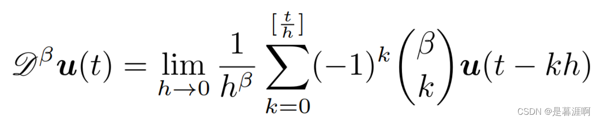
简单可以看成当前状态是之前状态的累加和，因而在设计网络时对应的就是**加权求和**操作。同时网络引入了多尺度特征，总的网络结构如下：
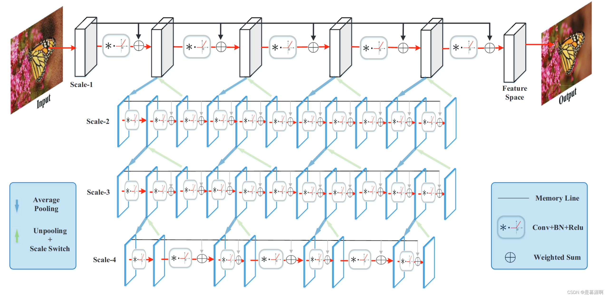

从每个scale来看，前面的状态都会通过memory line加权到后面的状态，也就是FODE的[代码实现](https://github.com/hsijiaxidian/FOCNet/blob/master/+dagnn/PLM.m)。对不同的scale可以纵向来看更容易一点，单独看一个白色block及下面的3对降采上采过程，就是一个单独的Unet，区别一个是上采过程中需要通过一个gate决定是否需要与该特征**相加**，但我看代码好像都是加的。另一个就是与同scale的后面的Unet还通过memory line连接。

