# zero shot

好早前看了一下zero-shot的文章，并进行整理做成了PPT，今天有空分享一下，大家可以互相学习讨论。

每张PPT下都有链接，更详细的介绍可以查看链接。

## 1、定义

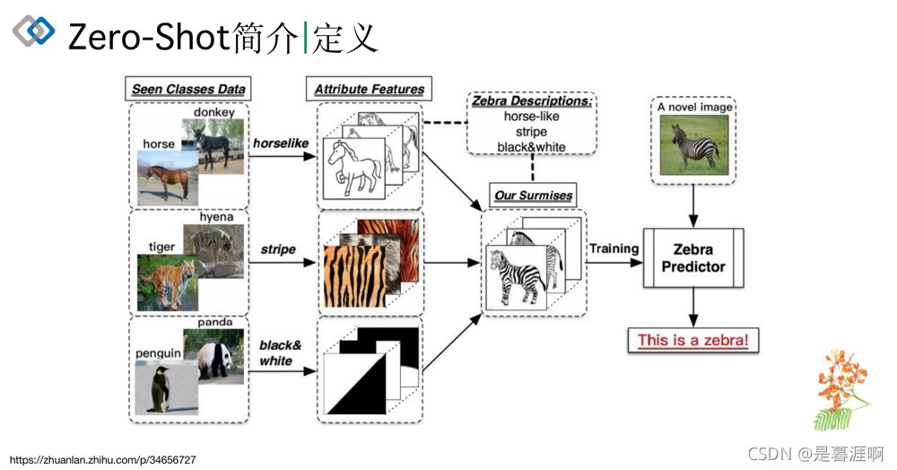

这是zero-shot介绍时常用的一张图，从见过的类别（第一列）中提取特征（如：外形像马、条纹、黑白），然后根据对未知类别特征的描述，测试未见过的类别。

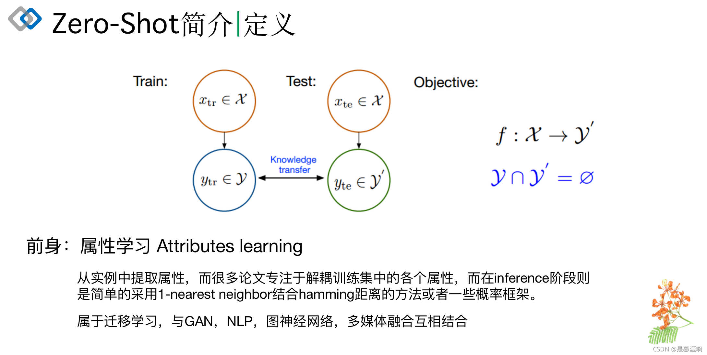

## 2、开山之作

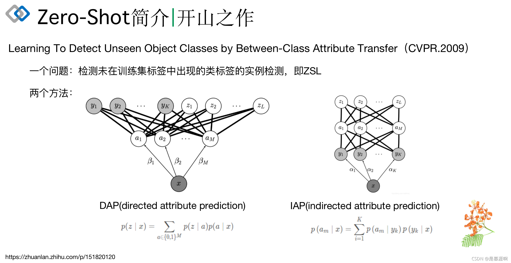

DAP和IAP可以看一下公式的区别，后来基本都采用IAP方式。y为已知类别标签，a为特征属性，z为未知类别。

由公式可以看出模型主要是预测特征属性，由此引入下面图片写的缺点，属性到类别的改进引出了下图的两篇论文。

另外要说明一下这些早期数据集，是有一个属性到标签的矩阵，比如属性是100个，标签有60个，就有一个100*60的矩阵，代表专家先验知识。

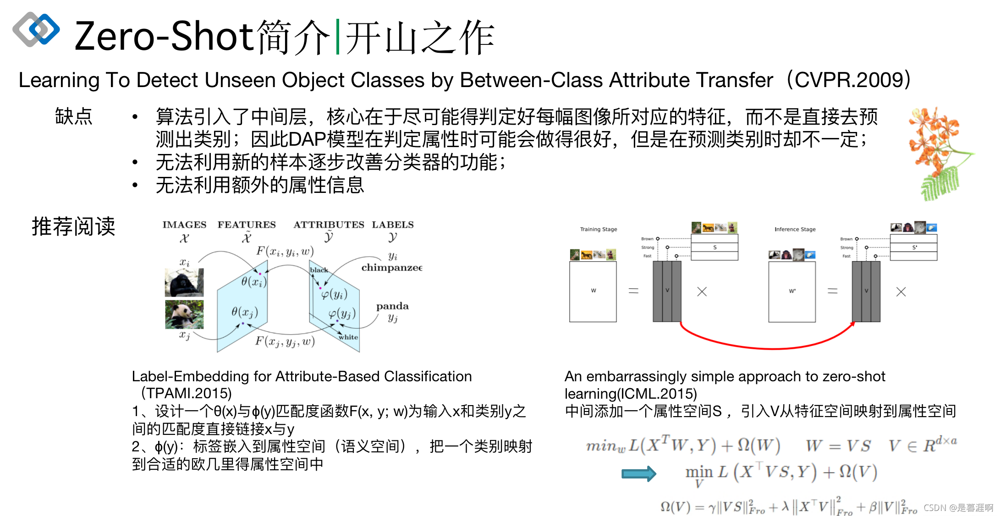

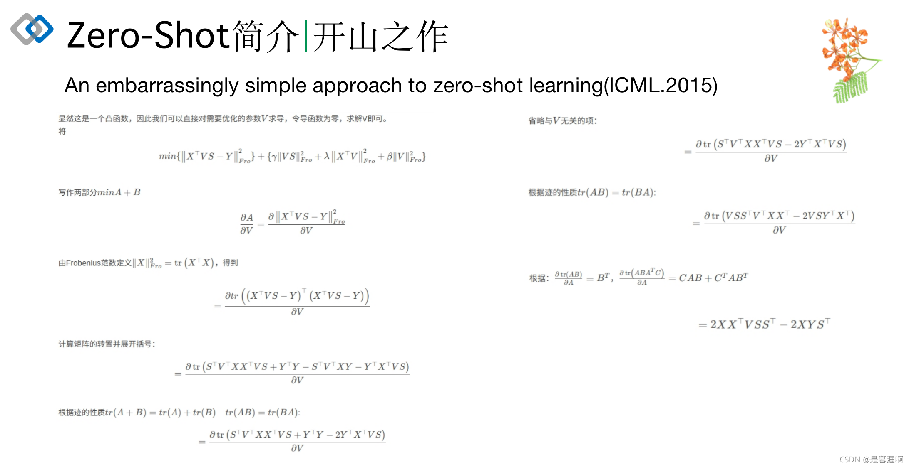

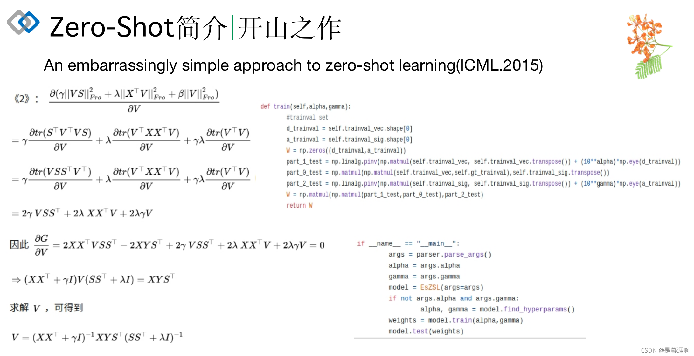

这两张图是《An embarrassingly simple approach to zero-shot learning》的公式推导和代码实现。我建议可以推导一下，很多性质直接用。最后看代码你会发现，公式直接推导出了最优权重，因此不需要训练过程了。这就是命名中超级简单的意思。

## 3、图像到语义

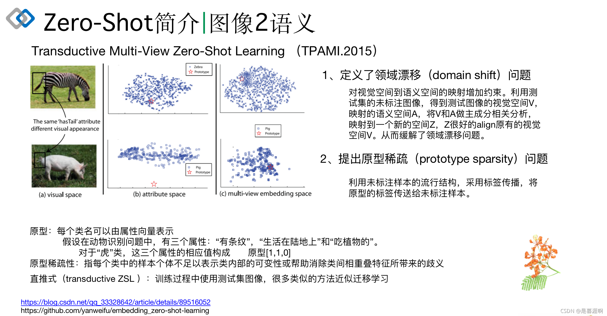

按我的理解翻译一些人话：

领域漂移这里：我认为是可以当成DA里面的特征对齐

每个类中的样本个体不足以表示类内部的可变性：比如我们定义了虎的原型中有尾巴属性，但是有的虎是正面图，你看不见尾巴，那我们定义的原型就无法表示现在这只虎了。

帮助消除类间相重叠特征所带来的歧义：比如斑马和猪都有尾巴属性，他们就是重叠的特征，但是网络分不出来这俩尾巴的区别。

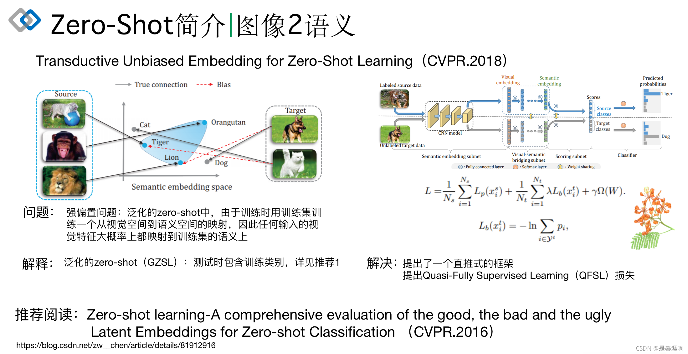

介绍一下\( L_b \)，这里我想了好久，我觉得pi是判断属于未见的类还是已见的类。比如图中的狗，此时没有对应狗的标签，网络预测它属于未见类，这个信息是可以提供的。

## 4、语义到图像

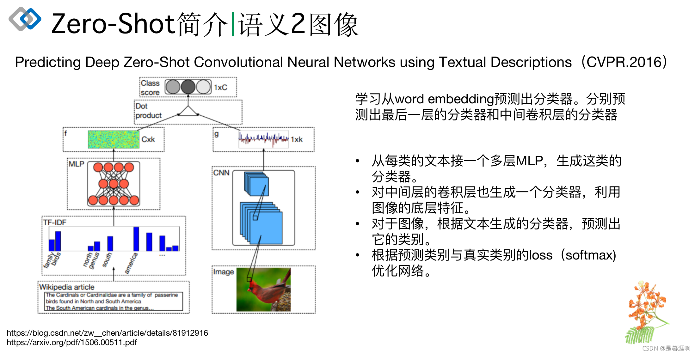

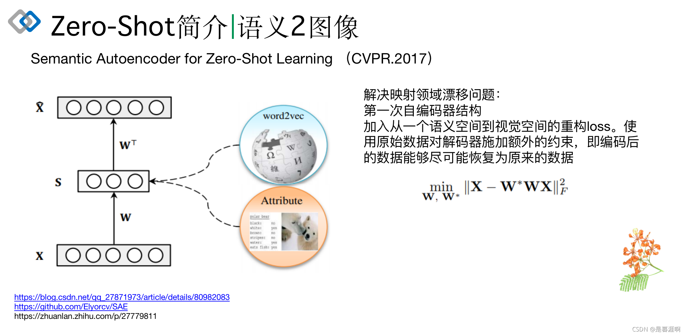

## 5、生成模型

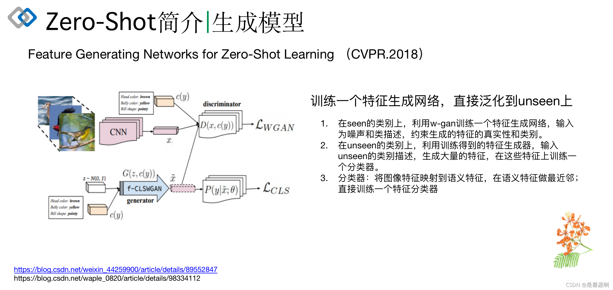

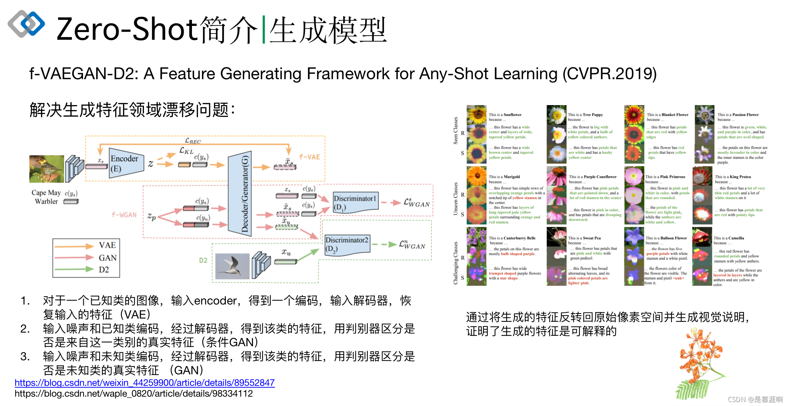

## 6、其他

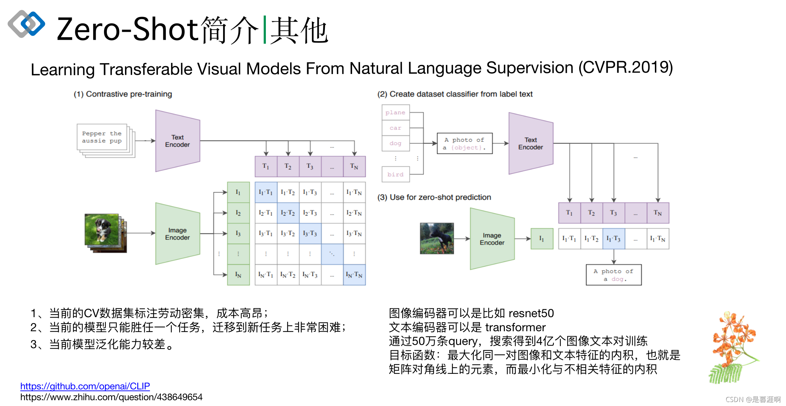

后面cv发展起来后的工作看网络图基本就可以理解，最后这个蛮好玩的，有兴趣可以测试代码跑一跑。
